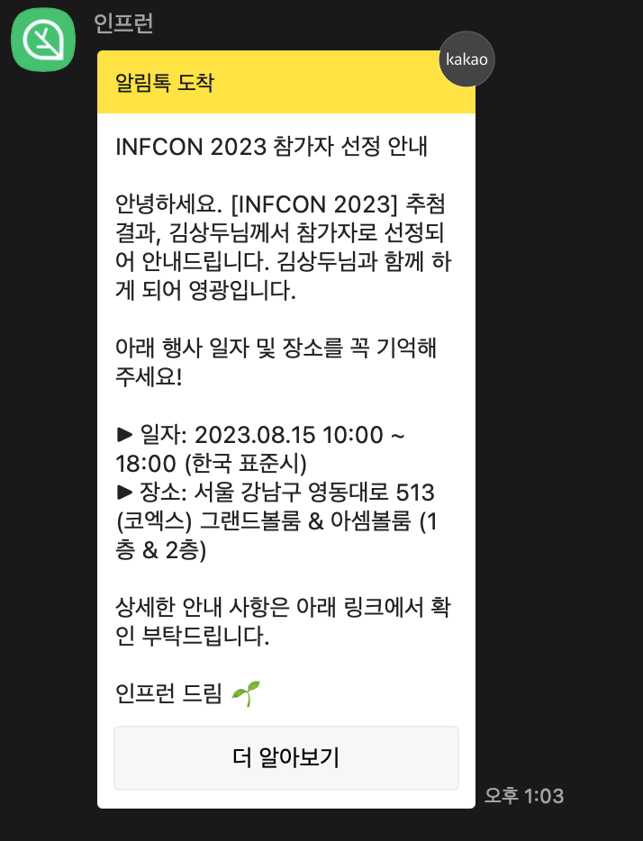

2024년이 된지도 벌써 3주가 흘렀습니다. 취업 준비에 대한 회고는 이전에 작성했기에, 이번에 적어볼 회고는 이후에 대한 이야기입니다. 

올해 했던것들중 좋았던점과 아쉬웠던 점을 정리하고, 이를 바탕으로 새해엔 어떤것을 해볼지 목표까지 정해보려합니다.

## 회사 생활
2년간의 준비를 뒤로하고 2023년 6월 개발자로써 취업하게되었습니다. 사내 도메인이 어려운 편이었고, 프론트엔드 팀에서 관리하고있는 레포지토리가 많은 편이라 처음에는 적응하기 어려웠지만 주변 개발자 분들이 많이 도와주신 덕분에 어렵지 않게 적응할수 있었습니다.

입사후 적응기간을 지나 이제 7개월차인만큼 많은 일을 하지는 않았지만 생각보다 느낀점이 많았습니다. 이제까지 회사에서 진행했던 업무들을 정리하고, 개인적으로 느꼈던점을 이야기 해보려합니다.

### 진행했던 업무들

#### 신규 페이지 구현
입사후 2개월차에 신규페이지를 구현하는 작업을 진행하였습니다. 약 1달동안 진행한 프로젝트였고, 간단한 등록/조회/수정/목록 페이지를 구현하는 작업이었습니다. 구현 난이도 자체가 어려운것은 아니어서 구현 자체에는 큰 어려움이 없었지만, 프로젝트를 진행하면서 느낀점이 있었습니다.

등록 페이지 구현시 기존에 존재하지 않는 아코디언 형태의 Form UI를 구현해야하였습니다. 처음에는 이를 다른 페이지에서도 사용할수 있도록 재사용 가능한 공통 컴포넌트로 구현하였습니다. 하지만 요구사항이 추가되면서 컴포넌트를 공통화하는데 있어서 난이도가 높아졌는데, 이 때문에 추후 사용될지 안될지 알수 없는 UI에 대한 공통화가 과연 필요할까 라는 의문이 들었고, 이 때문에 지금 공통 컴포넌트를 구현하는데 리소스를 사용하는것 보다 이후 동일한 UI가 사용될때 공통화 하는게 맞지 않을까 라는 생각이 들어 공통화 하지 않고 페이지 내에 포함시켰습니다.

한편 전반적인 도메인에 대한 이해가 부족하다보니 유저의 어떤 정보를 사용하여 API의 쿼리에 넣어야 할지 잘못 결정하기도 하였습니다. 추후 통합테스트시 발견하여 고칠수 있었지만, 코드 문제가 아닌 도메인 문제였기에 도메인에 대한 이해를 위해 더 노력해야겠다는 생각을 하였습니다.

#### 팀내 컨벤션 공통화
프론트엔드 팀에 합류할 당시 팀원분들은 최근까지 다른 도메인 팀에 있었던 상황이었습니다. 그러다보니 팀내 공통적인 컨벤션이 없었고, 각자 이전 팀에서 사용하던 컨벤션을 그대로 사용하고 있었습니다. 이때문에 코드 컨벤션 뿐만 아니라 커밋메시지 또한 컨벤션이 맞지 않았습니다. 

모든 팀원분들이 컨벤션의 필요성을 느끼고 계셨던 만큼 구두나 일부 문서로 공유되고 있었던 컨벤션들을 정리하고, 일부 불일치 하는 컨벤션에 대해서는 추가적인 회의를 통해 합의한뒤 이를 문서화 하여 공유하였습니다.

또한 코드리뷰시 정해진 컨벤션을 지켰는지 검토하는것이 비효율적이라고 생각하여 husky와 lint-stage를 이용하여 컨벤션을 강제화한뒤 코드리뷰시 컨벤션을 검토하지 않도록 하였습니다.

#### 여러 도메인 유지보수
프론트엔드팀은 백엔드팀들과 다르게 하나의 팀에서 여러 도메인을 다루고 있었기에, 모든 도메인 페이지를 수정할수 있어야 했습니다. 하지만 처음 입사시 하나의 도메인을 이해하기도 어려웠기에, 초기 여러 도메인의 작은 수정사항을 반영하는것이 굉장히 어려웠습니다.

특히 비즈니스적으로 중요한 화면의 경우 간단한 수정임에도 전체 테스트를 거치는것이 마음 편한경우도 있었는데 이때 자동화된 테스트가 있으면 좋겠다는 생각을 하기도 하였습니다.

하지만 이러한 유지보수를 몇번 해보다 보니 오히려 전체 도메인에 대한 이해를 높이는데 많은 도움이 되었던것 같습니다.

### 느꼈던 것들

#### 커뮤니케이션은 개발을 잘하는것 만큼 중요하다.
회사를 다니기 전에는 개발자에게 가장 중요한것이 개발실력이라고 생각했습니다. 물론 이러한 생각은 여전히 유효하지만 타인과 소통하는것 즉 커뮤니케이션이 개발만큼 중요한것 같다는 생각을 가지게 되었습니다. 특히 이러한 커뮤니케이션 중에서도 논의와 질문 하는 방법에 대해서 이야기 해보려합니다.

상대방과 논의를 진행하다보면 상대의 의견에 동의하지 않아 반박해야할때가 있습니다. 사람이 자신의 의견을 반박당하면 자기방어적이 되는 경우가 있기때문에 이런경우 서로 감정소모만 하게되고 결론이 나지 않는 경우가 있는것 같습니다. 따라서 반대 의견을 제시할때는 상대방의 의견을 최대한 존중하면서 자신의 의견을 피력하고 반박의 근거로 주제와 동떨어진 내용을 가져오지 않도록 주의하는것이 좋다고 생각합니다.

한편 질문을 할때는 질문 받는 사람이 질문을 이해할수 있도록 질문에 대한 맥락을 제공해야한다고 생각합니다. 이때 맥락은 사람마다 다른데 질문의 배경지식이 풍부한 사람이면 키워드 몇개로 충분할수 있지만, 배경지식이 부족한 경우 충분한 맥락을 제공해야 질문을 곧바로 이해할 수 있을것입니다. 따라서 평소 질문 대상자가 어느정도의 이해도가 있는지 파악하는것 또한 맥락을 제공하는데 있어서 중요한 요건이 된다고 생각합니다.

#### 기본기에 충실하자

react, vue, react-query, next.js 와 같은 라이브러리를 잘사용하는것 보다, 어떤 라이브러리 일지라도 금방 이해하고 사용 할수 있는 능력을 키우는것이 중요하다고 생각하였습니다. 왜냐하면 라이브러리는 비즈니스 요구사항을 보다 손쉽게 적용하기위한 도구에 불과하므로 비즈니스의 변화에 따라 선택하는 라이브러리는 변화할 수 있기 때문입니다.

이를 위해 유행하는 라이브러리를 잘 사용하는것 보다는 처음 보는 라이브러리에도 쉽게 적응할 수 있도록 javascript언어에 대해서 deep dive하거나, 모던 프론트엔드에서 빠지지 않고 사용되는 모듈 번들러나 바벨 같은 트랜스파일러의 동작원리를 이해하는것이 보다 좋지 않을까 라는 생각을 하였습니다.

### 올해 달성하고자 하는 목표

#### 진행한 작업에 대한 기록을 남기자
구두로 논의한 내용이나 질문에 대해서는 글로 한번더 정리한뒤 메신저나 위키에 공유하고, 프로젝트를 진행할때는 구현 방안에 대해서 고민해보고 이를 문서화 한뒤 요구사항이 변할때 이를 버저닝하여 관리하려 합니다. 그리고 한달에 한번은 이번달에 한것들을 간단하게 정리해두어 이후 회고나 평가때 사용하려합니다.

#### 질문에 맥락을 제공하기
개인적으로 질문을 할때 상대방이 충분한 맥락을 가지고 있다고 생각하여 단순한 질문만 던지는 경우가 많았습니다. 질문자는 정확하지 않은 답변을 받을수 있고, 답변자는 질문을 이해하기 위해서 더많은 시간을 사용해야하기 때문에, 질문을 할때 답변자가 질문을 이해할수 있도록 질문 내용과 함께 맥락을 정리해 제공하려합니다.

## 개인 활동

### 공부

회사에 취업한뒤에도 공부를 꾸준히 하려고 노력했는데, 생각보다 많이 하지는 못했던것 같습니다. 객체지향과 함수형 프로그래밍에 대한 기본적인 이해를 쌓고자 서적과 강의를 통해 이론을 공부하였고, 테스트 코드를 한번 작성해보고 싶어서 테스트 코드에 대한 많은 아티클과 강의를 이용하여 실제 실무에 적용하는 방법을 공부하였습니다.

### 네트워킹

네트워킹 활동을 위해서 개인적으로 진행한 활동은 없었지만, 운좋게 당첨되어 인프콘에 다녀왔습니다.

인프콘에서 진행한 강연들은 이후 온라인으로 들을수 있었기에 내용적인 측면 보다 다양한 사람들이 모인 자리에서 라이브로 들었을때의 생동감이 큰 장점이었던것 같습니다. 그리고 강의 쉬는시간 마다 굿즈를 모으러 돌아다니는것도 재미있었습니다.
한편으로 마지막에 진행한 네트워킹 행사에서는 다양한 사람과 커피챗을 진행했었습니다. 다양한 직군에서 일하는 사람과 만나 궁금한점을 묻고 대답을 들었는데 좋은 조언들을 많이 들어서 이러한 점이 좋았었습니다.

### 올해 달성하고자 하는 목표
#### 오픈소스 컨트리뷰트
이제까지 오픈소스에 기여한 형식은 번역, 한국인 개발자가 유지보수하는 라이브러리에 기여하는것이었습니다. 물론 이러한 기여도 좋은 방식이라고 생각하지만 보다 많이 사용하면서 널리 유지보수하고있는 라이브러리에 대해서 열린 이슈를 분석하고 기여해보려합니다.

목표는 올해 10개이상의 mr을 생성하고 merge되는것이며 한달에 하나정도의 분량이기에 가능하지 않을까 생각해봅니다.

#### react deep dive
취준할때도 react 소스코드를 열어보고, 소스코드기반의 분석글을 읽으면서 deep dive를 한적이 있었는데 취업하고나서는 시간이 없다는 핑계로 거의 하지 못했던것 같습니다.

fiber, lane model, concurrent등의 개념들에 대해서 공부하고 이를 react에서 어떤 방식으로 구현하고 있는지 학습한뒤  아티클로 정리하려합니다.

## 마치며 
반년짜리 회고이지만 나름 느낀것도 많았고 액션아이템도 어느정도 선정할수 있었던것 같습니다. 다음 회고는 올해 6~7월쯤이 될것 같은데, 이때까지 아래 목표를 잘 지키기위해 열심히 노력하려 합니다.

- 질문시 충분한 맥락을 제공하기
- 작업할때 기록을 남기기
- 오픈소스 컨트리뷰트 하기(mr 10개이상 날려보기)
- react deep dive 하기

