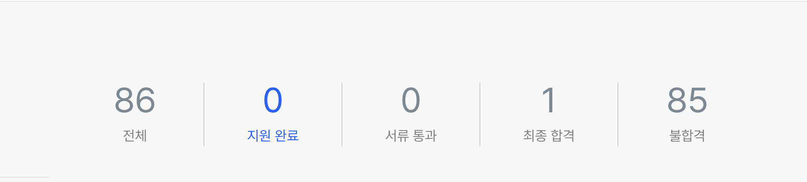

취준을 할때는 회사에 합격하자마자 바로 회고를 써야겠다고 생각했지만, 막상 회사에 합격하고나서는 새로운 환경에 적응한다는 핑계로 계속 미루게 되었습니다. 하지만 회사에 입사한지 4개월이 다되어가는 만큼 더 미룰수는 없겠다는 생각이 들어서 약 2년간의 취준 과정을 되돌아보고 이를 기록으로 남겨두려 합니다.

## 프론트엔드 개발자가 되기로 결심하며

전역이후 대학에 복학해 전공수업을 듣던 어느날 문득 이길이 맞는걸까 라는 생각이 들었습니다. 갑자기 이런 생각이 들었던 이유는 그날따라 수업이 너무 어려워 도저히 알아 들을수 없었기 때문이었습니다. 물론 그날 수업이 어려웠다는 이유만으로 이러한 생각이 들었던것은 아니었습니다. 1학년때부터 수업을 듣거나 공부를 할때 너무 지겹고 재미가 없었던 경험들이 진로에 대한 의심을 하게 만들고있었는데 이날의 어려웠던 수업이 그 의심을 확신으로 바꾸어주었던것 이었습니다.

결국 이날부터 전공공부를 계속 할 것인지 진지하게 고민해보았습니다. 학부수준에서 성적은 잘 받을 수 있었지만, 전공을 살려 직업을 가지게 되었을때 진짜 잘하고 좋아하는 학생들이 모여있는 곳에서 경쟁하기는 너무 어려울것 같다는 생각이 들었습니다. 결국 전공을 과감하게 포기하고 보다 흥미가 있고 적성에 맞는 다른길을 찾아보기로 하였습니다.

먼저 어릴적 잘했고 좋아했던 것들을 하나씩 떠올려보기 시작하였습니다. 곰곰히 생각해보니 만드는것과 글쓰기와 독서를 좋아했던 기억이 있어서 캘리그래피를 배워보기도했고, 편집자에 관심을 가지기도 했었습니다.

그러던중 고등학교때 잠깐 C언어를 배웠던 기억이 떠올랐습니다. 사실 책 한권 사서 앞부분을 조금 보고 hello world 수준의 프로그래밍을 해본게 다였지만, 혹시 나와 잘 맞지 않을까라는 막연한 생각을 가지게 되었습니다.

결국 개발자를 한번 해보기로 마음먹었는데, 개발에도 프론트엔드, 백엔드, 게임개발등 다양한 분야가 있다보니 인터넷으로 찾아보더라도 어떤것을 해볼지 결정하기 어려웠습니다. 결국 모든 분야를 조금씩 해보고 마음에 드는것을 선택하기로 하였습니다.

그중에서 처음 시도해본 분야는 프론트엔드였습니다. 생활코딩을 이용하여 HTML, CSS, Javascript로 간단한 웹페이지를 만들어보는것이 목표였는데 생각보다 너무 재미있었고, Javascript도 처음 배우는 프로그래밍 언어여서 어려웠지만 알아가는 재미가 있었습니다. 때문에 다른 분야를 해보지 않고 프론트엔드 개발자로 목표를 괜찮을것 같다는 생각이 들었고 본격적으로 프론트엔드 개발자를 준비하기로 결정하였습니다.

## 독학으로 공부하기

프론트엔드로 개발자로 방향을 정하고 나서 다음으로 결정해야 했던것은 부트캠프와 같은 학원에서 공부하느냐, 독학으로 공부하느냐 였습니다. 제가 공부를 시작했을때는 코로나가 한창이던 시기라 많은 부트캠프가 온라인으로 진행되었는데, 온라인으로 진행되는 수업이 큰 도움이 되지 않을것 같기도 하고, 개발자는 꾸준히 공부를 계속 해야되는 만큼 지금 독학으로 학습 환경을 만들어두는것이 미래에 도움이 될것 같아 독학을 선택하였습니다.

독학을 하면서 가장 어려웠던 점은 내가 공부한 내용을 정확하게 이해했는지와, 어떤것을 공부해야할지를 파악하는것이었습니다. 전자의 경우 최대한 검증된 여러 자료를 이용해 교차 학습을 하게되면 내가 하나의 자료를 읽고 잘못 이해하더라도 다른 자료를 통해 이를 다시 생각해 볼 수 있었기에 다소의 시간이 소요되기는 했지만, 내가 잘못이해하고 넘어가는일이 많지 않았습니다. 후자의 경우 구글에 수많은 프론트엔드 개발자 로드맵, 커리큘럼을 찾고, 많이 나온 키워드를 위주로 공부하였습니다. 이후에는 면접을 보고, 인프런의 멘토링을 활용하여 공부할거리를 찾아내었습니다. 특히 인프런 멘토링 같은 경우에는 전자의 경우도 어느정도 극복이 가능하기에 많은 도움이 되었습니다.

다만 한가지 아쉬운 부분은 스터디에 참여하여 다른사람과 지식을 공유하며 공부해보지 못했던 점이었습니다. 만약 온라인이더라도 다른사람과 스터디를 했더라면 좀더 쉽게 독학의 어려움을 극복할 수 있지 않았을까 라는 생각이 듭니다.

다음으로는 제가 했던 공부들을 소개하고자합니다. 다만 커리큘럼을 처음부터 확실하게 세우고 시작하지 못했다보니 했던것을 다시 하거나, 기초에 해당하는 부분을 나중에 학습하는등 순서를 잘지키지 못했습니다. 때문에 실제 진행한 순서는 아니지만, 지금 생각했을때 더 효율적이라는 생각이 드는 순서로 소개하고자 합니다.

### 1. CS 학습

비전공자가 전공자가 가진 경험과 지식을 어느정도라도 따라가기 위해서 CS과목을 학습하였습니다. 물론 전공자들이 듣는것처럼 모든 전공과목을 들을수는 없었지만, 대다수의 대학에서 전공필수로 지정하는 과목들에대해서는 대학 다닐때 전공수업을 들었던것 처럼 학습하였습니다.

1. C언어 : 처음에는 [혼자공부하는 C언어 (서현우 저)](https://hongong.hanbit.co.kr/c%EC%96%B8%EC%96%B4/) 를 이용하여 공부하였습니다. 간단한 책이다 보니 부족함이 있어서 홍정모 님의 [따라하며 배우는 C언어](https://www.inflearn.com/course/following-c)를 이용하여 추가적으로 학습하였습니다. 프론트엔드 개발자가 C언어를 사용할일은 거의 없을것 같아 이후 다른 CS과목들을 수강할때 도움을 받을수 있도록 타입, 포인터, 동적할당, 배열등의 주요 문법을 이해하고 간단한 코드를 읽을수 있을 정도로 학습하였습니다.
2. 자료구조 : [윤성우의 열혈 자료구조(윤성우 저)](https://product.kyobobook.co.kr/detail/S000001589149)와 [강의](https://cafe.naver.com/cstudyjava)를 이용하여 학습하였습니다. 처음에는 강의를 따라가면서 책을 한번 읽는 방식으로 진행하였고 이후에는 코드를 이해하고 직접 쳐보면서 2회독을 추가로 진행하였습니다. 연결리스트, 스택, 큐 , 우선순위큐, 해시맵 등의 기본적인 자료구조는 C언어가 아닌 자바스크립트로 직접 구현할 수 있을정도로 이해하면서 학습하였습니다.
3. 알고리즘 : 해당 과목의 경우 대학 강의 수준보다 코딩테스트 수준인 [이것이 코딩테스트다(나동빈 저)](https://product.kyobobook.co.kr/detail/S000001810273) 를 통해서 이론을 학습하고, 백준과 프로그래머스를 이용해서 실전 문제를 풀면서 코딩테스트에 대비하였습니다. 코딩 테스트 자체는 한 항목으로 다룰수 있을것 같아 아래에서 더 자세히 정리하고자 합니다.
4. 네트워크 : [한양대학교 이석복 교수님의 네트워크 강의](http://www.kocw.net/home/cview.do?mty=p&kemId=1169634)를 수강하였습니다. 비전공자들에게 유명한 강의이고, 강의력이 대단하셔서 한번만 들어도 어느정도 개념을 이해하는데 어렵지 않습니다. 저는 강의를 두번정도 듣고 책과 비교하면서 주요 개념을 정리하는식으로 학습하였습니다. TCP/UDP, HTTP와 HTTPS, OSI 7계층등의 개념에 대해서 정확하게 이해하고, 유명한 면접질문인 "'www.google.com'을 주소창에서 입력하면 일어나는 일" 에 대해 깊이있는 대답을 할 수 있도록 학습하였습니다.
5. 운영체제 : [이화여자대학교의 반효경 교수님의 운영체제 강의](http://www.kocw.net/home/search/kemView.do?kemId=1046323)를 수강하였습니다. 위와 마찬가지로 비전공자들에게 유명한 강의이고 강의력이 대단하셔서 정말 쉽게 이해하고 들을수 있습니다. 다만 주교재인 공룡책이 쉬운편이 아니라서 강의 내용위주로 내용을 정리해두었습니다. 운영체제는 스레드와 프로세스, 임계영역, 교착상태, 스레싱, cpu의 기본적인 동작등 기본적인 개념에 대해서 정확하게 이해할 정도로 학습하였습니다.
6. 컴퓨터구조 : [영남대학교 최규상 교수님의 컴퓨터구조 강의](http://www.kocw.or.kr/home/cview.do?mty=p&kemId=1125218)를 수강하였습니다. 워낙 잘 가르쳐주시는 교수님이지만, 내용이 원래 어려운 편이라 이해하기 쉽지만은 않았습니다. 어려운 내용이어서 cpu에서 명령어를 어떻게 처리하는지 흐름정도만 이해하는 정도로 학습하였습니다.
7. 데이터 베이스: [데이터베이스 개론(김연희 저)](https://product.kyobobook.co.kr/detail/S000001743852) 책을 사용해 공부하였습니다. 강의를 듣지는 않았고, 해당책을 두번정도 읽어보고 실습해보며 학습하였습니다. 관계형데이터베이스의 기본용어, 기본적인 쿼리문 작성방법, 트랜젝션의 개념 등을 학습하였습니다.

### 2. 코딩테스트

코딩테스트의 경우 그리디, dp, bfs, dfs, 이분탐색, 누적합, 구현등의 주요 알고리즘 유형에 대해서 이론을 학습하고 백준과 프로그래머스를 이용하여 특정 문제를 보고 어떤 유형인지 감을 잡을수 있을 정도까지 문제를 풀었습니다. 쉬운 유형의 경우 20문제 정도를 풀었고, 어려운 유형의 경우 50문제까지도 풀었던것 같습니다.

유형을 학습한뒤에는 유형을 가리지 않고 문제를 풀었습니다. 백준기준 실버 5 ~ 골드 3사이의 문제를 주로 풀었고, 프로그래머스기준으로는 1 ~ 3단계 정도의 문제를 풀었습니다. 문제를 풀때는 문제당 1시간 내외를 정해두고 해당 시간안에 풀지못하면 정답을 찾아보았습니다. 사실 정답을 찾지않고 끝까지 해보는게 기억에 오래남긴했지만, 아무래도 취준생이다 보니 너무 오랜시간을 할애하기엔 부담이되었기 때문입니다.

연습을 아무리 하더라도 실전에서 좋은결과를 받지 못하면 의미가 없기에 실전 경험을 많이 가지려 노력했습니다. 특히 시간의 압박속에서 문제를 풀어야하였기에, 문제를 풀때 시간을 정해두고 풀거나, 알고리즘 테스트를 볼수 있는 시험 혹은 채용과정은 무조건 응시하였습니다.

### 3. HTML, CSS

처음 개발에 입문할때 배웠다보니 깊이있게 학습하지 않고, 구현을 하는데에 중점을 두며 학습하였습니다. HTML의 경우 태그들의 기본 스타일과 시멘틱하게 짜는것에 대해서 이해하였고, CSS의 경우 display, position등의 주요 속성에 대해서 이해하면서 주어진 화면을 잘 구현하는데 중점을 두었습니다.

HTML, CSS는 처음에 공부한뒤 이후에는 거의 공부를 하지는 않았는데 웹 표준과 웹 접근성, CSS 방법론에 대해서 추가적으로 학습하면 더좋았을것 같습니다.

### 4. Javascript

처음은 [인사이드 자바스크립트(송형주, 고현준저)](https://product.kyobobook.co.kr/detail/S000001057490)라는 책으로 시작하였습니다. 처음에 나름 쉬운 책이라고 해서 구매했지만, 1회독을 할때는 대다수의 내용을 거의 이해할수 없었습니다. 당시에는 반복문, 조건문도 정확하게 몰랐기 때문이 아닌가 싶습니다. 하지만 3회독을 할때쯤에는 기본적인 내용은 대부분 이해할 수 있었고, 5회독을 할때쯤 대부분의 내용을 이해할수 있었습니다. 이때 이해했던 클로저, 실행컨텍스트, 호이스팅등의 개념이 나중에 Javascript 사용할때 많은 도움이 되었습니다.

다음으로는 [You Don't Know JS: 타입과 문법, 스코프와 클로저](https://product.kyobobook.co.kr/detail/S000001057933),[You Don't Know JS: 타입과 문법, 스코프와 클로저](https://product.kyobobook.co.kr/detail/S000001057933)를 읽었습니다. 앞선 책보다 난이도가 훨씬 높았기에 모두 이해한다는 마음가짐보다 최대한 건질수 있는것을 건지자는 생각에서 여러번 반복해서 읽었습니다.

이렇게 책 두권을 이용해 학습하면서 이론적인 공부가 어느정도 되었다고 생각하여 HTML, CSS, Javascript를 이용하여 본격적으로 웹페이지를 만들어 보았습니다. 투두리스트, open Api를 이용한 정보제공 페이지등을 만들어보면서 Javascript 개념뿐만 아니라 dom 선택자, window객체의 메서드, 내장 메서드등 대해서도 이해할 수 있었습니다.

React를 공부하기 시작한 이후에도 Javascript는 꾸준히 공부하였습니다. 특히 [모던 Javascript 튜토리얼](https://ko.javascript.info)을 주로 이용하였는데, 다양한 개념들을 온라인으로 볼 수 있어서 가끔 한챕터씩 읽어보는것이 큰 도움이 되었습니다.

### 5. 실제 프로젝트 만들기

Javascript를 어느정도 공부했다는 생각이 드는 시점부터는 React를 공부하기 시작하였습니다. 처음에는 React를 배우기위해서 [React를 다루는 기술(김민준 저)](https://product.kyobobook.co.kr/detail/S000001792882) 이라는 책을 이용해 공부하였습니다. 책의 코드를 따라쳐가면서 한번 공부하고, 이를 조금 커스텀하여 간단한 사이트를 React로 구현해보았습니다.

어느정도 React를 이용해 원하는 사이트를 구현할 수 있게 되자, 백엔드 서버까지 있는 사이트를 혼자서 만들면 좋겠다는 생각이 들었습니다. 백엔드 지식에 대해 이해하면서 백엔드 서버가 있는 사이트를 구현하기 위해 [node.js 교과서(김민준 저)](https://product.kyobobook.co.kr/detail/S000200437346)를 이용하여 Express 기반으로 서버를 만드는 학습을 하였습니다.

그리고 앞서 공부했던 React와, Express를 이용하여 지도기반의 풀스택 포트폴리오를 제작하였습니다. 특히 프로젝트를 진행하면서 많은 에러를 마주쳤는데, 에러가 발생하면 일단 해결하되, 이러한 에러가 왜 발생했는지 이해하여 기술 자체에 대해서 이해도를 높이면서 다음에 동일한 에러가 발생하지 않도록 하였습니다. 이러한 경험은 면접에서 트러블 슈팅에 대해서 질문할때 많은 도움이 되기도 하였습니다.

한편 개인적으로 프로젝트로 한사이클 돌려보는것도 중요하다고 생각하지만, 디자이너나 백엔드와 협업을 해보는것도 좋다고 생각하여 온라인이긴 하지만 다른 사람들과 같이 프로젝트를 진행하기도 하였습니다. 비록 완성도가 높은 프로젝트를 만들지는 못했지만, 디자이너의 관점이나 백엔드 관점을 이해할 수 있었다는 점이 도움이 되었던것 같습니다.

### 6. 기술의 근본원리 이해하기

위의 학습을 진행한뒤에는 어느정도 기초는 갖추어졌다는 생각이 들어, 단순히 특정 라이브러리나 기술을 사용해보는것을 넘어서는 학습이 필요하다는 생각이 들었습니다. 따라서 사용하는 기술의 철학이나 동작원리에 대해서 깊이있게 이해하는 학습을 하였습니다. 특히 이해한뒤에 직접 만들어보는것이 기억에 오래 남아서 좋았습니다.

create-react-app 대신 babel, webpack만을 사용해 React를 빌드해보거나, React의 등장배경과 철학에 대해서 공부하고 15 버전의 스택프레임을 기반으로 하여 직접 만들어보거나, spa를 위해 react-router-dom을 직접 만들어 보았습니다. 특히 React와 관련해서는 [황준일 님의 블로그](https://junilhwang.github.io/TIL/)가 많은 도움이 되었습니다.

물론 쉽지는 않았지만 나름 분석하고 구현하는것이 재미있었고, 한번 해보고나니 기술 자체에 대해서 이해도가 높아져서 기술을 사용하는데에도 도움이 되었고, 다른 유사한 기술과 비교해 어떤 기술을 사용할지 선택하는데에도 도움을 주어서 좋았습니다.

기술의 원리를 이해하는 학습은 취업을 준비하는 막바지 과정에 시작했기 때문에 아직 하지못한것들이 많습니다. V8엔진의 동작원리, React의 동시성, Webpack과 같은 모듈번들러의 동작원리등에 대해서도 추후 학습을 해볼 계획입니다.

## 지원을 시작하며

기본적인 공부가 되었다는 생각이 들었던 시점부터는 회사에 지원을 하기 시작하였습니다. 작년 3월쯤 처음 지원할때는 서류에서 거의 붙지 못하였고, 운좋게 최종합격하였던 회사가 있었지만 생각과 너무 달라서 포기하였습니다. 하지만 이때 보았던 면접을 통해 부족한 부분을 채웠고 이후 작년 11월쯤 지원했을때에는 나름 인지도가 있는 기업에서 과제를 붙고 면접을 보는등 성과를 보았습니다. 다만 그럼에도 결국 최종합격에 이르지 못했고, 작년 3월과 마찬가지로 면접과정에서 부족하였던 부분을 보충하면서 올해 상반기 채용시기를 기다렸습니다.

올해 3월쯤부터 다시 지원을 하기 시작하였는데 서류전형에서부터 합격률이 높았고, 코딩테스트나 과제를 보았던 채용과정에서는 한번도 떨어지지 않을 정도로 운도 따라준다고 생각했습니다. 하지만 5월초까지 면접을 많이보았지만 최종합격까지 간 회사가 없었고 더이상 서류를 넣을곳이 보이지 않아서 남은 몇개의 면접을 본뒤 다 떨어지면 한분기정도 추가적으로 준비를 하려 하였습니다. 다행히도 이때 남은 면접중 하나에 합격하게 되었고, 회사가 마음에 들어서 입사하게 되었습니다.

일반적으로 지원을 하게되면 전형절차는 이력서제출 -> 코딩테스트 or 과제 -> 면접으로 이루어졌습니다. 코딩테스트의 경우 앞서 언급하였기에 특별히 더 적을 이야기가 없습니다. 따라서 이력서, 과제, 면접에 대해서 이야기 해보려고합니다.

### 이력서 작성방식

개발자의 경우 자유양식이 기본이지만, 찾다보니 어느정도 공통적으로 들어가야하는 내용이 있었습니다.

- 자기소개는 3~5줄 정도로 작성하되 근거가 있는 문장을 서술할것.
- 포트폴리오를 설명할때는 기술을 단순히 사용했다보다, 어떤 문제를 해결하기 위해서 어떤 기술을 사용하였고 그결과 해결된 문제에 대해 수치화 하여 기술할것.
- 블로그는 선택사항이지만 위에서 언급한 내용의 근거가 되기 쉬우므로, 유명한 기업의 기술블로그처럼 아티클 형태로 글을 작성할것.

기본적으로 위와 같이 쓰면서 자신의 상황에 맞게 가감하는것이 좋다고 생각합니다. 이력서를 작성하면서 제가 가장 많이 참고한 글은 [워니님의 이력서](https://wonny.space/writing/work/engineer-resume) 이고, 추가적으로 [인프런 멘토링](https://www.inflearn.com/mentors)을 활용해 이력서 첨삭을 받아본다면 더욱 좋을것 같습니다.

### 과제 진행하기

코딩테스트를 제외하고, 과제를 받았던 경우는 20번 정도 였습니다. 보통 3 ~ 7일정도 안에 할 수 있는 분량을 주고 주어진 디자인과 API에 맞게 코딩을 하는 문제가 나왔습니다. 회사에 따라 테스트코드 작성을 요구하거나, 특정라이브러리 사용을 제한하거나등의 추가적인 요구사항이 존재하기도 하였습니다.

어려운 과제는 없었지만, 해결하는데 많은 시간이 소요되기에 코드리뷰를 해주거나 보상이 없다면 떨어졌을때 허탈감이 큰 편이었습니다. 그래서 과제에서 최대한 얻어가는게 있도록 요구사항을 분석하고 의도에 맞게 구현하는 연습을 한다는 생각을 가지고 진행하였습니다.

### 면접 준비하기

기술면접의 경우 구글에 프론트엔드 개발자 면접질문을 검색했을때 나오는 문항들에 대해서 대답할 수 있도록 준비하는것이 기본이라고 생각했습니다. 단 개념에 대해서 이해하지 못한채로 단순히 외워만간다면 추가적인 질문에 대해서 대답하기 어려워 좋은 점수를 받지는 못할거라 생각했습니다. 따라서 면접 질문들에 대한 대답을 단순히 외우는것이 아닌 질문에 대해서 학습하고 나만의 대답을 정리하는 방식으로 준비하였습니다.

한편 잘 알고 있더라도 대답을 못할수 있기에 실제 면접을 많이 경험하거나 면접 스터디를 통해 간접적으로 연습을 해보면 좋을것 같습니다. 저는 면접스터디는 거의 하지 못하였지만 실제 면접을 보는것 처럼 질문에 대해서 말을 하면서 대답하는 연습을 하였습니다. 또한 실제 면접을 보면서 대답하는 수준이 더 높아짐을 확실히 느낄수 있었습니다.

인성면접의 경우 기술면접의 연장선인 경우도 있지만, 대부분 컬쳐핏이 맞는지 확인하는 면접인 경우가 많았습니다. 정답이 정해진 질문이 아니지만, 대부분 정답으로 인정하는 범위가 있었던것 같습니다. 사실 이러한 면접은 개발 직군에 국한되지 않는 일반적인 면접질문이기에, 일반적인 면접 전략을 찾아보는것이 도움이 될 것 같습니다. 저같은 경우에 따로 찾아보지는 않았고, 솔직하게 제 생각을 잘 정리해 대답하였습니다.

## 앞으로 하고싶은것

취업이라는 큰 목표를 달성했기에, 다음목표는 일단 더좋은곳으로의 취업보다는 더 나은 개발자가 되기 위한 공부로 잡고자합니다. 이를 위해 학습, 네트워킹, 오픈소스 기여 세가지를 해보려합니다.

### 부족한 공부 채우기

아무래도 취업이 최우선 목표이다보니 취업에 중요한 것 위주로 공부를 할수 밖에 없었습니다. 하지만 이제는 취업 그자체에 매달리지 않아도 될것 같아, 취준과정에서 놓쳤거나 접어두었던것들을 꺼내보려 합니다.

- 객체지향과 함수형 프로그래밍 : 객체지향은 프론트엔드에서 크게 중요시 되지 않아서 공부하지않고 넘어갔지만 지금 생각해보니 더나은 프로그래머가 되기 위해서는 반드시 공부해보아야 할것 같고, 함수형 프로그래밍은 주류로 보기는 어렵지만 어떤 패러다임인지 궁금하여 공부해보고자합니다.
- 테스트 자동화 : 취업을 준비하면서 몇가지 테스트 라이브러리를 사용해 개인프로젝트에서 테스트코드를 적용해보았지만, 단순히 작성해본 정도에 그친것 같다는 생각이 들었습니다. 테스트 코드를 어떻게 작성해야하며, 이를 위해 더 좋은 코드를 짜는 방법에 대해서 공부해보고자 합니다. 특히 프론트엔드에서 TDD가 쉽지 않은것으로 알고있는데, 이러한 TDD를 하는 방법에 대해서도 고민해보고자합니다.
- 기술 딥다이브 : 앞서 언급한것 처럼 V8엔진, React 동시성, 모듈번들러의 동작원리등 기술에 대해서 사용을 넘어 동작원리에 대해서 학습하려합니다. 특히 이러한 학습을 할때는 이해한뒤 직접 만들어보려합니다. 이해가 잘 되었을때 직접 만들수 있기도 하고, 기억에 제일 오래남았기 때문입니다.

### 네트워킹 해보기

독학으로 공부를 하다보니 온라인으로 진행했던 프로젝트를 제외하면 다른 개발자와 이야기할 기회가 많지 않았습니다. 다른 개발자와 이야기 하면서 다양한 시각을 얻어보고싶어 이를 시도해보고자합니다.

- 스터디 진행하기 : 오프라인으로 진행되는 프론트엔드 스터디를 직접 만들어보려합니다. 위에 적어둔 부족한 공부를 하면서 다른 사람과 이야기를 나눌수 있는 좋은 기회라 생각하기에 적절하게 기획된 스터디를 진행해보려합니다.
- 다양한 컨퍼런스 참여하기 : 최근 인프런에서 진행하는 인프콘에 다녀왔는데, 비슷한 관심사를 가진 다른 개발자와 이야기하는것이 너무 재미있었고 새로운 정보나 시각을 얻을수 있어 좋았습니다. 앞으로 기회가 된다면 인프콘 같은 큰 컨퍼런스가 아닌 소규모 컨퍼런스일지라도 참여해보려고합니다.

### 오픈소스 기여하기

오픈소스에 기여해보고자 하는 이유는, 오픈소스를 사용하는 사람으로써 오픈소스 생태계에 기여하는 일이 뿌듯하기도 하고 문제를 해결한다는점에서 실력을 높이는데도 도움이 된다고 생각하기 때문입니다.

취업을 준비할때도 오픈소스에 기여하기 위해서 여러 오픈소스를 돌아다닌 기억이 있습니다. 지식이 부족해 코드를 읽기도 어려웠어서 공식문서 번역 프로젝트에 참여하거나, 혹은 제가 사용하고있었던 라이브러리에 타입관련 기여를 한것이 전부였습니다.

때문에 틈틈히 관심이가는 오픈소스의 코드를 읽어보거나 이슈를 확인해서 간단한 문제부터 해결해보는 경험을 해보려합니다.

## 마치며

강의를 듣거나, 혹은 책을 보고난뒤 어땠는지 개인적으로 간략하게 정리해본 경험은 있지만, 이렇게 오랜기간의 경험에 대해서 회고를 한것은 이번이 처음인것 같습니다. 회고가 좋다는 말은 많이 들었지만, 이렇게 글로 정리하다보니 잘했던 부분과 부족했던 부분을 파악하는데 많은 도움이 된것 같습니다. 그래서 이번 회고를 시작으로 앞으로 반년단위의 회고를 주기적으로 해보려합니다. 올해가 끝나면 아마 첫 회사생활에 대한 회고가 되지 않을까 싶습니다.
