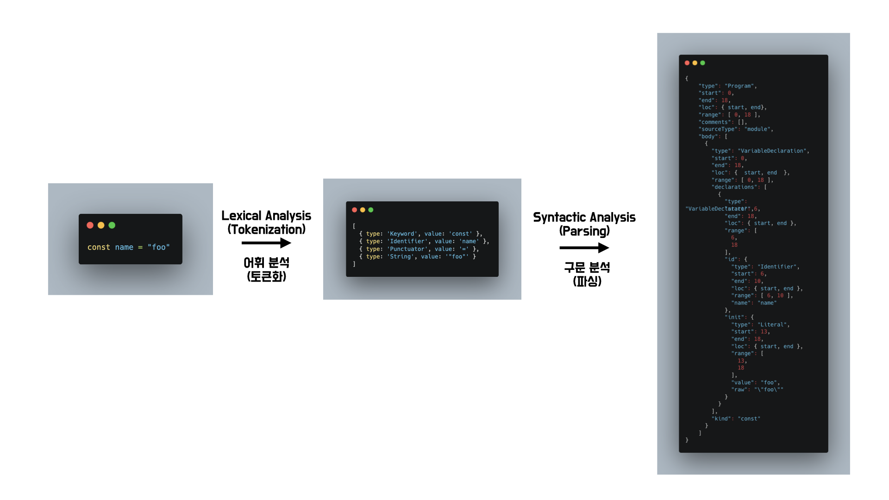

여러분은 팀내에서 ESLint를 사용하고 계신가요? 요즘은 개인 프로젝트에서도 일관된 컨벤션을 유지하기 위해 ESLint를 사용하는 만큼 대부분의 프론트엔드 개발자 분들이 팀내에서 ESLint를 사용하고 있을것입니다.

왠만한 규칙들은 이미 ESLint 생태계에 존재하기 때문에 보통 팀내에서 결정된 컨벤션에 맞는 규칙을 찾기만 하면 되는 경우가 많습니다. 하지만 도메인이 반영된 코드나 팀내에서 만들어진 라이브러리를 위한 규칙은 일반적이지 않기 때문에 존재하지 않을 가능성이 높습니다.

이때 ESLint에서 제공하는 API를 이용하면 우리 팀에만 존재하는 컨벤션을 ESLint 규칙으로 만들어 팀내 고유한 컨벤션을 ESLint에 포함시킬수 있습니다.

이번 아티클에서는 ESLint의 동작원리와 API에 대해서 살펴보고 이를 바탕으로 간단한 ESLint 규칙을 만들어보면서 ESLint에 생태계에 존재하지 않는 규칙을 만드는 방법에 대해 알아보겠습니다.


## ESlint의 오류 탐색 방식
ESLint는 어떤 방식으로 코드에서 오류를 찾아내고 이를 수정해주는것일까요? 설명을 위해 `==` 대신 `===` 연산자를 사용하도록 강제하는 eqeqeq라는 ESLint 규칙을 예시로 사용하겠습니다.

가장 간단하게 생각해볼수 있는건 IDE에서 제공하는 리팩토링처럼 코드 내의 모든 `==` 를 찾아서 경고한뒤 --fix 옵션을 사용하면 모두 `===` 로 바꿔주는것입니다. 큰 문제가 없어보이지만, 연산자가 아닌 문자열 내의 `==` 도 `===` 로 변경하므로 아래와 같은 상황이 발생할 수 있습니다.
```
// FIXME: 히스토리 파악후 == 대신 === 를 사용하도록 수정해주세요 // before

// FIXME: 히스토리 파악후 === 대신 === 를 사용하도록 수정해주세요 // after ??? 이게 무슨말이에요...
```

따라서 ESLint는 소스코드에서 키워드를 검색하는 방식으로 오류를 탐색하는것이 아니라 소스코드를 AST라는 의미있는 정보로 변환한뒤 AST의 타입정보를 기반으로 하여 소스코드 내에서 오류를 탐색합니다. AST라는 처음 보는 단어가 등장하였는데 AST는 ESLint Custom Rule을 만드는데 있어서 매우 중요한 요소이기 때문에 아래에서 보다 자세히 살펴보겠습니다. 


## AST 이해하기


AST(Abstract Syntax Tree)는 소스코드를 트리형태로 표현한것입니다. 일반적으로 Babylon 같은 AST파서를 이용하여 소스코드에서 AST를 만들어냅니다.

AST파서를 통해 소스코드로부터 AST가 생성되기까지 두번의 변환이 필요합니다. 이 두번의 변환은 정의된 규칙을 사용하여 문자를 읽어 이를 토큰으로 결합하는 어휘 분석 단계와 이 토큰들을 가져와 AST로 변환하는 파서 단계로 이 두가지 단계를 거치면 비로소 AST가 생성됩니다.

### AST 상세 분석
AST에는 노드라는 기본단위가 존재합니다. 노드란 문법적으로 의미있는 단위를 뜻하는 말로 함수, 객체, 변수, 식별자등이 여기에 해당합니다. 일반적으로 노드에는 타입(type)과 위치 정보(loc, start, end, range)가 공통적으로 존재하며 타입별로 필요한 정보가 추가적으로 존재합니다. 노드에 대해서는 아래에서 실제 AST를 분석하면서 좀더 살펴보겠습니다.

AST 분석을 위해 예제코드로 앞서 설명을 위해 사용하였던 `const name = "foo"` 를 재사용하겠습니다.

```json
{
    "type": "Program",
    "start": 0,
    "end": 18,
    "loc": { start, end },
    "range": [ 0, 18 ],
    "comments": [],
    "sourceType": "module",
    "body": [
      {
        "type": "VariableDeclaration",
        "start": 0,
        "end": 18,
        "loc": { start, end },
        "range": [ 0, 18 ],
        "declarations": [
          {
            "type": "VariableDeclarator",
            "start": 6,
            "end": 18,
            "loc": { start, end },
            "range": [ 6, 18 ],
            "id": {
              "type": "Identifier",
              "start": 6,
              "end": 10,
              "loc": { start, end },
              "range": [ 6, 10 ],
              "name": "name"
            },
            "init": {
              "type": "Literal",
              "start": 13,
              "end": 18,
              "loc": { start, end },
              "range": [ 13, 18 ],
              "value": "foo",
              "raw": "\"foo\""
            }
          }
        ],
        "kind": "const"
      }
    ]
}
```
#### 최상위 노드(Program)

```json
{
    "type": "Program",
    "start": 0,
    "end": 18,
    "loc": { start, end },
    "range": [ 0, 18 ],
    "comments": [],
    "sourceType": "module",
    "body": [ ... ]
}
```
AST의 최상위 노드의 타입은 Program 입니다. 우리가 일반적으로 사용하는 개념인 전역객체와 매우 유사합니다. 이 타입에는 추가적인 프로퍼티가 세가지 존재합니다.

- comments : 해당 파일내의 모든 주석이 담겨있습니다.
- sourceType: ECMAScript 모듈이면 `module`, 단일 파일의 독립적인 javascript코드이면 `script`입니다.
- body : 함수의 본문처럼, 모든 소스코드 노드를 포함하고 있습니다. 주석의 경우 comments에 포함되므로 body에 포함되지 않습니다.

일반적으로 소스코드의 정보에 접근하기 위해 body를 사용합니다. 위 예제코드의 경우 소스코드가 한줄이기 때문에 body배열의 길이도 1입니다. 따라서 body의 첫번째 요소 노드에 대해서 살펴봅시다. 

#### body의 첫번째 요소 노드

```json
{
  "type": "VariableDeclaration",
  "start": 0,
  "end": 18,
  "loc": { start, end },
  "range": [ 0, 18 ],
  "declarations": [ ... ],
  "kind": "const"
}
```

body의 첫번째 요소 노드는 변수선언입니다. 이 노드는 VariableDeclaration 타입으로 두가지 추가적인 프로퍼티를 가집니다.

- declarations : 선언에 대한 구체적인 정보를 가지고 있습니다. 배열인 이유는 `let a,b,c;`와 같이 하나의 변수 선언에 여러 변수를 선언할 수 있기 때문입니다.
- kind: 변수 선언에 사용된 키워드를 명시합니다. `var`, `const`, `let` 이 가능합니다.

declarations 프로퍼티 내부를 살펴보면 변수 선언에 대한 구체적인 정보를 얻을수 있습니다. 우리가 선언한 변수는 하나이므로, 해당 배열내 첫번째 요소를 살펴보겠습니다.

#### declarations의 첫번째 요소 노드
```json
{
  "type": "VariableDeclarator",
  "start": 6,
  "end": 18,
  "loc": { start, end },
  "range": [ 6, 18 ],
  "id": { ... },
  "init": { ... }
}
```

declarations의 첫번째 요소 노드는 변수선언자입니다. 이 노드는 VariableDeclarator 타입으로 두가지 추가적인 프로퍼티를 가집니다.

- id: 우리가 흔히 변수명이라고 불리는 식별자 노드가 담깁니다. 여기서는 name이 이에 해당합니다.
- init: 초기값 노드가 담깁니다. 여기서는 "foo"가 이에 해당합니다.

id와 init는 모두 자주 사용되는 정보로 각 프로퍼티가 노드를 가지고 있습니다. id와 init순으로 살펴보겠습니다.

#### id의 노드

```json
{
  "type": "Identifier",
  "start": 6,
  "end": 10,
  "loc": { start, end },
  "range": [ 6, 10 ],
  "name": "name"
}
```
id 프로퍼티는 Identifier타입의 노드를 가지고 있습니다. 노드내에 특별한 정보는 없고 변수명을 담고 있는 프로퍼티인 name이 존재합니다. 변수뿐만 아니라 함수이름 클래스 이름등도 해당 타입의 노드가됩니다.

이 노드는 특정 프로퍼티가 노드를 포함하고 있지 않기 때문에 최하위 노드입니다.

#### init의 노드
```json
{
	"type": "Literal",
	"start": 13,
	"end": 18,
	"loc": { start, end },
	"range": [ 13, 18 ],
	"value": "foo",
	"raw": "\"foo\""
}
```
init 프로퍼티는 Literal타입의 노드를 가지고 있습니다. 이는 초기값으로 문자열을 할당했기 때문입니다. 해당 노드에는 실제 의미있는 값을 의미하는 value와 소스코드상에 명시된 값을 의미하는 raw 프로퍼티가 존재합니다. 일반적으로 리터럴로 표기된 값이 해당 타입의 노드가 됩니다.

이 노드는 특정 프로퍼티가 노드를 포함하고 있지 않기 때문에 최하위 노드입니다.

#### 정리

`const name = "foo"` 소스코드의 AST를 분석해보았습니다. 기억해야할것은 최상위 노드의 타입이 Program이라는것과 Program 노드의 내부에 존재하는 노드들은 여러 타입들이 존재하며 노드는 또 다른 노드를 프로퍼티에 포함하고 있을수 있다는 사실입니다.

또한 노드의 경우 앞서 살펴본 VariableDeclaration, VariableDeclarator, Literal, Identifier 외에도 화살표 함수를 의미하는 ArrowFunctionExpression, If문을 의미하는 IfStatement 등 수많은 타입이 존재합니다. 타입의 종류가 엄청 많고 타입마다 추가적으로 존재하는 프로퍼티가 다르기 때문에 모든 타입을 다 외우기 보다는 필요할때마다 [소스코드를 AST로 변환](https://astexplorer.net/)시켜 타입을 살펴보는것이 좋습니다.

### 적용해보기
앞서 조그만 AST를 같이 분석해보았습니다. 이제 이를 이용해 특정 상황을 AST내에서 검색해봅시다. 모든 변수선언을 찾아 규칙을 적용한다고 할때 const, let, var과 같은 키워드를 찾는것이 아니라 AST에서 VariableDeclaration 타입을 검색함으로써 보다 정확한 검색을 할 수 있습니다.

```javascript
sourceCode.match(/(const|let|var)/) // 텍스트나 주석내의 문자도 검색됩니다.

ast.body.filter(({type})=>type==="VariableDeclaration") // 변수 선언 노드를 모두 찾을수 있습니다.
```

## ESLint 플러그인 제작을 위한 API 이해하기
AST에 대한 이해가 어느정도 쌓였다면 이제 추가적으로 알아야할 내용은 규칙 작성시 사용해야할 두가지 API, rule과 RuleTester가 어떤 방식으로 동작하는지 살펴보는것입니다.

### rule
ESLint 규칙을 만들때 규칙은 하나의 객체에 작성하게 되며 해당 객체는 객체인 meta와 함수인 create라는 프로퍼티를 가지고 있습니다.

```javascript
module.exports = {
	meta:{ .. },
  create(){}
}
```

#### meta 프로퍼티
meta에는 주로 규칙에 대한 메타 정보가 담기게 됩니다. 객체이므로 가능한 프로퍼티 별로 넣어야 하는 정보를 하나씩 살펴보겠습니다.

- type(string): 규칙의 성격을 명시합니다. 아래와 같이 세가지가 가능합니다.
	- problem: 코드의 에러발생을 방지하는 규칙
  - suggestion: 코드를 더 좋게 변경하지만 에러발생을 막는것은 아닌 규칙
  - layout: 공백, 세미콜론, 쉼표등 코드 모양과 관련된 규칙
- docs(object): 문서 정보와 관련이 있습니다. 객체 형태로 세가지 프로퍼티를 가질수 있습니다.
	- description(string): 규칙에 대한 간단한 설명
  - recommended(boolean): eslint:recommended 와 같이 추천에 포함할지 여부
  - url(string): 규칙 문서 링크(ide 오류에서 링크에 접근 가능)
- messages(object): 에러 메시지를 미리 정의할수 있습니다. 객체의 프로퍼티 키가 에러 메시지 제목이 되며 이를 이용해 테스트 코드나, 규칙 내부에서 사용가능합니다.
- fixable(string): code 또는 whitespace를 가질수 있으며 규칙이 수정가능한 경우 값을 넣어야합니다
- hasSuggestions(boolean): 규칙이 수정 제안을 제공하는경우 활성화
- schema(object|array): [json schema](https://json-schema.org/)를 이용하여 options의 타입 지정
- deprecated(boolean): 해당 규칙 deprecated 여부
- replacedBy(array): 해당 규칙이 deprecated 되었다면 이를 대체할 수 있는 규칙 표기

일반적으로 type 정도만 작성하고 수정이 필요한경우 fixable, 옵션을 사용한다면 schema 정도를 사용하게 되며 나머지 프로퍼티는 많이 사용하지는 않습니다. 중요한건 create 함수를 작성하는것이므로 본격적으로 해당 프로퍼티를 살펴보겠습니다.

#### create 프로퍼티
create 프로퍼티는 값으로 함수를 넘겨야하며, 해당 함수는 context라는 객체가 인수로 담겨 실행됩니다. 함수의 리턴값으로는 객체를 넘겨야 하며 이 객체에는 순회할 AST 타입정보를 키값으로 하는 함수를 담게 됩니다.

##### context 객체

함수의 리턴값을 어떻게 작성해야할지 살펴보기 전에, create함수 내부에서 사용가능한 context 객체 내부에 어떤 값들이 있는지 살펴보겠습니다. id, filename, sourceCode, physicalFilename 등 많은 프로퍼티가 존재하고 유용한 프로퍼티들이 많지만, 이들을 모두 살펴보기에는 지면이 한정되어있기 때문에 중요하다고 생각하는 두가지 프로퍼티인 options와 report만 살펴보겠습니다.

options 프로퍼티를 사용하면 사용자가 eslint config 설정에서 포함한 옵션값을 받을수 있습니다. 예를들면 아래와 같습니다.
```javascript
my-rule:["error",{testOptions:true}] // config 설정

create(context){
	const testOptions = context.options[0].testOptions // 첫번째 옵션은 해당 규칙의 on off룰이므로 옵션 객체에 포함되지 않습니다.
}
```
report는 오류를 보고하고, 수정을 제안할수 있는 메서드 입니다. 해당 메서드는 하나의 객체를 인자로 받는데, 해당 객체의 프로퍼티를 살펴볼 필요가 있습니다. 이때 프로퍼티들이 사용 용도에 따라 묶이기 때문에 해당 단위에 맞춰 살펴보겠습니다.

먼저 에러가 발생한 위치를 보고하기 위해서는 node와 loc 두가지 프로퍼티를 사용합니다. node는 오류 리포트를 발생시킬 노드 객체를 담는 프로퍼티이고 loc은 오류를 발생시킬 위치를 담는 프로퍼티로 start, end 객체를 값으로 가지며 각각은 line와 column 값을 가지게됩니다. 만약 node와 loc 모두 존재하는 경우 loc이 오류 리포트에서 우선순위를 가집니다.
```javascript
// node의 위치와 관계없이 loc의 위치에 오류(빨간줄)이 표기됩니다.
context.report({
	node:IdentifierNode
    loc:{
    	start:{
        	line:1
            column:10
        }
       end:{
           line:1
           column:20
       }
    }
})
```

다음은 에러메시지와 관련된 노드입니다. 일반적으로 message와 동적인 값을 표기하기 위한 data가 사용됩니다. 
message에는 에러메시지로 표기할 데이터를 문자열로 입력하고 동적으로 입력할 값을 `{{}}` 내에 넣어두고 data내의 프로퍼티로 입력하면됩니다. 
하지만 앞서 meta에서 살펴본것 처럼 meta의 message에 messageId를 명시해둔경우 messageId만으로 에러 메시지를 표기할 수 있습니다.

```javascript
// messageId 사용하기
meta:{
    messages: {
      importName:
        '@common에서 불러온 모듈은 파일명인 {{expectedImportName}} 을 이름으로 해야하지만 현재 {{defaultImportName}} 로 불러오고 있습니다',
    },
}
...
context.report({
	node,
	messageId: 'importName',
	data: {
		defaultImportName,
		expectedImportName,
	}
});

// message 사용하기 
context.report({
	node,
	message:'@common에서 불러온 모듈은 파일명인 {{expectedImportName}} 을 이름으로 해야하지만 현재 {{defaultImportName}} 로 불러오고 있습니다',
	data: {
		defaultImportName,
		expectedImportName,
	}
});
```
마지막은 수정을 가능하게 해주는 fix프로퍼티입니다. fix프로퍼티는 함수로 fixer라는 수정에 도움되는 메서드가 포함된 객체를 인자로 받고, 실행할 fixer메서드를 리턴해야합니다. 특정 라인과 컬럼을 명시하거나 노드를 명시해 해당범위의 소스코드에 대해 제거, 교체, 추가가 가능하도록 해주는 다양한 메서드가 존재합니다. 예를들어 특정 범위의 소스코드를 특정 키워드로 변경하는 코드를 살펴보겠습니다.

```
fix(fixer) {
	return fixer.replaceTextRange(0, 20, "테스트 변경 문자열");
},
```

##### return 객체 
이제 create 함수가 return하는 객체를 작성해봅시다. create함수는 AST트리를 순회 하면서 return 객체의 프로퍼티키에 명시되어있는 타입과 선택자에 맞는 노드를 방문한 경우 해당 프로퍼티에 담긴 함수를 실행하므로 우리가 규칙을 적용하기를 원하는 노드를 키로, 해당 노드 발견시 실행할 함수를 값으로 담아 return 할 객체를 만들어 내면 됩니다. 이때 값에 담기는 함수에는 기본적으로 발견한 노드를 인자로 넘겨주므로 해당 인자를 이용하여 실행할 함수 내부를 완성하면 됩니다.

결국 여기서 중요한것은 타입과 선택자를 잘 조합하여 원하는 노드를 명시하는것입니다. 타입의 경우 앞서 이야기한것처럼 AST 노드의 type 프로퍼티에 명시된 것들로 VariableDeclaration과 같은것입니다. 선택자는 타입을 더욱 강화하여 노드 내의 프로퍼티에 조건을 걸거나 부정, 자식노드 검색등이 가능해 보다 강력하게 원하는 노드를 제약할수 있습니다. 

예를들어 특정 타입에 존재하는 프로퍼티가 특정값을 가진경우의 노드를 찾고싶다고 해봅시다. setTimeout 함수를 실행하는 코드`setTimeout(()=>{},1000)`를 선택하고 싶을경우 아래와 같이 작성하면 됩니다.
```javascript
create(context){
	"CallExpression[callee.name='setTimeout']":function(node){
      console.log(node)
    }
}
```
### RuleTester

규칙을 작성하였으면 이를 테스트 할수 있는 테스트 코드도 작성할 수 있어야합니다. 이를 위해 ESLint에서는 Custom Rule의 테스트 코드 작성을 손쉽게 할수 있도록 RuleTester라는 API를 제공합니다. 

RuleTester는 클래스로 사용을 위해서는 인스턴스화가 필요합니다. 이때 초기값으로 parser와 parserOptions를 넣을수 있습니다. parser의 경우 AST로 변환할 도구를 선택하는것입니다. 만약 넣지 않을경우 기본적으로 제공되는 파서를 선택하지만 typescript규칙을 작성할경우 `@typescript-eslint/parser` 와 같은 파서를 사용해 테스트 하는것이 필요합니다. 

parserOptions는 파싱할때 파싱 옵션을 의미합니다. 보통 우리가 eslint.config.js에 넣는 옵션과 동일합니다. 따라서 이 옵션들을 적용하여 만든 인스턴스는 다음과 같습니다.

```javascript
const { RuleTester } = require('eslint');
const parser = require.resolve('@typescript-eslint/parser'); // 타입스크립트파일에 규칙을 적용할거라면 필요합니다.

const parserOptions = {
  ecmaVersion: 2020, // 2020 버전의 es
  sourceType: 'module', // import를 사용하는 모듈 타입
};

const ruleTester = new RuleTester({
  parser,
  parserOptions,
});
```

이렇게 ruleTester의 인스턴스를 만들었다면 메서드인 run을 통해 테스트를 실행할수 있습니다. run의 첫번째 인자는 규칙이름이고 두번째는 앞서 만들었던 규칙이며 세번째는 테스트 코드가 담긴 객체입니다.

세번째 인자는 테스트 코드가 담겨있으며 객체형태로 valid와 invalid 두가지 프로퍼티를 가집니다. valid 프로퍼티에는 유효한 테스트 케이스를 입력해야하며 필수적으로 code에 유효한 코드를 입력해야합니다. invalid 프로퍼티에는 유효하지 않은 테스트 케이스를 입력해야하며 필수적으로 code에 유효하지 않은 코드를 입력하고, 에러메시지가 포함된 객체를 에러 발생 횟수 및 순서에 따라 errors 배열에 넣어야하며 만약 수정이 된다면 outputs에 수정된 코드를 넣어주어야합니다.

글 초반부에 살펴본 eqeqeq(`==`대신 `===` 사용을 강제하는 규칙)에 대한 테스트 코드는 아래와 같습니다. 
```javascript
const eqeqeqRule = require('./eqeqeq');

ruleTester.run('eqeqeq', eqeqeqRule, {
  valid: [{ code: `const isTrue = 1 === "1"` }],
  invalid: [
    {
      code: `const isTrue = 1 == "1"`,
      output: `const isTrue = 1 == "1"`,
      errors: [{ messageId: 'toEqeqeq' }],
    },
  ],
});

```

## Custom Rule 직접 만들어보기
이제 간단한 플러그인을 처음부터 끝까지 만들어보면서 이제까지 살펴보았던 내용을 모두 적용해보겠습니다.

만들고자 하는 규칙은 @common으로 시작하는 절대 경로를 가진 default import 에서 import 명은 반드시 불러온 파일 이름과 동일해야한다는 규칙이며, 이때 잘못 import하고 있는경우 수정해주는 기능을 포함하고 있습니다. 아래 예제 코드를 살펴보면 이해하기 쉽습니다. 

```
import utils from "@common/utils" // correct!
import utilites from "@common/utils" // incorrect!
import utilites from "../../utils" // correct! because import path is not include @common
```
> 예제로 만드는 코드는 typescript코드를 고려하지 않기 때문에 typescript 파일에서 정상적으로 적용되지 않을수도 있습니다. 이유는 typescript parser와 ESLint 기본 파서간에 파싱 결과물에 있어서 차이가 존재하기 때문입니다. 

### 프로젝트 세팅하기
먼저 플러그인을 위해 새로운 폴더를 생성합니다. 기존에 진행중인 프로젝트 내부도 좋고, 완전 새로운 폴더로 생성해도 좋습니다. 이후 초기화 한뒤 필요한 종속성을 설치합니다. 종속성으로 설치할 라이브러리는 ESLint 하나 뿐입니다. 

```
 npm init -y
 npm i eslint -D
```

### 테스트 코드 작성하기
앞서 배운 ruleTester를 사용해 우리가 작성할 규칙의 테스트 코드를 먼저 작성해 보겠습니다. TDD로 진행할것은 아니지만, 테스트코드를 먼저 살펴보는것이 규칙을 이해하는데 도움이 되기 때문입니다. 

유효한 결과가 나올 코드와 유효하지 않은 결과가 나올 코드 각각에 대한 테스트 코드가 필요합니다. 아래 테스트 시나리오를 토대로 테스트 코드를 작성해 보겠습니다.

유효한 결과
- common 모듈을 하나 import 하는경우
- common 모듈하나, 다른 모듈 하나를  import 하는경우
- common 모듈을 두개 import 하는경우

유효하지 않은 결과
- common 모듈을 하나를 잘못 import 하는경우
- common 모듈하나를 잘못 import하고, 다른 모듈 하나를 import 하는경우
- common 모듈을 두개를 잘못 import 하는경우

root에 common-default-import-name.test.js파일을 만들고 아래 코드를 작성해봅시다.
```javascript
const { RuleTester } = require('eslint');
const fooBarRule = require('./common-default-import-name');

const parserOptions = {
  ecmaVersion: 2020,
  sourceType: 'module',
};

const ruleTester = new RuleTester({
  parser,
  parserOptions,
});

const validationsError = {
  messageId: 'importName',
  data: {
    defaultImportName: 'validations',
    expectedImportName: 'validators',
  },
};

const utilitiesError = {
  messageId: 'importName',
  data: {
    defaultImportName: 'utilities',
    expectedImportName: 'utils',
  },
};

ruleTester.run('common-default-import-name', fooBarRule, {
  valid: [
    {
      code: `
        import utils from "@common/utils"

        const utilResult = utils.addition(1, 2)
        utils.addition(1, 2)
        console.log(utils.addition(1, 2))
        `,
    },
    {
      code: `
        import utils from "@common/utils"
        import validators from "@common/validators"

        const utilResult = utils.addition(1, 2)
        utils.addition(1, 2)
        console.log(utils.addition(1, 2))

        const validatorResult = validators.isMobilePhone("010-123-4567")
        validators.isMobilePhone("010-123-4567")
        console.log(validators.isMobilePhone("010-123-4567"))
      `,
    },
    {
      code: `
        import commonHelper from "../helper"
        import commonConstant from "../constant"

        const helperResult = commonHelper.test(1, 2)
        commonHelper.test(1, 2)
        console.log(commonHelper.test(1, 2))

        const result = commonConstant.MAX_LENGTH
        commonConstant.MAX_LENGTH
        console.log(commonConstant.MAX_LENGTH)
      `,
    },
  ],
  invalid: [
    {
      code: `
        import utilities from "@common/utils"

        const utilResult = utilities.addition(1, 2)
        utilities.addition(1, 2)
        console.log(utilities.addition(1, 2))
        `,
      output: `
        import utils from "@common/utils"

        const utilResult = utils.addition(1, 2)
        utils.addition(1, 2)
        console.log(utils.addition(1, 2))
        `,
      errors: [utilitiesError, utilitiesError, utilitiesError, utilitiesError],
    },
    {
      code: `
        import utilities from "@common/utils"
        import validations from "../../validators"

        const utilResult = utilities.addition(1, 2)
        utilities.addition(1, 2)
        console.log(utilities.addition(1, 2))

        const validatorResult = validations.isMobilePhone("010-123-4567")
        validations.isMobilePhone("010-123-4567")
        console.log(validations.isMobilePhone("010-123-4567"))
        `,
      output: `
        import utils from "@common/utils"
        import validations from "../../validators"

        const utilResult = utils.addition(1, 2)
        utils.addition(1, 2)
        console.log(utils.addition(1, 2))

        const validatorResult = validations.isMobilePhone("010-123-4567")
        validations.isMobilePhone("010-123-4567")
        console.log(validations.isMobilePhone("010-123-4567"))
        `,
      errors: [utilitiesError, utilitiesError, utilitiesError, utilitiesError],
    },
    {
      code: `
        import utilities from "@common/utils"
        import validations from "@common/validators"

        const utilResult = utilities.addition(1, 2)
        utilities.addition(1, 2)
        console.log(utilities.addition(1, 2))

        const validatorResult = validations.isMobilePhone("010-123-4567")
        validations.isMobilePhone("010-123-4567")
        console.log(validations.isMobilePhone("010-123-4567"))
        `,
      output: `
        import utils from "@common/utils"
        import validators from "@common/validators"

        const utilResult = utils.addition(1, 2)
        utils.addition(1, 2)
        console.log(utils.addition(1, 2))

        const validatorResult = validators.isMobilePhone("010-123-4567")
        validators.isMobilePhone("010-123-4567")
        console.log(validators.isMobilePhone("010-123-4567"))
        `,
      errors: [
        utilitiesError,
        validationsError,
        utilitiesError,
        utilitiesError,
        utilitiesError,
        validationsError,
        validationsError,
        validationsError,
      ],
    },
  ],
});

```

### rule 작성하기
rule을 작성할때는 크게 meta 프로퍼티와 create 프로퍼티로 나누어진다고 이야기 하였습니다. 먼저 meta 프로퍼티를 작성한후 create 프로퍼티를 작성해봅시다.

#### meta 프로퍼티
우리가 작성할 코드가 오류를 발생시킬 정도는 아니므로 type에는 'suggestion'을 넣어줍니다. docs에는 간단하게 description을 포함해줍시다. 선택사항이므로 적지 않아도 괜찮습니다. 에러 메시지를 messageId로 관리할 예정이므로 message 프로퍼티에 importName이라는 에러메시지를 정의해줍시다. 코드 수정이 계획되어있으므로 fix에 'code'를 적고 옵션은 계획에 없으므로 schema는 비워둡시다. 이를 표현하면 아래와 같습니다.


```	javascript
meta: {
    type: 'problem',
    docs: {
      description: '@common 하위에서 default import 하는경우 불러온 파일명을 이름으로 해야합니다.',
    },
    messages: {
      importName:
        '@common에서 불러온 모듈은 파일명인 {{expectedImportName}} 을 이름으로 해야하지만 현재 {{defaultImportName}} 로 불러오고 있습니다',
    },
    fixable: 'code',
    schema: [],
  }
```

#### create 프로퍼티
프로퍼티를 작성하기전에 가장 먼저 해야할일은, 우리가 타겟으로 삼는 코드의 AST구조를 알아내는것입니다. 앞서 작성한 유효하지 않은 테스트 케이스중 한가지를 예시로 사용하겠습니다.
```javascript
import utilities from "@common/utils"

const utilResult = utilities.addition(1, 2)
utilities.addition(1, 2)
console.log(utilities.addition(1, 2))
```
[소스코드를 AST로 변환하여 주는 사이트](https://astexplorer.net/)에접속해 valid 테스트 코드중 하나를 돌린뒤 최상위 노드인 Program 타입만 가져와 봅시다.
```json
{
    "type": "Program",
    "start": 0,
    "end": 24,
    "loc": { ... },
    "range": [ 8, 161 ],
    "comments": [],
    "sourceType": "module",
    "body": [
      ImportDeclaration
      VariableDeclaration
      ExpressionStatement
      ExpressionStatement
    ]
}
```
최상위 타입인 Program 노드를 살펴보면 body의 첫번째 요소에 존재하는 ImportDeclaration 타입이 우리가 첫번째로 선언한 타입임을 쉽게 알 수 있습니다. 이 노드를 분석하면서 어떤 요소를 검사해야 import 경로와 이름을 비교할수 있는지 알아봅시다.

```json
{
  "type": "ImportDeclaration",
  "start": 8,
  "end": 41,
  "loc": { ... },
  "range": [ 8, 41 ],
  "specifiers": [
    {
      "type": "ImportDefaultSpecifier",
      "start": 15,
      "end": 20,
      "loc": { ... },
      "range": [ 15, 20 ],
      "local": {
        "type": "Identifier",
        "start": 15,
        "end": 20,
        "loc": { ... },
        "range": [ 15, 20 ],
        "name": "utils"
      }
    }
  ],
  "source": {
    "type": "Literal",
    "start": 26,
    "end": 41,
    "loc": { ... },
    "range": [ 26, 41 ],
    "value": "@common/utils",
    "raw": "\"@common/utils\""
  }
}
```
ImportDeclaration 타입의 노드에는 추가로 존재하는 프로퍼티가 specifiers, source 두가지입니다. 이를 좀더 살펴보면 specifiers의 경우 import 시 가져오는 모듈의 이름이고, source의 경우 모듈의 경로임을 알 수 있습니다. 따라서 이 두 프로퍼티를 적절히 이용하면 손쉽게 오류 검출 및 수정이 가능해 보입니다.

먼저 source에서 경로를 찾아봅시다. source의 value프로퍼티에 경로가 담겨있으므로 여기에 "/"로 split하여 마지막 요소를 얻으면 import 이름으로 사용해야하는 결과물이 나옵니다.

다음은 specifiers에서 import 모듈 이름을 찾아봅시다. specifiers은 배열로 여러개가 존재할수 있음을 알수 있습니다. 이는 default가 아니라 객체형태로 import하는 경우를 대비한 케이스입니다. 따라서 specifiers의 배열내 요소중, 타입이 ImportDefaultSpecifier인 default import 노드를 찾아 local 프로퍼티의 name을 찾아 앞서 source에서 찾은 규칙 이름과 동일한지 비교하면됩니다.

```javascript
  create(context) {
    const includePath = '@common';
    const obj = {};
    return {
      ImportDeclaration(node) {
        const isDefaultImport =
          node.specifiers.length === 1 && node.specifiers[0].type === 'ImportDefaultSpecifier'; // specifiers의 길이가 1이고, 첫번째 노드의 타입이 ImportDefaultSpecifier 인 경우 규칙을 적용할 default import입니다.

        // 
        if (isDefaultImport) {
          const defaultImportName = node.specifiers[0].local.name; // 현재 import 이름
          const expectedImportName = node.source.value.includes(includePath) 
            ? node.source.value.split('/').reverse()[0]
            : defaultImportName; // source에서 찾아낸 기대되는 import 이름

          // 현재 이름과 기대되는 이름이 다르면 오류 리포트
          if (defaultImportName !== expectedImportName) {
            obj[defaultImportName] = expectedImportName;
            context.report({
              node,
              messageId: 'importName',
              data: {
                defaultImportName,
                expectedImportName,
              },
              fix(fixer) {
                // 실제 import 이름이 명시된 범위를 기대되는 import 이름으로 변경
                return fixer.replaceTextRange(
                  [node.specifiers[0].range[0], node.specifiers[0].range[1]],
                  expectedImportName,
                );
              },
            });
          }
        }
      },
    };
  },
```
여기까지 왔다면 import이름이 기대하는 바와 다를때 오류를 리포트하고 자동수정까지 해주는 기능을 만든것입니다. 하지만 한가지 간과한것이 있다면 이름 수정시 이전 이름을 사용하는 코드를 모두 찾아 수정해야한다는것입니다. 이를 위해서 앞서 살펴보지 않은 body의 2~4 번째 타입을 살펴보겠습니다.

```json
{
    "type": "VariableDeclaration",
    "start": 51,
    "end": 90,
    "loc": { ... },
    "declarations": [
      {
        "type": "VariableDeclarator",
        "start": 57,
        "end": 90,
        "loc": { ... },
        "id": { ... },
        "init": {
          "type": "CallExpression",
          "start": 70,
          "end": 90,
          "loc": { ... },
          "callee": {
            "type": "MemberExpression",
            "start": 70,
            "end": 84,
            "loc": { ... },
            "object": {
              "type": "Identifier",
              "start": 70,
              "end": 75,
              "loc": { ... },
              "name": "utils"
            },
            "computed": false,
            "property": { ... }
          },
          "arguments": [ ... , ... ]
        }
      }
    ],
    "kind": "const"
},
{
    "type": "ExpressionStatement",
    "start": 99,
    "end": 119,
    "loc": { ... },
    "expression": {
      "type": "CallExpression",
      "start": 99,
      "end": 119,
      "loc": { ... },
      "callee": {
        "type": "MemberExpression",
        "start": 99,
        "end": 113,
        "loc": { ... },
        "object": {
          "type": "Identifier",
          "start": 99,
          "end": 104,
          "loc": { ... },
          "name": "utils"
        },
        "computed": false,
        "property": {
          "type": "Identifier",
          "start": 105,
          "end": 113,
          "loc": { ... },
            "identifierName": "addition"
          },
          "name": "addition"
        }
      },
      "arguments": [ ..., ...]
},
{
    "type": "ExpressionStatement",
    "start": 128,
    "end": 161,
    "loc": { ... },
    "expression": {
      "type": "CallExpression",
      "start": 128,
      "end": 161,
      "loc": { ... },
      "callee": {
        "type": "MemberExpression",
        "start": 128,
        "end": 139,
        "loc": { ... },
        "object": { ... },
        "computed": false,
        "property": { ... }
      },
      "arguments": [
        {
          "type": "CallExpression",
          "start": 140,
          "end": 160,
          "loc": { ... },
          "callee": {
            "type": "MemberExpression",
            "start": 140,
            "end": 154,
            "loc": { ... },
            "object": {
              "type": "Identifier",
              "start": 140,
              "end": 145,
              "loc": { ... },
              "name": "utils"
            },
            "computed": false,
            "property": { ... }
          },
          "arguments": [ ..., ... ]
        }
    ]
  }
}
```
세가지 타입 노드를 최소한으로 줄여 표기해보았습니다. utils라는 이름이 있는 노드를 찾아보면 모두 Identifier 라는 노드임을 알수 있습니다. 이 노드는 식별자로 우리가 사용하는 변수명이나 함수명 등을 의미하기에, 이 노드의 이름이 utils인경우를 찾아 변경하면 된다는것을 알 수 있습니다.

다만 모든 Identifier에서 name을 찾아 변경하면 문제가 생길수 있기에 예외조건이 필요합니다. 첫번째는 import문에서 검사를 굳이 할필요가 없기 때문에 그냥 패스하는것이고 두번째는 객체의 프로퍼티 `test.utilites`와 같은 형태도 utils로 변경하면 안되기에, 이에대한 예외처리가 필요합니다.

첫번째 예외처리는 import문 작성때처럼 해당 타입을 무시하면 되고, 두번째의 경우 ESLint 기본 파서에서 부모의 노드를 parents라는 프로퍼티로 제공하므로 부모 노드의 propery 타입이 자기자신인경우 즉 자신이 프로퍼티인경우 무시하는 로직을 추가하면 됩니다. 

위 예외조건과 더불어 import문 작성시 필요한 요건이 있습니다. 바로 import문을 검사할때 변경대상 키워드와 변경된 키워드를 map형태로 저장해두는것입니다. 그리고 Identifier node의 이름이 변경대상인경우 위 예외조건을 포함하여 이름변경을 수행하는것입니다.

이와 같은 로직을 모두 포함한 전체 create 함수는 다음과 같습니다. 
```javascript
  create(context) {
    const includePath = '@common';
    const obj = {};
    return {
      ImportDeclaration(node) {
        const isDefaultImport =
          node.specifiers.length === 1 && node.specifiers[0].type === 'ImportDefaultSpecifier';

        if (isDefaultImport) {
          const defaultImportName = node.specifiers[0].local.name;
          const expectedImportName = node.source.value.includes(includePath)
            ? node.source.value.split('/').reverse()[0]
            : defaultImportName;

          if (defaultImportName !== expectedImportName) {
            obj[defaultImportName] = expectedImportName;
            context.report({
              node,
              messageId: 'importName',
              data: {
                defaultImportName,
                expectedImportName,
              },
              fix(fixer) {
                return fixer.replaceTextRange(
                  [node.specifiers[0].range[0], node.specifiers[0].range[1]],
                  expectedImportName,
                );
              },
            });
          }
        }
      },
      Identifier(node) {
        const defaultImportName = node.name;
        const expectedImportName = obj[defaultImportName];
        if (
          !expectedImportName ||
          node.parent.type === 'ImportDefaultSpecifier' ||
          (node.parent.type === 'MemberExpression' && node.parent.property.name === node.name)
        )
          return;

        context.report({
          node,
          messageId: 'importName',
          data: {
            defaultImportName,
            expectedImportName,
          },
          fix(fixer) {
            return fixer.replaceTextRange([node.range[0], node.range[1]], expectedImportName);
          },
        });
      },
    };
  }
```

### 플러그인 번들링 및 사용하기 

이제 만들어진 플러그인을 직접 사용해 봅시다. 루트에 이 룰을 적용하기 위해 `eslint-plugin-bandi.js` 파일을 생성후 아래 코드를 작성합니다.

```javascript
// eslint-plugin-bandi.js

const fooBarRule = require("./enforce-foo-bar");
const plugin = { rules: { "enforce-foo-bar": fooBarRule } };
module.exports = plugin;
```

그리고 루트에 `eslint.config.js` 파일을 생성한 뒤 규칙을 적용할수 있도록 아래 코드를 작성합니다.


```javascript
"use strict";

const eslintPluginBandi = require("./eslint-plugin-bandi");

module.exports = [
    {
        files: ["**/*.js"],
        languageOptions: {
            ecmaVersion: 2020,
            sourceType: 'module',
        },
        plugins: {"bandi": eslintPluginBandi},
        rules: {
            "bandi/common-default-import-name": "error",
        },
    }
]
```

이제 `sample.js`파일을 만들고 해당 파일내부에 잘못된 규칙이 적용된 코드를 적은뒤 `npx eslint sample.js` 와 같이 ESLint를 실행하면 규칙을 사용해볼수있습니다.

> Custom Rule을 npm패키지로 관리하고 싶다면  [관련 아티클](https://kdydesign.github.io/2020/08/28/npm-tutorial/)을 참고해보세요

### 발전시켜보기
예제 규칙 만들기는 여기서 마무리하지만, 추가적으로 해볼만한것들이 아직 남아있습니다.

- 옵션을 허용하여 특정 파일의 경우 이름을 자유롭게 설정하거나 특정 이름을 가지도록 설정하기
- typescript에서 지원이 가능하도록 테스트 코드를 보강하기
- 자동 수정시 실제로 모듈을 사용하는 변수명만 변경되는것을 보장하도록 테스트 코드 추가하기(객체의 프로퍼티 `test.utilites`와 같은 형태에서 utilities가 변경되지 않는지)

관심이 있다면 한번 시도해보는것도 좋을것 같습니다.

> 전체 예제코드는 [github 저장소](https://github.com/developer-bandi/eslint-custom-plugin-example/tree/main)에서 보실수 있습니다.

## 마치며

이번 아티클에서는 ESLint Cutom Rule API를 사용하여 규칙을 직접 만들어 보았습니다. 기존에 AST에 대한 이해도가 있던것이 아니라면 아티클을 따라오는것이 마냥 쉽지는 않으셨겠지만 이제 간단한 규칙정도는 만들수 있게 되셨을것이라고 생각합니다.

만약 팀내에 문서로만 존재하는 컨벤션이 존재하고 이를 코드리뷰시 매번 검토하고 있었다면 이번 기회에 컨벤션을 ESLint 규칙화 한뒤 코드베이스에서 보다 손쉽게 컨벤션을 유지해보면 어떨까요?

## 참고자료
[ESLint와 AST로 코드 퀄리티 높이기](https://toss.tech/article/improving-code-quality-via-eslint-and-ast)
[ESLint 커스텀 룰 적용기](https://medium.com/@yeonbeen.park/eslint-%EC%BB%A4%EC%8A%A4%ED%85%80-%EB%A3%B0-%EC%A0%81%EC%9A%A9%EA%B8%B0-27d81168d918)
[ESLint 조금 더 잘 활용하기
](https://tech.kakao.com/2019/12/05/make-better-use-of-eslint/?source=post_page-----27d81168d918--------------------------------)
[자바스크립트 개발자를 위한 AST(번역)](https://gyujincho.github.io/2018-06-19/AST-for-JS-devlopers)
[Chapter 3. Lexical Analysis (Tokenization)](https://docs.esprima.org/en/latest/lexical-analysis.html)
[Custom Rule Tutorial](https://eslint.org/docs/latest/extend/custom-rule)
[Create Plugins](https://eslint.org/docs/latest/extend/plugins)
[Custom Rules](https://eslint.org/docs/latest/extend/custom-rules)