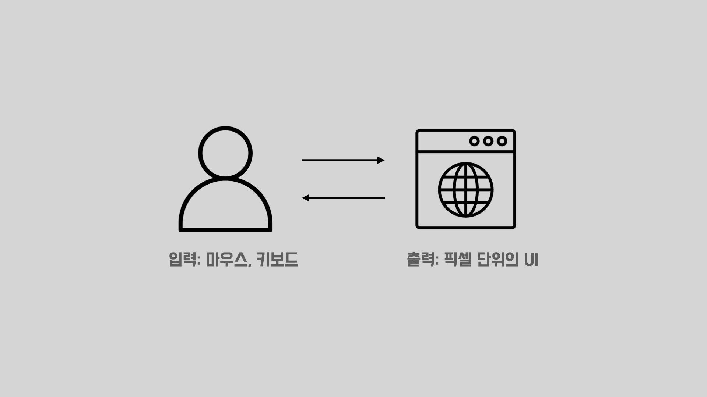
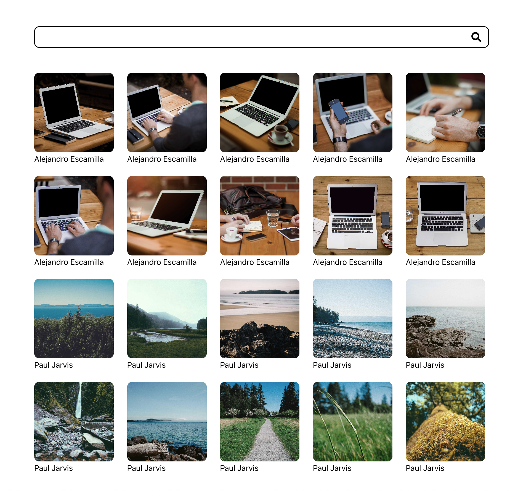
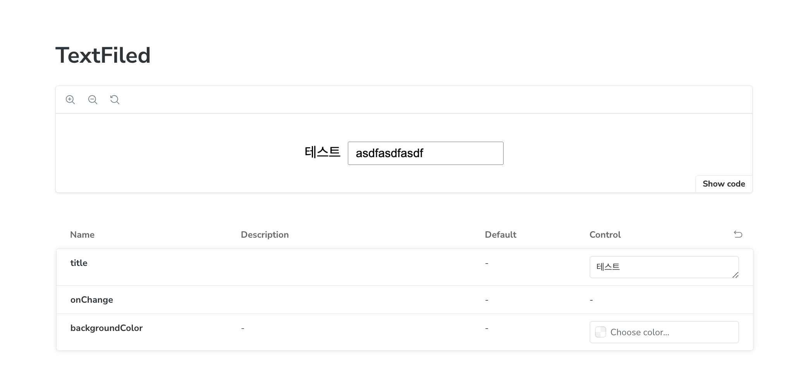
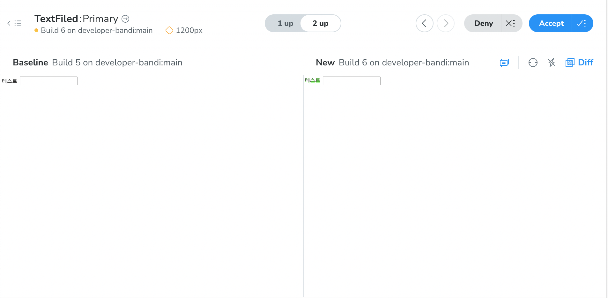

테스트란 우리가 작성한 코드가 잘 동작하는지 확인하는 행위를 말합니다. 가장 기본적이면서도 확실한 테스트는 직접 사용해보면서 우리가 작성한 기능이 잘 동작하는지 확인해 보는 것으로 회원가입 기능을 개발하였다면 유저가 사용하는것처럼 회원가입을 해보는것입니다.

하지만 이러한 방법은 문제가 있습니다. 매 코드 수정시 마다 사람이 직접 테스트를 수행해야하기에 많은 시간이 소요되며, 실수로 테스트를 누락할 가능성이 존재합니다. 따라서 일반적으로는 테스트 코드를 작성하여 테스트 과정을 자동화하게됩니다.

하지만 프론트엔드에서 테스트 코드를 통해 테스트 자동화를 하는 사례는 많지 않은편입니다. 다양한 이유가 있겠지만, 프론트엔드에서는 자주 변경되는 UI 때문에 테스트 코드가 깨지기 쉬운데 이를 보완하기 위한 보편적인 테스트 전략이 논의되지 않았다는 점이 주요한 원인이 아닐까 생각합니다.

다행히 최근에는 프론트엔드 환경에서 테스트 코드를 작성하는 방법에 대한 논의가 많이 이루어져서 프론트엔드에서도 보편적이라고 까지는 부르기 어렵지만, 프론트엔드의 환경에 맞는 테스트코드를 작성하는것에는 문제가 없을 정도의 다양한 방법들이 존재합니다.

따라서 이번 아티클에서는 프론트엔드에서 테스트 코드를 작성하는 방법들에 대해서 살펴보겠습니다.

> 이번 아티클에서는 방법론적인 측면을 설명하기에 예제 코드에 대한 설명을 깊이있게 하지 않습니다. 만약 코드를 이해하는데 어려움이 있다면 jest, react-testing-library, cypress의 공식 문서를 참고해보시면 좋겠습니다.

## 프론트엔드의 테스트 대상 이해하기


프론트엔드에서는 어떤것을 테스트 할까요? 우리가 보통 코드를 작성후 기능이 정상적으로 동작하는지를 테스트 하는 과정을 떠올려보면 프론트엔드의 테스트는 사용자 입력에 대해서 적절한 화면이 나타나는지를 확인하는것을 알 수 있습니다. 이를 좀더 구체화해보면 사용자가 발생시키는 이벤트(click, scroll, focus 등)라는 입력에 대해 특정 픽셀로 구성된 화면이 출력되는지 확인하는것을 프론트엔드 테스트 라고 할수 있습니다.

여기서 입력에 해당하는 이벤트는 대부분의 테스트 프레임워크에서 제공하고 있기 때문에 입력을 트리거 하는것은 어렵지 않습니다. 문제는 출력에 해당하는 화면입니다. 우리가 직접 테스트를 할때는 화면이 기대와 동일한지 눈으로 확인합니다. 컴퓨터에게는 사람처럼 눈이 없기 때문에 동일한지 확인하려면 화면을 픽셀 단위로 잘라서 동일한지 확인해야합니다.

하지만 픽셀을 비교하는 경우 많은 시간이 소요되기도하지만 거짓 음성이 발생하는 문제가 있습니다. 거짓 음성이란 테스트는 실패하였지만 실제 결과는 성공인 경우를 말하는데, 픽셀을 비교할때는 차이점이 존재하더라도 사람의 눈으로 보기에는 두 비교대상이 동일할수 있기 때문에 발생합니다.

따라서 픽셀을 비교단위로 삼지 않고, 테스트 하는 기능의 중요한 내용을 비교 단위로 삼는 방식을 사용할수 있습니다. 예를 들어 버튼을 누르면 특정 텍스트가 추가되어야한다면, 해당 텍스트가 화면내에 존재하는지 확인하는것입니다. 물론 앞서 픽셀을 비교하는것 보다 정확성은 떨어지지만, 앞서 언급했던 많은 시간이 소요되는 문제와 거짓음성 문제가 없다는 장점이 있습니다.

픽셀을 비교대상으로 삼는것과 중요한 내용을 비교대상으로 삼는것 모두 프론트엔드에서 테스트 코드를 작성할때 중요한 기법이며 전자를 시각적테스트, 후자를 기능적테스트라고 부릅니다. 지금부터 이 두가지 기법에 대해서 자세하게 알아보겠습니다.

## 기능 테스트

기능 테스트는 우리가 원하는 기능이 동작하는지를 검증하는 방식입니다. 따라서 출력을 검증하기 위해서 픽셀 데이터를 비교하는것이 아니라 텍스트나 컴포넌트 유무등의 기능이 동작함을 보장할수 있는 최소한의 데이터를 비교합니다.

픽셀 데이터를 비교하지 않기 때문에 정확성이 떨어진다는 단점이 있지만, 모든 픽셀데이터를 검증하는것 보다 훨씬 빠르며 테스트가 실패한경우 해당 케이스에서 코드에 문제가 있는것이 확실하므로 거짓 음성문제가 없다는 장점이 있습니다.

기능 테스트에는 단위 테스트, 통합테스트, E2E테스트가 있으며 각각은 테스트 범위와 다루는 범위가 상이합니다. 아래에서 하나씩 살펴보겠습니다.

> 사실 정적 테스트 라고 부르는 유형이 하나더 존재합니다. 일반적으로 타입스크립트나 플로우를 이용하여 타입 검사하는것을 의미하는데, 타입스크립튼 보편적으로 사용하는 편이고 이번 아티클은 테스트 코드 작성과 관련된 아티클이기에 정적 테스트는 제외하였습니다.

### 단위 테스트

단위 테스트는 코드베이스에서 기초가 되는 가장 작은 단위를 테스트 하는 방식입니다. 프론트엔드에서는 일반적으로 컴포넌트, 커스텀 훅, 유틸 함수를 테스트 하는것을 단위 테스트라고 부릅니다.

단위 테스트를 할때는 단위의 대상이 가급적 함수나 컴포넌트가 외부의 값을 참고하고 있지 않고 오로지 입력값 만을 이용해 출력값을 결정짓는 순수함수의 형태이면 좋습니다. 왜냐하면 순수함수의 경우 오로지 입력값 만으로 출력값이 정해지기 때문에 외부 상태값을 가짜로 만들어내지 않아도 되어서 테스트 하기 쉽고, 가짜 값을 만들지 않다보니 가짜 값이 유효한 값인지 신경쓰지 않아도 되어서 보다 정확한 테스트가 가능하기 때문입니다.

단위 테스트 도구로는 가장 유명하고 자주 쓰이는 jest를 사용합니다. vitest등 최근에는 jest보다 유용한 도구들이 많기 때문에 지원하는 기능과 팀내 합의에 따라 합리적인 도구를 선택하는것도 좋습니다.

이제 단위테스트의 대상이 될 수 있는 컴포넌트, 커스텀 훅, 유틸 함수에 대해서 간단한 예제 코드와 함께 테스트 코드를 작성해 보겠습니다.

#### 컴포넌트

일반적으로 가장 많이 사용되는 공통 컴포넌트인 TextField에 대해서 테스트 코드를 작성해 보겠습니다.
TextField는 아주 간단한 컴포넌트로 props를 받아 label을 노출 하며 label을 클릭하면 input이 foucus되고 input에 값을 넣으면 onChange 핸들러가 호출되는 특징을 가지고 있습니다.

```javascript
const TextField = ({ title, onChange }) => {
  return (
    <div>
      <label htmlFor={title}>{title}</label>
      <input id={title} onChange={onChange}></input>
    </div>
  )
}
```

style 요소는 테스트 할 수 없지만, 중요한 기능 두가지인 label 클릭시 input focus 여부와 onchange 핸들러 호출 여부를 테스트 하여 주요 기능이 정상 동작함을 확인합니다.

```javascript
test("label을 클릭하면 input이 foucus 됩니다", async () => {
  const title = "일련번호"
  const onChange = jest.fn()

  render(<TextField title="일련번호" onChange={onChange} />)

  userEvent.click(screen.getByText("일련번호"))

  expect(screen.getByLabelText(title)).toHaveFocus()
})

test("input에 값을 넣은 만큼 onChange 핸들러가 호출 됩니다", async () => {
  const title = "일련번호"
  const onChange = jest.fn()

  render(<TextField title={title} onChange={onChange} />)

  userEvent.click(screen.getByText(title))
  userEvent.type(screen.getByLabelText(title), "hello")

  expect(onChange).toHaveBeenCalledTimes(5)
})
```

#### 유틸 함수

객체를 쿼리스트링으로 변환하는 함수를 테스트 해보겠습니다. ObjectToQueryString이라고 불리는 이 함수는 객체의 값이 falsy한경우 쿼리에 포함하지 않으며 한글 value를 인코딩하여 쿼리 스트링으로 만드는 기능을 가지고 있습니다.

```javascript
const ObjectToQueryString = object => {
  return Object.entries(object)
    .filter(([key, value]) => !!value)
    .map(([key, value]) => {
      if (typeof value === "string" && value.match(/[ㄱ-ㅎ|ㅏ-ㅣ|가-힣]/))
        return [key, encodeURI(value)]
      return [key, value]
    })
    .map(([key, value]) => `${key}=${value}`)
    .join("&")
}
```

위 함수에 대해서 제공하는 기본 기능인 쿼리 표현을 위한 테스트 코드와 추가적으로 제공하는 기능 두가지를 테스트 하기 위해서 아래와 같이 테스트 코드를 작성해 볼 수 있습니다.

```javascript
import { objectToQueryString } from "./type"

it("하나의 쿼리만 존재하는 경우 &를 포함하지 않습니다", () => {
  const object = {
    a: "test",
  }
  const query = objectToQueryString(object)

  expect(query).toEqual("a=test")
})

it("여러 쿼리를 포함하는 경우 &로 쿼리사이를 구분하여 표기합니다", () => {
  const object = {
    a: "test",
    b: 1234,
  }
  const query = objectToQueryString(object)

  expect(query).toEqual("a=test&b=1234")
})

it('null, undefined, false, 0, "" 값을 포함하였을때 해당 값은 쿼리에 포함되지 않습니다', () => {
  const object = {
    a: null,
    b: undefined,
    c: false,
    d: 0,
    e: "",
    f: "test",
  }
  const query = objectToQueryString(object)

  expect(query).toEqual("f=test")
})

it("값에 한글이 포함되어 있는 경우 인코딩되어 출력됩니다", () => {
  const object = {
    a: "테스트",
  }
  const query = objectToQueryString(object)

  expect(query).toEqual(`a=${encodeURI("테스트")}`)
})
```

#### 커스텀 훅

흔히 캐러샐 이라고 부르는 배너의 이동을 제어하는 커스텀 훅을 만들어 보겠습니다. 간단한 훅으로 캐러샐의 이동을 제어하는 prevStep 과 nextStep함수가 존재합니다.

```javascript
export const useCarousel = (initialIndex: number, carouselLength: number) => {
  const [step, setStep] = useState(
    initialIndex < carouselLength ? initialIndex : 0
  )

  const prevStep = () => {
    if (step === 0) return setStep(carouselLength - 1)
    setStep(step - 1)
  }

  const nextStep = () => {
    if (step === carouselLength - 1) return setStep(0)
    setStep(step + 1)
  }

  return { step, prevStep, nextStep }
}
```

hook에서는 잘못 설정된 초기값을 바로잡아주는 기능과 nextStep 함수와 prevStep 함수가 각각 이동하는 기능 및 nextStep함수에서 마지막에 도달했을때 처음으로 돌아가는 기능과 prevStep함수에서 처음에 도달했때 마지막으로 돌아가는 기능을 테스트 해야합니다.

```javascript
it("초기값이 캐러샐 길이보다 긴 경우 첫번째 step을 0으로 설정한다", () => {
  const { result } = renderHook(() => useCarousel(5, 3))

  expect(result.current.step).toBe(0)
})

it("마지막이 아닌 스텝에서nextStep 함수를 호출하면 다음 스텝으로 이동한다", () => {
  const { result } = renderHook(() => useCarousel(0, 3))

  act(() => result.current.nextStep())

  expect(result.current.step).toBe(1)
})

it("마지막 스텝에서 nextStep 함수를 호출하면 처음 스텝으로 이동한다", () => {
  const { result } = renderHook(() => useCarousel(2, 3))

  act(() => result.current.nextStep())

  expect(result.current.step).toBe(0)
})

it("처음이 아닌 스텝에서 prevStep 함수를 호출하면 이전 스텝으로 이동한다", () => {
  const { result } = renderHook(() => useCarousel(1, 3))

  act(() => result.current.prevStep())

  expect(result.current.step).toBe(0)
})

it("처음 스텝에서 nextStep 함수를 호출하면 마지막 스텝으로 이동한다", () => {
  const { result } = renderHook(() => useCarousel(0, 3))

  act(() => result.current.prevStep())

  expect(result.current.step).toBe(2)
})
```

### 통합 테스트

통합 테스트는 여러 컴포넌트를 통합하여 테스트 하는것을 의미합니다. 컴포넌트를 통합한 결과는 페이지가 될 수도 있고, 페이지내의 특정 영역이 될 수도 있습니다. 이때 페이지가 작고 영역이 연관을 가지는 경우 그냥 하나의 페이지를 하나의 단위로 보는것이 좋고, 페이지 규모가 크고 영역이 연관을 가지지 않는경우 각자 영역을 하나의 통합된단위로 보는것이 좋습니다.

다만 규모가 크면서 연관이 깊은 경우 두가지를 조합하여 각자 영역에 대한 통합테스트와 페이지 단위의 통합테스트를 모두 진행하되, 페이지 단위의 통합 테스트를 할때는 각자 영역에서 진행한 통합테스트를 제외하는 방식으로 진행하는것이 좋습니다.

통합테스트시에는 단위테스트와는 달리 기획서상의 사용자 시나리오를 기준으로 테스트 코드를 작성하는것이 좋습니다. 예를 들어 랜딩페이지 접속시 서버에서 받아온 특정 데이터를 보여준다는 요구사항이 있는경우 이러한 시나리오를 사용자가 수행하는것처럼 코드를 짜는것입니다.

이때 Api의 경우 테스트를 위해 모킹을 하는것이 좋습니다. 통합 테스트 단계에서는 프론트엔드의 무결성을 증명하는것이 중요한데 실제 Api를 사용하게 되면 시간이 오래 걸리는것 뿐만 아니라 테스트가 백엔드에 의존성을 가져서 백엔드의 문제 때문에 실패하는 상황이 발생 할 수 있기 때문입니다.

위와 같이 사용자 행위 기반의 테스트를 위해서는 일반적으로 react-testing-library를 사용하지만, 경우에 따라서는 시각적 피드백이 존재하는 cypress를 사용할수도 있습니다. 전자의 경우 후자 보다 소요시간이 적게걸린다는 장점과 시각적 피드백이 없다는 단점이 있으며 후자는 시간이 오래걸린다는 단점이 있지만 시각적 피드백이 존재한다는 장점이 있으니 도구 선택시 참고하면 좋을것 같습니다.

> 통합테스트를 위한 api 모킹시에는 msw라는 라이브러리가 유용합니다. 관심이 있으시다면 [MSW를 활용하는 Front-End 통합테스트](https://fe-developers.kakaoent.com/2022/220825-msw-integration-testing/)를 참고해보세요

#### 예제 코드



상단의 이미지와 같이 간단한 검색 페이지를 테스트 해보겠습니다. 검증해야할 시나리오는 두가지입니다. 첫번째는 Input에 검색어를 입력한뒤 검색버튼을 눌렀을때 검색어를 기준으로 검색 결과가 리스트에 노출되는지 확인하는것입니다. 둘째는 Input에 검색어를 입력한뒤 검색버튼을 눌렀을때 검색 결과가 없는경우 특정 문자열을 보여주는것입니다.

내부적으로 search 컴포넌트와 list 컴포넌트의 통합 테스트를 수행합니다. 두 컴포넌트는 store을 이용해 검색 조건 및 결과 데이터를 관리하고 있으며 search 컴포넌트에서는 공통 컴포넌트인 Input을 가져와 사용합니다.

실제 코드의 분량이 방대하고 내부 구현이 중요하지는 않기 때문에 여기서는 테스트 코드만을 소개합니다. 첫번째 예제는 react-testing-library를 사용하였으며 두번째는 cypress를 이용한 경우로 두경우 모두 동일한 상황을 테스트 하고있으며 msw로 모킹을 처리한 상황입니다.

```javascript
it("검색어 입력후 검색 버튼을 클릭하면 검색 결과를 보여준다.", async () => {
  render(<App />)

  const inputBox = screen.getByRole("textbox")
  const searchButton = screen.getByRole("button")

  act(() => {
    userEvent.type(inputBox, "테스트")
    userEvent.click(searchButton)
  })

  await waitFor(() => {
    expect(screen.getAllByText("테스트", { exact: false }).length).toBe(20)
  })
})

it("검색어 입력후 검색 버튼을 클릭하였을때 결과가 없을 경우 결과가 없음을 보여준다", async () => {
  render(<App />)

  const inputBox = screen.getByRole("textbox")
  const searchButton = screen.getByRole("button")

  act(() => {
    userEvent.type(inputBox, "검색 결과 없는 검색어")
    userEvent.click(searchButton)
  })

  await waitFor(() => {
    expect(screen.getByText("검색 결과가 없습니다")).toBeInTheDocument()
  })
})
```

```javascript
it("검색어 입력후 검색 버튼을 클릭하면 검색 결과를 보여준다.", () => {
  const searchKeyword = "test"

  cy.interceptRequest(handler)

  cy.visit("/")
  cy.get("input[name=search]").type(searchKeyword)
  cy.get("button[name=search]").click()

  cy.get('[data-cy="title"]')
    .filter((index, element) => element.innerText.match(/^test[0-9]{0,2}$/))
    .should("have.length", 20)
})

it("검색어 입력후 검색 버튼을 클릭하였을때 결과가 없을 경우 결과가 없음을 보여준다", () => {
  const searchKeyword = "elseTest"

  cy.interceptRequest(handler)

  cy.visit("/")
  cy.get("input[name=search]").type(searchKeyword)
  cy.get("button[name=search]").click()

  cy.contains("검색 결과가 없습니다").should("have.length", 1)
})
```

### E2E 테스트

E2E 테스트는 End To End 테스트의 약자로 cypress, playwrite와 같은 E2E 테스트 도구를 이용하여 애플리케이션의 흐름을 처음부터 끝까지 테스트 하여 애플리케이션의 무결성을 검증하는 테스트를 의미합니다.

실제 브라우저 환경에서 실제 api를 사용하기 때문에 테스트 하는데 매우 오랜 시간이 걸리게 됩니다. 따라서 CI 환경에서 테스트 코드가 병렬적으로 실행되도록 설정해야합니다. cypress와 playwrite모두 유무료로 지원하고 있습니다.

#### 예제 코드

아래는 로그인과 관련된 간단한 cypress 예제입니다. 코드를 확인해보면 api 모킹 없이 실제 api를 사용하여 사용자가 웹사이트에 접속해 로그인하는 상황을 코드로 작성하고 테스트 합니다.

```javascript
it("사용자가 로그인 페이지에 진입해 아이디 비밀번호입력후 엔터키를 눌러 로그인에 성공하는경우 홈으로 이동해 유저 프로필을 확인한다", function () {
  // destructuring assignment of the this.currentUser object
  const username = "test"

  const password = "1234"

  // 로그인 페이지 진입
  cy.visit("/login")

  // 아이디 입력 input에 username 입력
  cy.get("input[name=username]").type(username)

  // 패스워드 입력 input에 password 입력 및 enter 입력
  cy.get("input[name=password]").type(`${password}{enter}`)

  // home으로 리다이렉션
  cy.url().should("include", "/home")

  // home에 username이 있는지 확인
  cy.get("h1").should("contain", username)
})
```

#### E2E테스트와 프론트엔드 테스트

E2E테스트는 애플리케이션 전체의 흐름을 테스트하여 무결성을 검증하기 때문에 사실 프론트엔드 테스트 라기보다 애플리케이션 테스트 라고 볼 수도 있습니다. 따라서 E2E 테스트를 도입할때는 테스트 전문가인 QA팀이 존재하는지의 여부에 따라 다른 방식이 적용되는것이 좋습니다.

QA팀이 존재하는 경우 QA팀과 논의하여 프론트팀이 QA팀을 보조하는 형식으로 E2E테스트를 진행하는것이 좋다고 생각합니다. 가령 cypress studio와 같은 도구를 사용해 low code로 테스트 코드를 작성할 수 있도록 QA팀을 도와주는것입니다.

QA팀이 존재하지 않는 경우에는 백엔드 개발자, 기획자와 충분히 협의하여 위처럼 E2E테스트 코드를 직접 작성해보면 좋다고 생각합니다.

## 시각적 테스트

앞서 설명한 기능적 테스트 만으로 우리가 만든 애플리케이션이 정상 동작함을 보장할 수 있을까요? 그렇지 않습니다. 기능은 동작할지 몰라도 글자가 너무 작아서 보이지 않거나 혹은 색상이 의도와 달라 눈에 잘 안들어올수 있습니다. 이를 위해 프론트엔드에서는 시각적 테스트를 수행해야합니다.

시각적 테스트를 수행할때는 비즈니스로직을 제외한 시각적 로직만 존재하는 이른바 UI 컴포넌트를 테스트 하는것이 좋습니다. 비즈니스 로직이 있을경우 해당 로직을 위한 더미데이터를 만들어야하는등 UI 컴포넌트를 테스트하는것 자체가 까다로울수 있기 때문입니다.

시각적 테스트는 기능적 테스트와 다르게 기대값을 직접 입력하기가 어렵습니다. 기대하는 데이터가 픽셀이나 구조적 데이터이다보니 이를 직접 만들기가 어렵습니다. 따라서 기대결과로 예상되는 상황의 화면을 픽셀 혹은 구조적 데이터로 만들어두고 이를 기대값으로 사용합니다. 따라서 기능적 테스트와 다르게 기댓값이 100% 정확한 값을 보장하지 않으므로 경우에 따라 거짓 음성이 발생할수 있습니다. 예를 들어 사람의 눈에는 동일한 이미지로 보이지만, 실상 픽셀이 미묘하게 차이나서 테스트가 실패하는 경우 거짓음성이 발생한다고 볼 수 있습니다.

시각적 테스트에는 크게 스냅샷 테스트와 시각적 회귀 테스트가 있습니다. 두가지 테스트에 대해서 알아봅시다.

### 스냅샷 테스트

스냅샷이란 특정 시점의 컴포넌트 혹은 함수의 결과를 직렬화하여 텍스트 형태로 저장해두고 매 테스트 마다 변경되었는지를 확인하여 변경이 실제 의도한것인지 확인하는것입니다. 컴포넌트 뿐만 아니라 함수에도 적용이 가능하다는 특징이 있습니다. 앞서 기능 테스트를 수행한 텍스트 필드에 대해서 스냅샷 테스트를 수행하는 코드와 결과는 다음과 같습니다.

```javascript
test("스냅샷 테스트", async () => {
  const { container } = render(
    <TextField title={"일련번호"} onChange={jest.fn()} />
  )

  expect(container).toMatchSnapshot()
})
```

스냅샷을 찍은 직후의 결과는 다음과 같습니다.

```javascript
exports[`스냅샷 테스트 1`] = `
<div>
  <div
    class="container"
  >
    <label
      class="title"
      data-testid="label"
      for="일련번호"
    >
      일련번호
    </label>
    <input
      class="field"
      data-testid="input"
      id="일련번호"
    />
  </div>
</div>
`
```

위와 같이 스냅샷 테스트를 사용하여 간단하게 컴포넌트의 출력을 검증할 수 있지만 html 속성이 아닌 css 속성이 달라진경우를 잡아낼수 없고, 스냅샷이 html태그로 구성된 텍스트 데이터를 보여주기 때문에 비교에 실패하더라도 실제 의도한 출력이 맞는지 확인하기 어려우며, 스냅샷 실패시 테스트를 성공상태로 만들기 매우 쉬워 실제 의도한 출력이 아니더라도 기대하는 테스트 결과로 저장되면 이후 거짓 음성이 나오게되어 테스트에대한 신뢰도가 떨어질 수 있습니다.

### 시각적 회귀 테스트

앞서 설명한 스냅샷 테스트의 상위 버전이라고 부를수 있으면서 실제 프론트엔드에서 테스트와 가장 유사한 테스트 입니다. 많은 비용이 드는 테스트 이므로 주로 CI환경에 테스트 플로우를 세팅해두고 매 커밋시마다 테스트 대상의 화면과 저장된 화면을 비교하여 차이가 있는지 파악하고, 차이가 존재한다면 사용자의 approve 혹은 코드 수정을 통해 테스트를 통과시키는 플로우를 동작시키는 방식으로 테스트를 수행합니다.

시각적 회귀 테스트는 여러 도구로 수행할수 있지만, 여기서는 storybook과 chromatice과의 조합으로 사용 하는 방식을 소개하고자 합니다. 테스트는 앞서 기능 테스트를 진행한 TextField를 사용하겠습니다. 먼저 컴포넌트에 대한 간단한 스토리를 작성 해봅시다.

시각적 회귀 테스트를 수행하지 않더라도 storybook을 이용하면 개별 컴포넌트를 시각적으로 확인하기 용이하기 때문에 만약 시각적 회귀 테스트 비용이 부담된다면 storybook을 이용해 매 코드 변경시 컴포넌트의 UI를 확인하거나 혹은 개발시 UI를 확인하면서 작업할때 용이합니다.

```javascript
import type { Meta, StoryObj } from "@storybook/react";
import TextField from "./TextField";

const meta = {
  title: "Example/TextFiled",
  component: TextField,
} satisfies Meta<typeof TextField>;

export default meta;
type Story = StoryObj<typeof meta>;

export const Primary: Story = {
  args: {
    title: "테스트",
    onChange: () => {},
  },
};
```



위 story가 존재하는 상황에서 chromatic 적용하면 매 배포시마다 story의 UI를 확인해 만약 이전과 차이가 있다면 직접 확인하라고 알려줍니다. 이때 사용자는 해당 페이지에 접속해 내가 의도한 변화이거나, 혹은 시각적으로 큰 차이가 없는경우 accept 함으로써 시각적으로 문제가 있는 요소가 배포되지 않도록 할 수 있습니다.

아래는 배포시 UI에 변경점이 발생하였을때의 상황입니다. 눈으로 보았을때 큰차이가 나지 않기 때문에 accept를 해주면 테스트를 통과한 상태로 만들수 있습니다.



이제 코드를 변경후 다시 배포를 수행하면 변경이 발생함을 알려주고, 이를 통해 의도치 않은 UI 변경점을 확인할수 있습니다.

## 테스트 코드를 작성하는 전략

기능적 테스트와 시각적 테스트 두가지에 대해서 살펴보았습니다. 이제 테스트 코드를 작성하는 몇가지 방법에 대해서는 이해하였을것입니다. 이제 남은것은 이 방법을 언제 쓰는것이 좋을지 살펴보는것입니다. 이번 섹션에서는 테스트 코드를 어떤 전략을 가지고 적용하면 좋을지 알아보겠습니다.

기능적 테스트의 경우 먼저 통합테스트를 작성하고 이후 단위테스트나 E2E 테스트를 작성해보는것이 좋습니다. 페이지나 특정 영역을 대상으로 사용자 시나리오를 바탕으로한 통합테스트를 작성해 최소한의 프론트엔드 무결성을 보증해주는것입니다.

통합테스트를 진행하면서 어느정도 중요성이 있는 페이지이거나 자주 사용되는 컴포넌트등을 발견하는경우 단위 테스트를 작성하는것이 좋습니다. 사실 통합테스트를 통해 단위 테스트의 대상인 유틸함수나 컴포넌트등도 모두 검증이 되기에 단위테스트가 굳이 필요하지 않다고 생각할수 있는데, 단위테스트를 작성함으로써 문제가 발생했을때 원인을 찾기위한 범위를 줄일수 있다는 장점이 있습니다.

E2E 테스트의 경우 앞서 언급한것 처럼 QA팀의 유무에 따라 달리 적용하는것이 좋습니다. QA팀이 없는 경우 E2E 테스트 코드를 짜되 비용이 많이 드는 테스트 방법이므로 비즈니스적으로 문제가 발생할시 큰 문제가 발생하는 영역에 대해서 적용해두는것이 좋습니다. 일반적으로 전체 비율의 10%를 넘어가지 않는 선에서 적용하면 유지보수를 하는데 문제가 없습니다.

시각적 테스트의 경우 기능 테스트에 비해 비용이 크고 필수적인 내용을 검증하는것이 아니기 때문에 시각적 요소가 매우 중요한 페이지에 한하여 적용하는것이 좋습니다. 가령 사내에서 사용되는 어드민 페이지의 경우 기능이 중요하지 시각적요소가 깨지는것이 큰 문제가 되지 않을 가능성이 높기에 기능적 테스트만으로 충분하지만 B2C로 서비스되는 쇼핑몰과 같은 웹사이트에서 시각적 요소가 깨지는것은 사용자에게 좋지 않은 경험을 줄수 있으므로 이경우 시각적 테스트를 적용하는것이 좋습니다.

이때 스냅샷 테스트 VS 시각적 회귀 테스트를 고민할것입니다. 앞서 두가지를 설명할때 스냅샷 테스트의 단점을 부각한것같아 어느정도 눈치채셨을수 있지만, 개인적으로는 스냅샷 테스트 보다는 시각적 회귀 테스트를 사용하는것이 좋다고 생각합니다. 시각적 회귀 테스트가 스냅샷 테스트에 비해서 많은 비용이 들기는 하지만 스냅샷 테스트를 프로젝트내에 유지시켜두면 앞서 언급한 단점들로 인해 무용지물이 되는 경우가 많기 때문입니다.

테스트 코드를 작성하는 이유를 설명하고자 한다면 켄트 백이 이야기한 불안함을 지루함으로 바꾸는 과정이라는 말이 가장 적절하다고 생각합니다. 우리는 코드를 작성할때 이 코드가 의도대로 실행되지 않을까 하는 불안감을 지우고 자신감을 얻기위해 테스트 코드를 작성하는것이기 때문입니다. 따라서 앞서 중요한곳에만 사용하는것이 좋다는 E2E 테스트나, 시각적 회귀 테스트가 들이는 비용대비 많은 불안감을 제거해준다면 다른 테스트보다 많은 비중을 두고 사용할수도 있기때문에 제가 소개해드린 방법은 개인적으로 선호하는 한가지 전략 정도로 이해해주시고, 항상 이 테스트 코드가 줄여주는 불안감과 들어기는 비용을 고려하여 테스트 코드를 작성해보면 좋을것 같습니다.

> 일반적으로 단위 테스트를 통합테스트보다 많이 사용해야한다는 이야기를 들어보신적이 있으실것입니다. 이는 많이 알려진 테스트 피라미드에 근거한 이야기입니다. 하지만 테스트 피라미드의 창시자인 마틴파울러나 TDD의 저자 켄트백은 단위 테스트를 고립된 하위 모듈을 테스트 하는것이 아닌 상위 모듈을 통해 하위 모듈을 검증하는 방식을 지칭하였습니다 즉 우리가 생각하는 통합테스트를 이들은 단위테스트로 생각한것입니다. 따라서 앞서 보편적인 전략을 소개할때 통합테스트를 단위 테스트보다 우선시하여 소개한것입니다. 이에 대해 관심이 있으시다면 [마틴 파울러의 블로그 게시물](https://martinfowler.com/articles/2021-test-shapes.html)을 참고해보시면 좋을것 같습니다.

## 마치며

프론트엔드에서 테스트 코드를 작성하기 위한 두가지 방법인 기능적, 시각적 테스트 방법에 대해서 살펴보았습니다.

사실 테스트 코드라는게 장애를 100% 예방하는것도 아니고 관리하지 않으면 애물단지가 되기 쉬운데다가 기능을 개발하는것 만큼의 리소스를 투입하여 작성해야하기에 초기 도입시 꺼려지는것이 사실입니다.

하지만 적절한 범위를 정해두고 이 범위 내에서 테스트 코드를 작성해두면 초기 테스트 코드 작성에 투입한 시간 보다 많은 이득을 유지보수나 리팩토링시 가져올수 있기 때문에 테스트 코드 도입에 대한 고민을 해보면 좋을것 같습니다.

> 이 아티클이 실무에서 테스트 코드 작성을 위한 도움을 드리고 있지는 않다보니 만약 테스트코드를 작성할때 도움이 되는 자료를 원하신다면 [실무에 바로 적용하는 프런트엔드 테스트 - 1부. 테스트 기초: 단위・통합 테스트](https://www.inflearn.com/course/%EC%8B%A4%EB%AC%B4%EC%A0%81%EC%9A%A9-%ED%94%84%EB%9F%B0%ED%8A%B8%EC%97%94%EB%93%9C-%ED%85%8C%EC%8A%A4%ED%8A%B8-1%EB%B6%80)와 [실무에 바로 적용하는 프런트엔드 테스트 - 2부. 테스트 심화: 시각적 회귀・E2E 테스트](https://www.inflearn.com/course/%EC%8B%A4%EB%AC%B4%EC%A0%81%EC%9A%A9-%ED%94%84%EB%9F%B0%ED%8A%B8%EC%97%94%EB%93%9C-%ED%85%8C%EC%8A%A4%ED%8A%B8-2%EB%B6%80) 두가지 강의를 참고해보시면 좋을것 같습니다.

## 참고자료

[E2E 테스트 도입 경험기](https://fe-developers.kakaoent.com/2023/230209-e2e/)
[MSW를 활용하는 Front-End 통합테스트](https://fe-developers.kakaoent.com/2022/220825-msw-integration-testing/)
[Static vs Unit vs Integration vs E2E Testing for Frontend Apps](https://kentcdodds.com/blog/static-vs-unit-vs-integration-vs-e2e-tests)
[Testing 1. 프론트엔드, 무엇을 테스트 할 것인가](https://blog.jbee.io/react/Testing+1.+%ED%94%84%EB%A1%A0%ED%8A%B8%EC%97%94%EB%93%9C%2C+%EB%AC%B4%EC%97%87%EC%9D%84+%ED%85%8C%EC%8A%A4%ED%8A%B8+%ED%95%A0+%EA%B2%83%EC%9D%B8%EA%B0%80)
[Testing 2. 프론트엔드, 어떻게 테스트 할 것인가](https://blog.jbee.io/react/Testing+2.+%ED%94%84%EB%A1%A0%ED%8A%B8%EC%97%94%EB%93%9C%2C+%EC%96%B4%EB%96%BB%EA%B2%8C+%ED%85%8C%EC%8A%A4%ED%8A%B8+%ED%95%A0+%EA%B2%83%EC%9D%B8%EA%B0%80)
[Testing 3. Store와 비즈니스 로직 테스트](https://blog.jbee.io/react/Testing+3.+Store%EC%99%80+%EB%B9%84%EC%A6%88%EB%8B%88%EC%8A%A4+%EB%A1%9C%EC%A7%81+%ED%85%8C%EC%8A%A4%ED%8A%B8)
[Testing 4. 컴포넌트 테스트와 검증](https://blog.jbee.io/react/Testing+4.+%EC%BB%B4%ED%8F%AC%EB%84%8C%ED%8A%B8+%ED%85%8C%EC%8A%A4%ED%8A%B8%EC%99%80+%EA%B2%80%EC%A6%9D)
[Testing 5. 여러 테스팅에 대한 단상](https://blog.jbee.io/react/Testing+5.+%EC%97%AC%EB%9F%AC+%ED%85%8C%EC%8A%A4%ED%8C%85%EC%97%90+%EB%8C%80%ED%95%9C+%EB%8B%A8%EC%83%81)
[[2019] 실용적인 프런트엔드 테스트 전략](https://www.youtube.com/watch?v=q9d631Nl0_4)
[[LIVE] 시각적요소 테스트 자동화하기 :: 1월 우아한테크세미나](https://www.youtube.com/watch?v=9AUEfGZslmw&t=5756s)
[시각적 회귀 테스트 (Visual Regression Test)](https://ideveloper2.dev/blog/2021-01-24--%EC%8B%9C%EA%B0%81%EC%A0%81-%ED%9A%8C%EA%B7%80-%ED%85%8C%EC%8A%A4%ED%8A%B8-visual-regression-test/)
[정말로 단위 테스트를 통합 테스트보다 많이 작성해야 할까?](https://sjquant.tistory.com/70)
