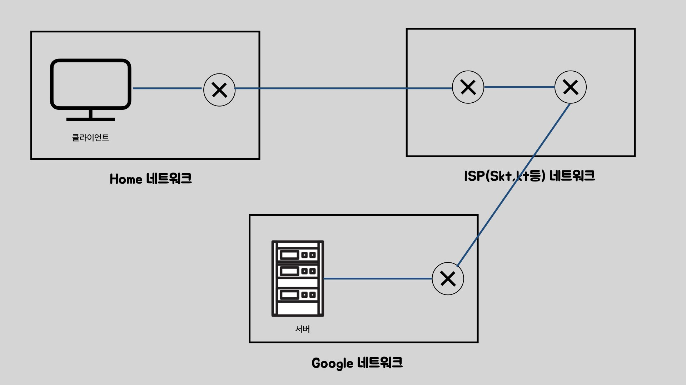
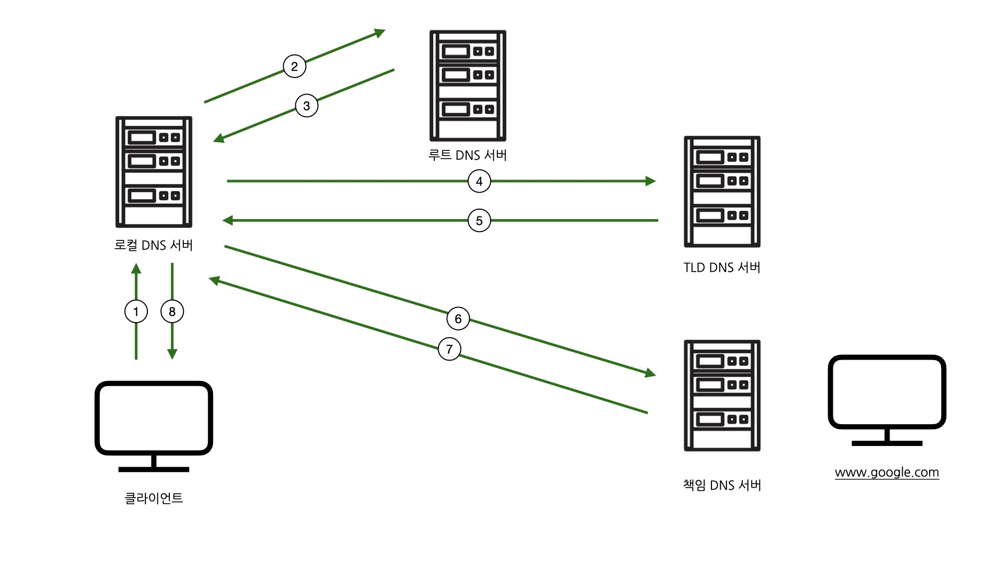
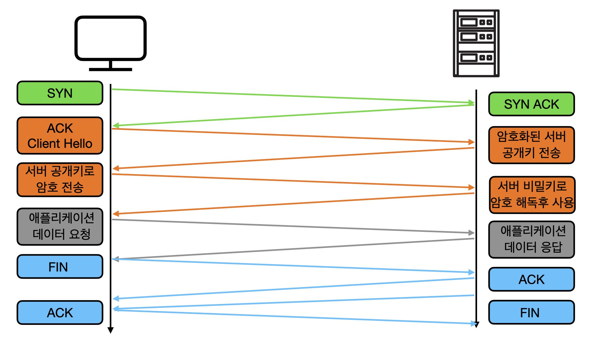
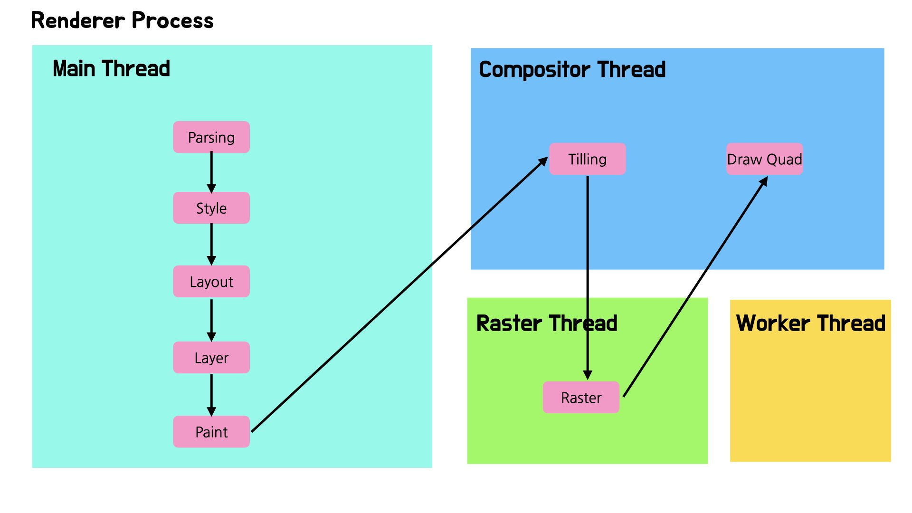
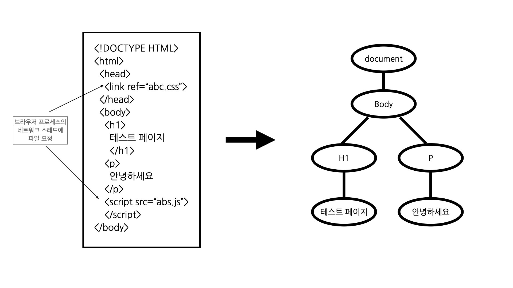
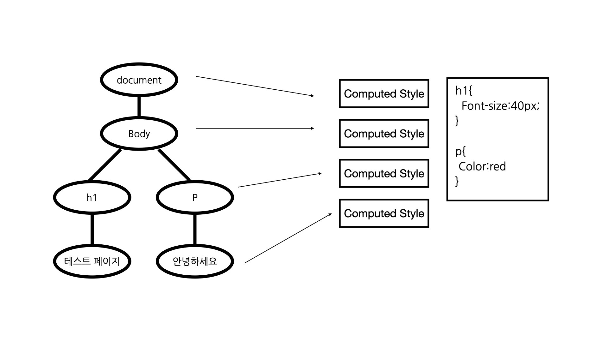
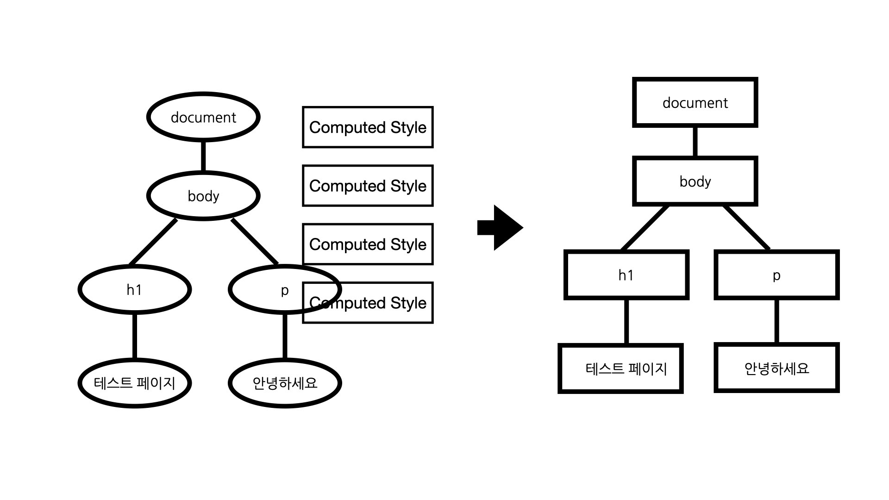
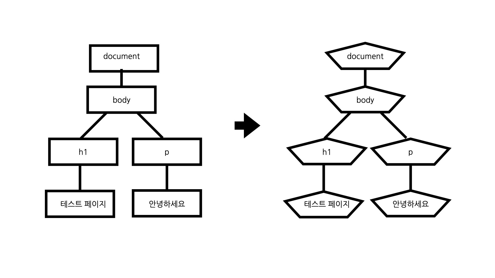
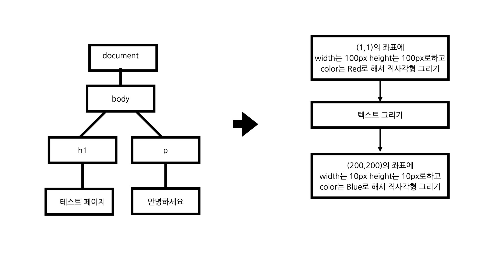
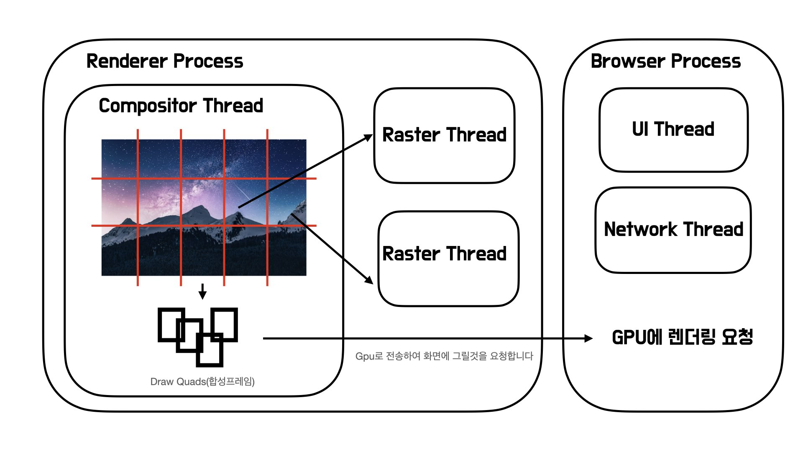

## 들어가며

브라우저가 HTML 파일을 요청하는 네트워킹 과정과, 이 HTML을 화면에 띄우기 위한 과정인 Critical rendering path(CRP)는 브라우저의 동작을 이해하는데 있어서 매우 중요합니다. 프론트엔드 개발자에게 있어서 중요한 성능최적화에 도움이 되기 때문입니다.

따라서 이번 포스트에서는 브라우저에 주소를 입력하는 순간부터 화면에 유저가 요청한 페이지가 보여지는 순간까지의 동작을 정리해보고 성능최적화를 어떤 방식으로 진행할수 있는지 이야기 해보고자합니다.

## 사전지식 이해하기

브라우저의 렌더링 과정을 정확하게 이해하기 위해서는 네트워크와 운영체제에 대한 지식이 필요합니다. 때문에 시작에 앞서 이해를 위한 지식을 간단하게 정리해보겠습니다. 만약 네트워크와 운영체제에 대한 기본적인 이해가 있으시다면 아래 내용은 넘어가셔도 좋습니다.

### 네트워크 5계층 과 전송

네트워크는 크게 5계층(또는 7계층)으로 분할되어있습니다. 애플리케이션, 전송, 네트워크, 데이터링크, 물리 계층입니다. 각각은 하는일이 모두 다르며 독립적으로 설계되어있습니다. 애플리케이션 계층에서는 네트워크 통신의 결과를 사용자에게 제공하며, 전송 계층에서는 전송의 모든 과정을 관할하고, 네트워크 계층에서는 실제 전송을 책임지고, 데이터 링크 계층에서는 라우터와 라우터 사이에서의(같은 네트워크를 의미) 데이터 전송을 책임지며, 물리 계층은 데이터를 전기적 신호로 변환하는것을 책임집니다.

전송과정에서는 상위의 계층이 하위의 데이터 영역에 들어가게 되는데, 가령 애플리케이션, 전송계층의 관계에서는 애플리케이션에서 헤더와 데이터 영역으로 구성된 패킷이 전송계층의 데이터로 들어가게 됩니다.

기본적으로 전송계층의 Port번호와 네트워크 계층의 IP주소를 이용해서 목적지를 판별하게되는데, Port번호는 IP주소 내부에서의 애플리케이션을 판별할때 사용되며, IP주소의 경우 목적지 컴퓨터를 판별할때 사용되게 됩니다. MAC 주소는 데이터 링크 계층에서 전송을 위해 사용됩니다.

### TCP와 UDP

이둘은 전송계층의 프로토콜입니다. 가장큰 차이점은 TCP의 경우 데이터를 무조건 정확한 순서대로 전달하지만, 속도가 느리며, UDP의 경우 속도가 빠르지만, 데이터를 반드시 전달하지않고 순서대로도 전달하지 않는다는 특징이 있습니다.

대부분의 서비스는 TCP를 이용하는데, 데이터 부분이 작거나 속도가 매우중요한 서비스에서는 UDP를 이용하는 경향이 있습니다. 아래에서 언급하겠지만, DHCP, UDP등에서는 데이터가 작기 때문에 이용하고, 음성통신은 속도가 중요하기 때문에 이용합니다.

### ISP

Internet Service Provieder 즉 인터넷을 할수 있게 해주는 업체를 의미합니다. Skt, kt, lg 등이 바로 ISP입니다. 전국에 망을 깔아두고 우리가 미국, 영국등 국제나 혹은 국내의 다른 곳과 통신할수 있도록 해주는 서비스를 제공하는 업체를 말합니다.

### 대칭키와 비대칭키 암호화

암호화 방식에는 크게 대칭키와 비대칭키 암호화 방식이 있습니다. 대칭키는 우리가 일반적으로 생각하는 방식으로 하나의 암호를 정해서 이를 이용해 메시지를 암호화하고 해독하는 방식입니다. 하지만 이는 미리 만날수 있는 사람과의 비밀대화를 위해서는 유용하지만 인터넷과 같이 모르는사람과 대화할때는 대화이전에 암호를 교환할수 없기 때문에 문제가 있습니다. 이를 해결하기 위해서 비대칭키 암호화 방식이 등장합니다.

비대칭키는 각자의 공개키와 비밀키로 구성됩니다. 공개키로 암호화한 메시지는 비밀키로만 풀 수 있고, 역방향도 가능합니다. 방식은 간단한데, 공개키는 말그대로 인터넷에 공개된 키입니다. 따라서 보내고자하는 사람이 상대의 공개키로 자신의 메시지를 암호화한뒤, 보내면 이를 상대방이 자신의 비밀키로 복호화 하여 메시지를 읽게 됩니다.

### 프로세스와 스레드

프로세스는 실행중인 프로그램을 의미하고, 스레드는 프로세스 내부에서 일부 데이터를 공유하면서 처리되는 실질적으로 작업의 단위로 볼수 있습니다. 운영체제위에서 실행되는 프로그램은 여러개의 스레드를 사용해서 병렬적으로 작업을 처리하고 통신하거나, 혹은 여러개의 프로세스를 사용하거나, 혹은 두가지 방법을 모두 사용할수 있습니다. Chrome의 경우 맨 마지막 경우로 두가지 방법을 모두 사용합니다.

프로세스를 여러개 사용하는 방식은 하나의 프로세스가 먹통이 되더라도 다른 프로세스는 살릴수 있다는 장점이 있지만, 이들은 통신하는방법이 간단하지 않고, 문맥교환이라고 부르는 cpu에서 처리하는 프로세스를 교체하는 과정에 꽤 큰 오버헤드가 발생합니다. 스레드를 여러개 사용하는방법은 앞선 문제는 없지만, 공유 자원을 다루어야할때 고려할점이 많습니다. Chrome의 경우 이러한 장단점을 고려해서 두가지 방법을 모두 사용하고 있습니다.

## HTML 요청과정

요청과정에 대해서 이해하기 위해서 전체적인 과정을 이미지와 같이 간략화하였습니다. 원형에 X표시가 된것은 라우터이며 Home 네트워크의 라우터가 게이트웨이 라우터 라고 가정하겠습니다. 또한 게이트웨이 라우터에서 DHCP서버가, ISP네트워크의 어딘가에 DNS서버가 있다고 생각하겠습니다.

### 1. DHCP 프로토콜

네트워크 요청을 위해서는 목적지 IP주소를 알아야하지만, 당연히 나의 IP(발송지 IP)주소는 기본적으로 알고있어야합니다. 그래야 서버가 요청한 데이터를 보내줄수 있기 때문입니다. 따라서 요청이전에 나의 IP주소를 알고있어야하는데, 이를 수동으로 설정하기에는 번거롭습니다. 따라서 운영체제에서는 이를 자동으로 설정해주는 DHCP라는 프로토콜을 사용하여 IP를 설정합니다. 이러한 DHCP의 동작에 대해서 간단하게 살펴보겠습니다.

1. DHCP 발견: 처음에 DHCP 서버도 어디에 있는지 모르기 때문에 broadcast를 의미하는 255.255.255.255 IP주소에 DHCP서버를 의미하는 67번을 붙여 요청합니다. 이때 src IP는 없기때문에 0.0.0.0이고, 클라이언트 포트 번호는 68번으로 지정되어있기에 68번을 붙여줍니다.

2. DHCP 제공: DHCP서버에서는 클라이언트의 요청을 받아서 IP주소를 Yiaddr에 넣어 보내줍니다. 이때 IP가 아직 없기 때문에 Transaction ID를 보내서 connection을 구분합니다.

3. DHCP 요청: 여러 DHCP서버에서 전달받은 IP중 하나를 선택하여 할당을 요청합니다. 이 요청은 1번과마찬가지로 진행되며 고려할부분은 Yiaddr 과 Transaction ID 부분의 값이 2번과 동일하다는 부분입니다.

4. DHCP ACK: DHCP에서 요청을 받으면 해당 IP를 정말 할당할수있는지 확인하고, 가능하다면 클라이언트에게 확인응답을 보내주게됩니다.

위 과정을 통해서 우리는 IP주소를 알게되었으며 위에서 언급하지는 않았지만, 부가적으로 게이트웨이 라우터의 주소와 DNS local server의 주소를 알게됩니다. DNS 서버는 이후 다시 언급하겠지만, 게이트웨이 라우터의 주소가 필요한 이유는, 우리가 미국(구글)으로 우편을 부친다고 하더라도 일단 우체통(게이트웨이 라우터)이 어디에있는지 알아야 하는것과 같습니다.

> 한가지 추가적으로 언급하고 넘어갈 부분은 게이트웨이 라우터의 IP주소는 알고 있지만, MAC 주소는 알수 없다는것입니다. 이를 위해서 ARP 프로토콜을 수행해야합니다. 다만 이과정은 DHCP에 의해서 수행되는것이 아니라 실질적으로 필요할때 수행됩니다. 따라서 이후 DNS 프로토콜을 수행하는 과정이 수행된다고 이해하면 되겠습니다.

> 우리가 받는 IP주소는 고유해야합니다. 일상에서 동일한 주소지가 2개라면 택배나 우편물을 전송하기 어려운 문제와 동일하게 응답을 전송할수 없기 때문입니다. 그런데 일반적으로 IP주소를 검색해보면 192.168.xxx.xxx와 같은 형태를 사용해 친구의 IP주소가 동일하는등 중복이 자주 있습니다. 이는 내부적으로 사용하는 사설 IP로 중복이 발생하여도 상관없습니다. 왜냐하면 NAT라는 기술이 외부로 나갈때는 고유한 공인 IP로 변환해주기때문입니다. 하지만 요청을 응답받을때 NAT 내부의 네트워크 IP는 외부에서볼때 하나의 공인 IP이므로 네트워크 내부의 컴퓨터를 구분해야하는데, 이를위해 Port번호를 사용합니다. 이로인해 웹서버와 같이 고정된 포트를 사용하는 서비스는 운영할수 없습니다. 흐름에서 약간 벗어나기 때문에 주석으로 설명하였지만 중요한 내용이기에 조금더 궁금하신분은 NAT에 대해서 검색해보시면 좋겠습니다.

### 2. DNS 프로토콜

이제 브라우저의 주소창에 www.google.com을 입력합니다. 그런데 브라우저가 필요로 하는것은 숫자로된 IP주소이지 문자로된 도메인주소가 아닙니다. 따라서 도메인주소를 IP주소로 변환해 주어야합니다. 이를 위해 이용하는 프로토콜이 DNS입니다. DNS 프로토콜을 이용해서 www.google.com의 IP주소를 얻는 방법을 살펴보겠습니다.

DNS는 계층적으로 이루어져있습니다. 주소의 .을 기준으로 분리하면 되는데, 크게 루트 DNS 서버, 최상위 레벨 도메인 네임 DNS 서버, 책임 DNS 서버 그리고 성격은 약간 다르지만, Local Name DNS 서버로 나눌수 있습니다.

- 루트 DNS 서버: com, kr 등 맨 마지막에 있는 이름의 DNS서버의 IP주소를 가지고 있습니다.
- 최상위 레벨 도메인 네임 DNS 서버: google.com, naver.com 의 DNS 서버의 IP 주소를 가지고 있습니다.
- 책임 DNS 서버: google의 경우 www.google.com, mail.google.com 등의 자신이 관할하는 도메인 주소에 대한 IP주소를 가지고 있습니다.
- 로컬 DNS 서버: 일반적으로 ISP에 많이 위치하며 DNS 결과를 캐싱해두는 공간입니다.

이제 이러한 서버들에 대해서 이해하였다면 서버와 클라이언트 그리고 Local Name DNS 서버사이에 DNS Query가 어떠한 방식으로 이루어지는지 알아봅시다.

화살표의 숫자는 전송 순서이며, 1번과 8번이 로컬 DNS 서버와 클라이언트 사이에 이루어지기 때문에, 실질적인 요청은 모두 Local DNS 서버에서 이루어지며 최종 결과만 클라이언트에서 응답받게 됩니다. 요청은 재귀적으로 이루어지는데, 루트 DNS 서버에 갔다가 오고, TLD DNS 서버에 갔다가 오고, 책임 DNS서버에 갔다가 와서 결국 IP주소를 얻어내게 됩니다. 이과정중에 만약 Local DNS 서버에 저장된 IP주소 정보가 있다면 요청을 보내지 않고 캐싱된 정보
를 사용하게됩니다.

> 앞서 UDP에 대해 이해하셨다면 왜 DNS는 UDP를 사용하는지 의문이 들수 있습니다. DNS가 상당히 중요한 서비스로 보이는데 신뢰성이 필요하지 않을까 라는 생각이 들기 때문입니다. 하지만, DNS query의 결과는 상당히 작은 데이터를 포함하고, 이는 손실가능성이 작을 뿐만 아니라, 손실되더라도 크게 피해가 없기 때문에 다시 재요청 하면 되기 때문입니다. 속도와 손실가능성을 따져보았을때, 속도를 선택한것이라고 이해하면 됩니다.

### 3. HTTP 프로토콜

목적지 IP, 나의 IP정보를 알고 있기 때문에, 본격적으로 HTTP 요청을 보내게 됩니다. HTTP프로토콜도 버전마다 방식이 다소 다른데, 가장 일반적인 상황을 고려하기위해서 HTTP/1.1을 사용하고 있으며 HTTPS 가 적용되어있다고 가정하겠습니다.

HTTP/1.1은 TCP를 이용하고 있기 때문에 실질적인 요청에 앞서서 3-way-handshake를 통해 연결을 수립하는 과정이 진행됩니다. 클라이언트가 syn 패킷을 보내고, 서버가 이에대한 ack와 자신의 syn패킷을 보내고 마지막으로 클라이언트가 서버의 syn에 대한 ack를 보내면 연결됩니다. 이때 마지막 ack에는 보내고자 하는 데이터를 담아 보낼수 있습니다.

일반적인 요청인경우 여기서 마무리되지만, HTTPS가 적용되면 SSL 계층을 통과한뒤 TCP 소켓을 통과하기 때문에, 애플리케이션 보안을 위한 절차가 추가됩니다. 먼저 clientHello라는 메시지를 클라이언트가 보냅니다(앞서 handshake과정의 ack와 함께 전송됩니다). 서버는 이에 응답하여 자신의 공개키를 CA(공인 인증기관)의 비밀키로 암호화하여 전송합니다. 클라이언트는 브라우저에 하드코딩된 CA의 공개키로 서버의 공개키를 획득한뒤, 약속된 암호를 암호화하여 보냅니다. 서버는 자신의 비밀키로 약속된 암호를 획득하고 이제부터 이를 이용해 통신을 시작합니다.

SSL 통신이 완료되었다면 이제 어플리케이션 데이터를 요청하고 전송받습니다. TCP를 사용하기 때문에, 전송과정에서 seq번호를 활용해서 순서를 보장받고, 누적확인응답(cumulative ack)과 타이머를 활용해서 데이터를 재전송함으로써 시간이 오래걸리더라도 필요한 데이터를 모두 응답받을수 있게 됩니다. 이러한 과정을 통해 HTML파일을 전송받을수 있습니다.

모든 전송이 완료되면 이제 4-way-handshake를 이용해 연결을 끊습니다. 서버와 클라이언트 각각 상대에게 fin 패킷을 보내고 ack를 받아야 연결이 종료됩니다. 이때 마지막 ACK응답 보낸 대상은 바로 연결을 끊지 않고 대략 30초 뒤에 끊습니다. 왜냐하면 ACK응답이 가지 않아 재요청이 들어올수 있기 때문입니다.

> SSL에서 CA라는것이 등장한 이유가 궁금할수 있습니다. 이유는 간단한데, 인터넷에 돌아다니는 서버의 공개키를 클라이언트가 맞다고 100% 확신할수 없기 때문입니다. 따라서 이 공개키가 서버의것이 맞다는것을 인증해주기 위해서 CA가 존재합니다.

## HTML 렌더링 하기

렌더링 과정을 설명하기에 앞서서 브라우저가 어떻게 이루어져있는지 알아보겠습니다. 브라우저마다 구현이 다양하기 때문에 가장 많이 사용하는 Chrome에 대해서 살펴보려합니다. Chrome은 주요한 작업을 여러개의 프로세스를 이용해 처리하며 프로세스에는 주소창, 네트워크 등을 관리하는 브라우저 프로세스, 탭을 구성하는 렌더러 프로세스, GPU관련 처리를 관리하는 GPU 프로세스등이 있습니다. 이들중에 관심있게 살펴보아야할 프로세스는 바로 렌더러 프로세스입니다.

렌더러 프로세스는 우리가 보는 화면을 구성하는 프로세스로, 탭당 하나씩 생성됩니다. 만약 크롬에 탭을 10개 띄운다면 10개의 프로세스가 생성됩니다. 이 프로세스는 내부적으로 여러 스레드로 구성되는데, 다음과 같습니다.

- Main Thread: 렌더링의 대부분 작업을 처리하고 관할합니다.
- Compositor Thread: 합성과 관련된 과정을 처리합니다.
- Raster Thread: 화면을 그리기 위해 비트맵 변환을 하는 과정을 처리합니다. 여러개 존재할수 있습니다.
- Worker Thread: 렌더링과 크게 상관없고, 브라우저에서 병렬처리를 위해 사용할수 있는 스레드입니다.

모든 과정이 Main Thread에서 진행되는데, 경우에 따라서 Main Thread가 Compositor Thread나 Raster Thread에 권한을 위임하여 실행하고 결과를 전달받는다고 이해하면 되겠습니다. 그럼 지금부터 과정을 따라가 보겠습니다.

> 브라우저 구현에 대해서 정해진 규약은 없기 때문에 때문에 safari, firefox등의 다른 브라우저의 세부구현은 다를수 있습니다.

### 1.Parsing

HTML에는 두가지 특징이 있습니다. 첫번째는 굉장히 너그러운 언어라 태그를 닫지 않거나 등의 오류를 발생시켜도 최대한 정상적으로 실행시키기 위해서 코드를 수정해줍니다. 두번째는 script 태그에 의해서 html이 추가될경우 재파싱이 이루어질수 있다는것입니다. 이러한 두가지 특성때문에 HTML은 기존의 프로그래밍 언어와 유사하게 파싱할수 없고, 독자적인 파싱 규칙이 적용된 파서를 적용하여 파싱합니다. 혹시 자세한 구현이 궁금하신 분은 제가 이전에 작성한 <a class="link nodisplay" href="https://puki4416blog.netlify.app/html-parser/">아티클</a>을 참고해주세요

파싱중에 리소스를 로딩해야할 경우가 있습니다. 위 이미지에서는 css 와 script입니다. 네트워크 요청도 Main Thread에서 처리할수 있지만, 속도를 높이기 위해서 Browser Process의 Network Thread에서 해당작업을 실행하게됩니다.

한편 두번째 특징에서 재파싱이 이루어질수 있다고 하였습니다. 이러한 특징때문에 script태그를 마주치면 기본적으로 html 파싱 자체가 멈추게 됩니다. 이러한 과정을 막을수 있는 방법이 존재하는데, async와 deffer 속성입니다. async 속성을 사용하면 script가 다운로드되는 동안은 파싱이 지속되도록 할 수 있고, defer 속성을 사용하면 html 파싱이 모두 끝난뒤 자바스크립트가 실행되도록 할수 있습니다.

### 2.Style

먼저 css파일을 파싱합니다. css는 문맥 자유언어이기 때문에 html과 달리 일반적인 프로그래밍언어를 파싱하는 방법과 유사하게 파싱이 가능합니다.

해석된 css 파일과 기존 브라우저에 적용된 기본 css를 합쳐 dom tree에 적용해 computed Style(계산된 스타일)을 적용하게됩니다. 해당 결과는 개발자도구의 (element-computed 또는 요소-계산됨)에서 확인할수 있습니다.

### 3.Layout

dom Tree와 computed Style을 얻었지만, 여전히 화면에 그리기위한 정보는 부족합니다. 우리가 css를 작성할때 요소가 브라우저의 어디에 위치하는지 정확한 위치를 기술하지는 않기 때문입니다. 따라서 이를 계산하는 과정이 필요합니다.

Layout 계산과정은 dom Tree와 computed Style을 순회하면서 요소의 정확한 좌표를 기록함으로서 진행됩니다. 이 결과가 기록된 Tree를 Layout Tree라고 합니다.

Layout Tree는 dom Tree와 다소 다를수 있습니다. 예를 들어 display 속성을 none으로 하는경우 삭제되며 가상선택자 같은경우 dom Tree에는 없지만 Layout Tree에는 포함될수 있습니다.

### 4.Layer

레이어란 브라우저가 매 스크롤 마다 화면을 새로 합성하지 않고 레이어들을 합쳐서 화면을 그릴수 있도록 요소를 분할해둔 것입니다. 이러한 정보를 수집한 결과가 포함된 Tree를 Layer Tree라고 합니다.

이러한 레이어는 Layers 탭에서 확인할수 있습니다. 브라우저를 약간 회전해보면 요소들이 입체적으로 겹쳐있는것을 볼수 있습니다.

### 5.Paint

앞선 과정을 통해 Layer Tree를 획득하더라도 정확한 화면을 그리기는 아직 부족한 상황입니다. 요소를 어떤 순서로 그려야하는지는 아직 결정되지 않았기 때문입니다. z-index와 같은 요소를 생각해보면 dom Tree의 순서대로 그렸을때 문제가 생길수 있음을 짐작할수 있습니다. 따라서 Layer Tree를 기반으로 paint순서를 알려주는 Paint Record를 만들어냅니다.

Paint Record는 Layers 탭에서 확인할수 있으며 Action(직선,텍스트,사각형등 어떤 모양인지), Position(좌표), Style(색상등 스타일 정보) 로 구성되어있습니다.

### 6.Composite

이제 화면을 그리기 위한 준비가 끝났습니다. 위 정보를 가지고 화면을 그리면되는데 화면에 안보이는 요소까지 모두 그릴 필요가 없기 때문에, 화면을 분할해서 뷰포트 근처의 요소가 먼저 그려질 수 있도록 합니다.

이 과정은 Main Thread가 Compositor Thread에 위임해서 진행되게 됩니다. Compositor Thread는 그려야 할 요소를 요청받아서 먼저 타일로 분할한뒤, 필요한 요소만 Raster Thread에게 비트맵으로의 변환을 요청합니다.

Raster Thread가 비트맵으로 변환을 끝내면 다시 Compositor Thread가 이를 응답받아 드로 쿼드(타일이 어디에 위치해야하는지에 대한 정보)들의 모임인 합성 프레임을 만들어내고
브라우저 프로세스를 이용해 Gpu 프로세스에 전달되어서 Gpu 프로세스가 화면을 그려주게됩니다.

> 일반적으로 리렌더링시 reflow와 repaint만 언급하는 경향이 있는데, 사실 composite 과정만 반복할수 있는 방법이 있습니다. 바로 css의 trasform과 같은 속성을 사용하는것입니다. 이러한 속성을 사용하면 main thread를 기다리지 않고 compositor thread에서 layer를 합성하여 보다 빠르게 결과를 보여줄수 있습니다. 일반적으로 고성능 애니메이션에서 사용하기 좋습니다.

## 마치며

브라우저의 핵심기능인 요청과 렌더링 과정을 정리해봄으로써 우리가 주소창에 www.google.com을 입력하는것 만으로 아래에서 수많은 작업들이 진행되고 있음을 알 수 있었습니다.

사실 최대한 요약을 해서 적은것이라 설명이 부족할수 있을것 같습니다. 이해가 안되는 부분이 있으션다면 참고자료 1,2번을 참고해보시면 좋을것 같습니다.

한편으로 크롬에서 또다른 메인은 바로 자바스크립트를 동작시켜주는 V8엔진이라고 생각합니다. 요청과 렌더링 과정에 대한 이해가 되었다면 다음으로 V8엔진에도 관심을 가져보는것이 좋지 않을까 생각합니다.

## 참고자료

<a class="link" href="https://d2.naver.com/helloworld/5237120">
  최신 브라우저의 내부 살펴보기 3 - 렌더러 프로세스의 내부 동작
</a>
<a class="link" href="https://tv.naver.com/v/4578425">
  웹 성능 최적화에 필요한 브라우저의 모든 것
</a>
<a
  class="link"
  href="https://velog.io/@himprover/%EC%B5%9C%EC%8B%A0-Chrome-%EB%B8%8C%EB%9D%BC%EC%9A%B0%EC%A0%80-%EB%A0%8C%EB%8D%94%EB%A7%81-%EB%B0%A9%EC%8B%9D%EC%9D%84-%EC%95%8C%EC%95%84%EB%B3%B4%EC%9E%90#1-parsing"
>
  최신 Chrome 브라우저 렌더링 방식을 알아보자!
</a>
<a
  class="link"
  href="https://aws-hyoh.tistory.com/entry/HTTPS-%ED%86%B5%EC%8B%A0%EA%B3%BC%EC%A0%95-%EC%89%BD%EA%B2%8C-%EC%9D%B4%ED%95%B4%ED%95%98%EA%B8%B0-3SSL-Handshake"
>
  HTTPS 통신과정 쉽게 이해하기 #3(SSL Handshake, 협상)
</a>
