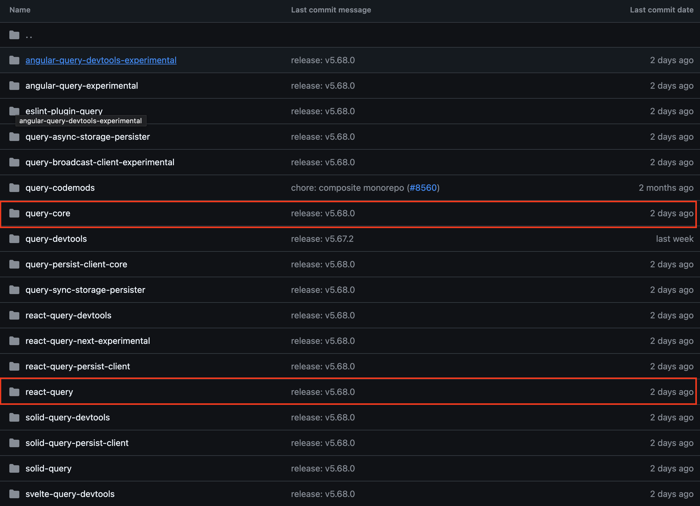

이번 아티클을 시작으로 총 6편에 걸쳐서 React-Query가 내부적으로 어떻게 구현되어있는지 살펴볼것입니다.

평소에 React-Query는 어떻게 **동일한 쿼리키를 가진 useQuery의 호출을 한번의 API호출로 해결하는지**, **새로운 데이터를 어떻게 컴포넌트에 반영하는지** 궁금하셨다면 이 글을 흥미롭게 읽으실 수 있을것입니다.

시리즈의 주제가 Deep Dive인만큼 기본개념과 사용법에 대해서는 간단하게 살펴보거나 생략하는 경우가 많을것입니다. 하지만 Deep Dive를 하기전에 반드시 필요한것이 기본개념과 사용법에 대한 이해이므로 React-Query를 처음 접하시거나 많이 사용해보시지 않으셨다면 시리즈를 시작하기전에 [React-Query 공식 문서의 GUIDES & CONCEPTS 항목](https://tanstack.com/query/latest/docs/framework/react/guides)은 모두 읽어보시는것을 추천드립니다. 글을 이해하시는데 많은 도움이 될것입니다.

React-Query Deep Dive 시리즈의 첫번째 아티클에서는 본격적인 Deep Dive에 들어가기에 앞서서 등장배경과 라이브러리 구성을 살펴보겠습니다.

> 라이브러리 버전은 v5.68.0버전입니다.

## 등장배경
React와 같은 View 라이브러리를 사용하여 웹 애플리케이션을 만들게 되면 View 라이브러리는 자체적으로 상태를 관리하는 방법을 제공하지 않기 때문에 별개의 상태관리 라이브러리(React의 경우 Redux)를 함께 사용하게 됩니다. 이때 클라이언트에서 사용되는 데이터(폼에 입력된값, 사용자의 스크롤위치등)뿐만 아니라 서버에서 사용되는 데이터(비동기 API를 이용해 원격 서버에서 가져오는 데이터)도 상태관리 라이브러리를 사용해 관리(Redux의 경우 Redux-Thunk, Redux-Saga 사용)합니다. 

하지만 상태관리 라이브러리는 클라이언트측 상태를 관리하는데는 좋지만, 서버상태를 관리하는데는 몇가지 문제가 있습니다. 이 문제를 이해하기 위해 React, Redux, Redux-Thunk를 사용한 예제코드를 살펴보겠습니다.

```typescript
// 액션
const fetchDataRequest = () => {
  return {
    type: FETCH_DATA_REQUEST,
  };
};

const fetchDataSuccess = (data) => {
  return {
    type: FETCH_DATA_SUCCESS,
    payload: data,
  };
};

const fetchDataFailure = (error) => {
  return {
    type: FETCH_DATA_FAILURE,
    payload: error,
  };
};

// 액션 생성자
export const fetchData = () => {
  return (dispatch) => {
    dispatch(fetchDataRequest());
    axios.get('https://api.example.com/data')
      .then(response => {
        const data = response.data;
        dispatch(fetchDataSuccess(data));
      })
      .catch(error => {
        dispatch(fetchDataFailure(error.message));
      });
  };
};

// 리듀서
const reducer = (state = {data:[], isLoading:false, error:null}, action) => {
  switch (action.type) {
    case FETCH_DATA_REQUEST:
      return {
        ...state,
        isLoading: true,
        error: null,
      };
    case FETCH_DATA_SUCCESS:
      return {
        ...state,
        isLoading: false,
        data: action.payload,
      };
    case FETCH_DATA_FAILURE:
      return {
        ...state,
        isLoading: false,
        error: action.payload,
      };
    default:
      return state;
  }
};

// 컴포넌트
const App = () => {
  const dispatch = useDispatch();
  const data = useSelector(state => state.data);
  const isLoading = useSelector(state => state.isLoading);
  const error = useSelector(state => state.error);

  useEffect(() => {
    dispatch(fetchData());
  }, [dispatch]);

  if (isLoading) {
    return <p>Loading...</p>;
  }

  if (error) {
    return <p>Error: {error}</p>;
  }

  return (
    <div>
      {/* Render your data here */}
      <button onClick={()=>{dispatch(fetchData())}}>갱신</button>
    </div>
  );
};

export default App;
```

1. 캐싱처리
특정 시점까지, 혹은 특정 payload를 기준으로 동일한 데이터를 반환함을 개발자가 알고 있다면 사용자가 갱신 버튼을 눌러 새로운 데이터를 요청하더라도 API를 호출할필요가 없습니다. API를 특정 저장소에 저장해두고, 필요할때만 서버에서 API를 호출하면됩니다. 예제 코드에서는 이러한 기능이 없으므로 시간, payload조건을 명시한뒤 저장소에 값을 저장하여 캐싱하는 기능을 직접 개발해야합니다.

2. 동일 API에 대한 중복요청 방지
예제에서는 App 컴포넌트에서만 `dispatch(fetchData())`를 요청하고 있지만, 자식이나 형제 컴포넌트에서 `dispatch(fetchData())`를 동시에 요청하게 되면 동일한 API를 `dispatch(fetchData())` 코드만큼 호출하게 됩니다. 현재는 이러한 기능이 없으므로 `fetchData` 함수 내부에서 디바운스 처리를 함으로써 동일한 API에 대한 중복요청을 방지하는 기능을 직접 개발해야합니다.

3. 오래된 API 시점을 인지하고 이를 백그라운드에서 자동 업데이트하기
예를들어 서버 데이터가 3분에 한번씩 갱신될수 있다는것을 알고 있다면 3분에 한번 API를 재호출하여 갱신해주는것이 좋을것입니다. 현재는 이러한 기능이 없으므로 setInterval을 통해 App 컴포넌트에서 `dispatch(fetchData())`를 호출함으로써 자동업데이트 기능을 직접 개발해야합니다.

4.데이터의 상태 관리
현재 데이터에 대한 상태(로딩,에러등)을 관리하기위해서는 데이터 이외의 추가적인 상태를 직접 선언해야합니다. 현재는 이러한 기능이 없기 때문에 직접 모든 상태를 선언하여 액션을 수행할때 상태를 직접 변경해주어야합니다.

이외에도 다양한 문제들이 있지만, 서버상태를 클라이언트 상태관리 도구로 해결하고자 했을때의 한계에 대해서는 이해하셨을것이라 생각합니다. 

이러한 상황에서 등장한 React-Query는 서버상태를 관리하는 코드를 선언적으로 작성할수 있도록 해주면서 네트워크와 관련된 문제를 해결해주기 때문에 서버측 상태를 손쉽게 관리할수 있게 해줍니다. React-Query로 재작성한 예제를 보시면 더욱 이해가 쉬울것입니다.

```typescript
function Example() {
  const { isPending, error, data } = useQuery({
    queryKey: ['apiData'],
    queryFn: () =>
      fetch('https://api.example.com/data').then((res) =>
        res.json(),
      ),
  })

    if (isPending) {
    return <p>Loading...</p>;
  }

  if (error) {
    return <p>Error: {error}</p>;
  }

  return (
    <div>
      {data}
      <button onClick={()=>{dispatch(fetchData())}}>갱신</button>
    </div>
  )
}
```
## 라이브러리 구성


react-query는 [query](https://github.com/TanStack/query) 저장소 내에 있습니다. 저장소를 살펴보면, 모노레포 구조로되어있고, 주요 패키지들은 packages 폴더내에있습니다.

query의 핵심 로직은 query-core라는 패키지 내부에 있습니다. 이 로직을 react-query, vue-query등 다른 VIEW 라이브러리에서 가져가서 사용하게됩니다. 

따라서 이번 시리즈내내 살펴볼 폴더는 react-query, query-core 두가지이며 이중에서 query-core 폴더의 코드를 분석하는데 많은 시간을 할애하게 될것입니다.

## 마치며
다음장에서는 react-query 내부적으로 사용되는 몇가지 공통 유틸리티 클래스와 주요 클래스에 대해서 살펴보겠습니다.


## 참고자료
[react-query Overview](https://tanstack.com/query/latest/docs/framework/react/overview)
[Redux Thunk: Real Examples for Better Understanding](https://medium.com/@usamaijaz912/redux-thunk-real-examples-for-better-understanding-ed66ab732ac6)