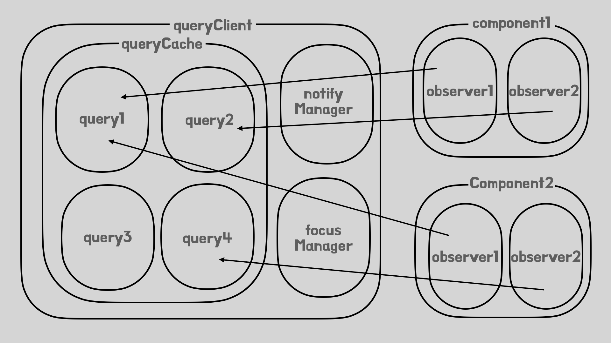

이번 아티클에서는 react-query 내부적으로 사용되는 공통 유틸리티 클래스와 핵심 클래스에 대해서 살펴보겠습니다.

## 공통 유틸리티 클래스

내부적으로 자주 사용되는 몇가지 공통 유틸리티 클래스(Subscribable, Removable, FocusManger, NotifyManager, OnlineManager)에 대해서 살펴보겠습니다.

### Subscribable

```typescript
export class Subscribable<TListener extends Function> {
  protected listeners = new Set<TListener>()

  constructor() {
    this.subscribe = this.subscribe.bind(this)
  }

  subscribe(listener: TListener): () => void {
    this.listeners.add(listener)

    this.onSubscribe()

    return () => {
      this.listeners.delete(listener)
      this.onUnsubscribe()
    }
  }

  hasListeners(): boolean {
    return this.listeners.size > 0
  }

  protected onSubscribe(): void {
    // 아무 동작이 정의되어있지 않음
  }

  protected onUnsubscribe(): void {
    // 아무 동작이 정의되어있지 않음
  }
}
```

이 클래스는 상속받는 클래스의 인스턴스가 구독가능하도록 해줍니다. 내부 메서드의 종류나 구현은 구독/발행 패턴의 일반적인 형태입니다.

추가적으로 구독과 해제시 호출되는 `onSubscribe`,`onUnsubscribe`함수내부를 빈상태로 선언하여 내부로직을 자식클래스에서 정의하도록 해두었다는 것만 기억해둡시다.

### Removable

```typescript
export abstract class Removable {
  gcTime!: number
  #gcTimeout?: ReturnType<typeof setTimeout>

  destroy(): void {
    this.clearGcTimeout()
  }

  protected scheduleGc(): void {
    this.clearGcTimeout()

    if (isValidTimeout(this.gcTime)) {
      this.#gcTimeout = setTimeout(() => {
        this.optionalRemove()
      }, this.gcTime)
    }
  }

  protected updateGcTime(newGcTime: number | undefined): void {
    this.gcTime = Math.max(this.gcTime || 0, newGcTime ?? 5 * 60 * 1000)
  }

  protected clearGcTimeout() {
    if (this.#gcTimeout) {
      clearTimeout(this.#gcTimeout)
      this.#gcTimeout = undefined
    }
  }

  protected abstract optionalRemove(): void
}
```

이 클래스는 상속받는 클래스의 인스턴스가 시간에 따라 제거되록 해줍니다. `scheduleGc`함수를 호출하여 제거를 예약하면,
중간에 `clearGcTimeout`함수를 호출하지 않는이상 타임아웃 시간이 되었을때 `optionalRemove`함수를 호출하여 객체를 제거합니다.

`optionalRemove`함수의 경우`Subscribable`클래스의 `onSubscribe`,`onUnsubscribe`메서드와 유사하게 자식 클래스에 구현을 위임하였는데, 여기서는 추상클래스이므로 반드시 구현해야한다는 차이가 있습니다.
이유는 `onSubscribe`,`onUnsubscribe`는 핵심기능인 구독을 위한 메서드가 아니라 구독이 되거나 해제되었을때 발생하는 이벤트 핸들러이므로 내부 구현이 필요하지 않지만, `optionalRemove`는 삭제라는 기능을 구현하기 위해 반드시 필요하기 때문입니다.

### FocusManager

```typescript
export class FocusManager extends Subscribable<Listener> {
  #focused?: boolean
  #cleanup?: () => void

  #setup: SetupFn

  constructor() {
    super()
    this.#setup = onFocus => {
      if (!isServer && window.addEventListener) {
        const listener = () => onFocus()
        window.addEventListener("visibilitychange", listener, false)

        return () => {
          window.removeEventListener("visibilitychange", listener)
        }
      }
      return
    }
  }

  protected onSubscribe(): void {
    if (!this.#cleanup) {
      this.setEventListener(this.#setup)
    }
  }

  protected onUnsubscribe() {
    if (!this.hasListeners()) {
      this.#cleanup?.()
      this.#cleanup = undefined
    }
  }

  setEventListener(setup: SetupFn): void {
    this.#setup = setup
    this.#cleanup?.()
    this.#cleanup = setup(focused => {
      if (typeof focused === "boolean") {
        this.setFocused(focused)
      } else {
        this.onFocus()
      }
    })
  }

  setFocused(focused?: boolean): void {
    const changed = this.#focused !== focused
    if (changed) {
      this.#focused = focused
      this.onFocus()
    }
  }

  onFocus(): void {
    const isFocused = this.isFocused()
    this.listeners.forEach(listener => {
      listener(isFocused)
    })
  }

  isFocused(): boolean {
    if (typeof this.#focused === "boolean") {
      return this.#focused
    }

    return globalThis.document?.visibilityState !== "hidden"
  }
}

export const focusManager = new FocusManager()
```

이 클래스는 싱글톤으로 생성된 인스턴스를 구독하면 현재 애플리케이션의 포커스 여부(화면이 애플리케이션을 보여주고있는지 여부)를 알 수 있습니다. 이 포커스 여부를 확인하기 위해서 브라우저의 `visibilitychange`이벤트와 `visibilityState`상태를 이용합니다.

이 클래스가 싱글톤인 이유는, 포커스 상태가 애플리케이션 내에서 여러개일수 없기 때문입니다. 따라서 싱글톤을 생성하고, 이를 필요한곳에서 구독해 사용하게 됩니다. 가장 일반적으로 이 객체가 사용되는 상황은 사용자가 창을 포커스했을때 stale상태인 쿼리를 다시 패치하는것입니다.

### onlineManager

```typescript
import { Subscribable } from "./subscribable"
import { isServer } from "./utils"

type Listener = (online: boolean) => void
type SetupFn = (setOnline: Listener) => (() => void) | undefined

export class OnlineManager extends Subscribable<Listener> {
  #online = true
  #cleanup?: () => void

  #setup: SetupFn

  constructor() {
    super()
    this.#setup = onOnline => {
      if (!isServer && window.addEventListener) {
        const onlineListener = () => onOnline(true)
        const offlineListener = () => onOnline(false)
        // Listen to online
        window.addEventListener("online", onlineListener, false)
        window.addEventListener("offline", offlineListener, false)

        return () => {
          window.removeEventListener("online", onlineListener)
          window.removeEventListener("offline", offlineListener)
        }
      }

      return
    }
  }

  protected onSubscribe(): void {
    if (!this.#cleanup) {
      this.setEventListener(this.#setup)
    }
  }

  protected onUnsubscribe() {
    if (!this.hasListeners()) {
      this.#cleanup?.()
      this.#cleanup = undefined
    }
  }

  setEventListener(setup: SetupFn): void {
    this.#setup = setup
    this.#cleanup?.()
    this.#cleanup = setup(this.setOnline.bind(this))
  }

  setOnline(online: boolean): void {
    const changed = this.#online !== online

    if (changed) {
      this.#online = online
      this.listeners.forEach(listener => {
        listener(online)
      })
    }
  }

  isOnline(): boolean {
    return this.#online
  }
}

export const onlineManager = new OnlineManager()
```

이 클래스는 싱글톤으로 생성된 인스턴스를 구독하면 현재 애플리케이션의 온라인여부(네트워크 연결 여부)를 알 수 있습니다. 이 온라인 여부를 확인하기 위해서 브라우저의 `online`,`offline`이벤트를 사용합니다.

이 클래스가 싱글톤인 이유는, 네트워크의 연결 상태가 애플리케이션 내에서 여러개 일수 없기 때문입니다. 따라서 싱글톤을 생성하고, 이를 필요한곳에서 구독해 사용하게 됩니다. 가장 일반적으로 이 객체를 사용하는 상황은 쿼리 패치중에 네트워크가 끊어졌을경우 다시 네트워크가 연결된 시점에 데이터를 받아오는것입니다.

### notifyManager

```typescript
export function createNotifyManager() {
  let queue: Array<NotifyCallback> = []
  let transactions = 0
  let notifyFn: NotifyFunction = callback => {
    callback()
  }
  let batchNotifyFn: BatchNotifyFunction = (callback: () => void) => {
    callback()
  }
  let scheduleFn: ScheduleFunction = cb => setTimeout(cb, 0)

  const schedule = (callback: NotifyCallback): void => {
    if (transactions) {
      queue.push(callback)
    } else {
      scheduleFn(() => {
        notifyFn(callback)
      })
    }
  }

  const flush = (): void => {
    const originalQueue = queue
    queue = []
    if (originalQueue.length) {
      scheduleFn(() => {
        batchNotifyFn(() => {
          originalQueue.forEach(callback => {
            notifyFn(callback)
          })
        })
      })
    }
  }

  const batch = <T>(callback: () => T): T => {
    let result
    transactions++
    try {
      result = callback()
    } finally {
      transactions--
      if (!transactions) {
        flush()
      }
    }
    return result
  }

  const batchCalls = <T extends Array<unknown>>(
    callback: BatchCallsCallback<T>
  ): BatchCallsCallback<T> => {
    return (...args) => {
      schedule(() => {
        callback(...args)
      })
    }
  }

  return {
    batch,

    batchCalls,
    schedule,
    setNotifyFunction: (fn: NotifyFunction) => {
      notifyFn = fn
    },
    setBatchNotifyFunction: (fn: BatchNotifyFunction) => {
      batchNotifyFn = fn
    },
    setScheduler: (fn: ScheduleFunction) => {
      scheduleFn = fn
    },
  } as const
}

// SINGLETON
export const notifyManager = createNotifyManager()
```

이 클래스는 싱글톤으로 생성된 인스턴스의 메서드를 사용하면 특정 작업들을 일괄적으로 수행할수 있게 됩니다.

`schedule`함수를 실행하거나, `schedule`함수로 래핑하는 `batchCall`함수를 호출한 결과를 실행할 경우 트랜잭션 상태가 아니라면 함수를 `setTimeout`을 이용해 비동기로 실행하지만, 그렇지 않는다면 큐에 적재해둡니다. 그리고 큐에 적재된 작업은 `batch`함수를 실행하였을때 모두 실행되게됩니다.

이 클래스가 싱글톤인 이유는, 모든 배치 실행을 한군데서 관리하기 위해서입니다. 이 클래스의 `schedule`이나 `batchCall`를 컴포넌트에서 사용하면, 한번의 리렌더링으로 구독한 query가 컴포넌트에 반영될수 있도록 해줍니다.

## 주요 클래스



```typescript
import {
  QueryClient,
  QueryClientProvider,
  useQuery,
} from "@tanstack/react-query"

const queryClient = new QueryClient()

function App() {
  queryClient.setQueryData(["query3"], {})

  return (
    <QueryClientProvider client={queryClient}>
      <Component1 />
      <Component2 />
    </QueryClientProvider>
  )
}

function Component1() {
  const { data: query1Data } = useQuery({
    queryKey: ["query1"],
    queryFn: () =>
      fetch("https://api.github.com/repos/TanStack/query").then(res =>
        res.json()
      ),
  })

  const { data: query2Data } = useQuery({
    queryKey: ["query2"],
    queryFn: () =>
      fetch("https://api.github.com/repos/TanStack/router").then(res =>
        res.json()
      ),
  })

  return (
    <div>
      <div>
        <h1>{query1Data?.name}</h1>
        <p>{query1Data?.description}</p>
        <strong>👀 {query1Data?.subscribers_count}</strong>{" "}
        <strong>✨ {query1Data?.stargazers_count}</strong>{" "}
        <strong>🍴 {query1Data?.forks_count}</strong>
      </div>
      <div>
        <h1>{query2Data?.name}</h1>
        <p>{query2Data?.description}</p>
        <strong>👀 {query2Data?.subscribers_count}</strong>{" "}
        <strong>✨ {query2Data?.stargazers_count}</strong>{" "}
        <strong>🍴 {query2Data?.forks_count}</strong>
      </div>
    </div>
  )
}

function Component2() {
  const { data: query1Data } = useQuery({
    queryKey: ["query1"],
    queryFn: () =>
      fetch("https://api.github.com/repos/TanStack/query").then(res =>
        res.json()
      ),
  })

  const { data: query2Data } = useQuery({
    queryKey: ["query4"],
    queryFn: () =>
      fetch("https://api.github.com/repos/TanStack/virtual").then(res =>
        res.json()
      ),
  })

  return (
    <div>
      <div>
        <h1>{query1Data?.name}</h1>
        <p>{query1Data?.description}</p>
        <strong>👀 {query1Data?.subscribers_count}</strong>{" "}
        <strong>✨ {query1Data?.stargazers_count}</strong>{" "}
        <strong>🍴 {query1Data?.forks_count}</strong>
      </div>
      <div>
        <h1>{query2Data?.name}</h1>
        <p>{query2Data?.description}</p>
        <strong>👀 {query2Data?.subscribers_count}</strong>{" "}
        <strong>✨ {query2Data?.stargazers_count}</strong>{" "}
        <strong>🍴 {query2Data?.forks_count}</strong>
      </div>
    </div>
  )
}
```

쿼리를 사용하기 위해 관여하는 객체는 `queryClient`, `querycache`, `query`, `queryObserver` 총 네가지입니다.

컴포넌트는 `queryObserver`를 구독하고 `queryObserver`는 `query`를 구독하며 이 `query`들은 `queryCache`에 저장되어 관리됩니다. 또한 `queryCache`와 여러 매니저는 `queryClient`에서 관리하는 구조입니다. 예제코드와 이미지를 비교하면서 확인해보시면 좋을것 같습니다.

각 객체별로 내부 코드를 확인해보면서 하는 역할을 좀더 자세히 살펴보겠습니다.

### query

```typescript
export class Query extends Removable {
  queryKey: TQueryKey
  queryHash: string
  options!: QueryOptions
  state: QueryState

  #initialState: QueryState<TData, TError>
  #revertState?: QueryState<TData, TError>
  #cache: QueryCache
  #client: QueryClient
  #retryer?: Retryer<TData>
  observers: Array<QueryObserver<any, any, any, any, any>>
  #defaultOptions?: QueryOptions<TQueryFnData, TError, TData, TQueryKey>
  #abortSignalConsumed: boolean

  constructor(config: QueryConfig) {
    super()

    this.#abortSignalConsumed = false
    this.#defaultOptions = config.defaultOptions
    this.setOptions(config.options)
    this.observers = []
    this.#client = config.client
    this.#cache = this.#client.getQueryCache()
    this.queryKey = config.queryKey
    this.queryHash = config.queryHash
    this.#initialState = getDefaultState(this.options)
    this.state = config.state ?? this.#initialState
    this.scheduleGc()
  }

  setData(
    newData: TData,
    options?: SetDataOptions & { manual: boolean },
  ): TData {
    const data = replaceData(this.state.data, newData, this.options)

    // Set data and mark it as cached
    this.#dispatch({
      data,
      type: 'success',
      dataUpdatedAt: options?.updatedAt,
      manual: options?.manual,
    })

    return data
  }

  #dispatch(action: Action<TData, TError>): void {
    const reducer = (
      state: QueryState<TData, TError>,
    ): QueryState<TData, TError> => {
      switch (action.type) {
        case 'failed':
          return {
            ...state,
            fetchFailureCount: action.failureCount,
            fetchFailureReason: action.error,
          }
        case 'pause':
          return {
            ...state,
            fetchStatus: 'paused',
          }
        case 'continue':
          return {
            ...state,
            fetchStatus: 'fetching',
          }
        case 'fetch':
          return {
            ...state,
            ...fetchState(state.data, this.options),
            fetchMeta: action.meta ?? null,
          }
        case 'success':
          return {
            ...state,
            data: action.data,
            dataUpdateCount: state.dataUpdateCount + 1,
            dataUpdatedAt: action.dataUpdatedAt ?? Date.now(),
            error: null,
            isInvalidated: false,
            status: 'success',
            ...(!action.manual && {
              fetchStatus: 'idle',
              fetchFailureCount: 0,
              fetchFailureReason: null,
            }),
          }
        case 'error':
          const error = action.error

          if (isCancelledError(error) && error.revert && this.#revertState) {
            return { ...this.#revertState, fetchStatus: 'idle' }
          }

          return {
            ...state,
            error,
            errorUpdateCount: state.errorUpdateCount + 1,
            errorUpdatedAt: Date.now(),
            fetchFailureCount: state.fetchFailureCount + 1,
            fetchFailureReason: error,
            fetchStatus: 'idle',
            status: 'error',
          }
        case 'invalidate':
          return {
            ...state,
            isInvalidated: true,
          }
        case 'setState':
          return {
            ...state,
            ...action.state,
          }
      }
    }

    // 상태 업데이트
    this.state = reducer(this.state)

    // 쿼리의 업데이트를 옵저버와 캐시에게 전파
    notifyManager.batch(() => {
      this.observers.forEach((observer) => {
        observer.onQueryUpdate()
      })

      this.#cache.notify({ query: this, type: 'updated', action })
    })
  }
}
}
```

`query`는 `queryKey`기반으로 식별되는 객체로 `queryFn`에 들어오는 함수를 실행한 결과와 이에 대한 상태를 가집니다. 앞서 말씀드렸던것 처럼 `query`는 자신을 구독하는 `observers`를 가지고 있으므로, `query`의 상태가 변화하면 `observer`에게 전파하게됩니다.

`query` 상태를 변경하고자 할때는 `dispatch`메서드에 원하는 action과 payload를 넣어 호출하면 `dispatch`메서드 미리 정의된 `reducer`함수에 이를 통과시키고, 상태를 변경한뒤 `observer`에게 통보합니다. `setData` 메서드와 `#dispatch` 메서드를 참고해보세요.

### queryObserver

```typescript
export class QueryObserver<
  TQueryFnData = unknown,
  TError = DefaultError,
  TData = TQueryFnData,
  TQueryData = TQueryFnData,
  TQueryKey extends QueryKey = QueryKey,
> extends Subscribable<QueryObserverListener<TData, TError>> {
  #client: QueryClient
  #currentQuery: Query<TQueryFnData, TError, TQueryData, TQueryKey> = undefined!
  #currentQueryInitialState: QueryState<TQueryData, TError> = undefined!
  #currentResult: QueryObserverResult<TData, TError> = undefined!
  #currentResultState?: QueryState<TQueryData, TError>
  #currentResultOptions?: QueryObserverOptions<
    TQueryFnData,
    TError,
    TData,
    TQueryData,
    TQueryKey
  >
  #currentThenable: Thenable<TData>
  #selectError: TError | null
  #selectFn?: (data: TQueryData) => TData
  #selectResult?: TData
  // This property keeps track of the last query with defined data.
  // It will be used to pass the previous data and query to the placeholder function between renders.
  #lastQueryWithDefinedData?: Query<TQueryFnData, TError, TQueryData, TQueryKey>
  #staleTimeoutId?: ReturnType<typeof setTimeout>
  #refetchIntervalId?: ReturnType<typeof setInterval>
  #currentRefetchInterval?: number | false
  #trackedProps = new Set<keyof QueryObserverResult>()

  constructor(
    client: QueryClient,
    public options: QueryObserverOptions<
      TQueryFnData,
      TError,
      TData,
      TQueryData,
      TQueryKey
    >,
  ) {
    super()

    this.#client = client
    this.#selectError = null
    this.#currentThenable = pendingThenable()
    if (!this.options.experimental_prefetchInRender) {
      this.#currentThenable.reject(
        new Error('experimental_prefetchInRender feature flag is not enabled'),
      )
    }

    this.bindMethods()
    this.setOptions(options)
  }
```

`query`의 상태변화를 구독하고 컴포넌트가 구독하는 객체입니다. `query`의 상태가 변화하면 `observer`가 변화되고, `observer`를 구독하는 컴포넌트가 리렌더링되어 상태가 컴포넌트에 반영되게 됩니다.

이 객체를 생성하는 가장 간단한 방법은 바로 `useQuery`를 사용하는것입니다. `useQuery`를 사용하면 자동으로 `observer`를 생성하여 우리가 `queryKey`로 명시한 `query`를 구독하게됩니다.

### queryCache

```typescript
export class QueryCache extends Subscribable<QueryCacheListener> {
  #queries: QueryStore

  constructor(public config: QueryCacheConfig = {}) {
    super()
    this.#queries = new Map<string, Query>()
  }
  // build, add, remove, find 등등...
}
```

`queryCache`의 역할은 `query`들을 관리하는것입니다. 현재 존재하는 쿼리들의 저장소 역할 뿐만 아니라, 생성, 제거, 찾기 등의 기능을 제공합니다.

### queryClient

```typescript
export class QueryClient {
  #queryCache: QueryCache
  #mutationCache: MutationCache
  #defaultOptions: DefaultOptions
  #queryDefaults: Map<string, QueryDefaults>
  #mutationDefaults: Map<string, MutationDefaults>
  #mountCount: number
  #unsubscribeFocus?: () => void
  #unsubscribeOnline?: () => void

  constructor(config: QueryClientConfig = {}) {
    this.#queryCache = config.queryCache || new QueryCache()
    this.#mutationCache = config.mutationCache || new MutationCache()
    this.#defaultOptions = config.defaultOptions || {}
    this.#queryDefaults = new Map()
    this.#mutationDefaults = new Map()
    this.#mountCount = 0
  }

  mount(): void {
    this.#mountCount++
    if (this.#mountCount !== 1) return

    this.#unsubscribeFocus = focusManager.subscribe(async (focused) => {
      if (focused) {
        await this.resumePausedMutations()
        this.#queryCache.onFocus()
      }
    })

    this.#unsubscribeOnline = onlineManager.subscribe(async (online) => {
      if (online) {
        await this.resumePausedMutations()
        this.#queryCache.onOnline()
      }
    })
  }

  unmount(): void {
    this.#mountCount--
    if (this.#mountCount !== 0) return

    this.#unsubscribeFocus?.()
    this.#unsubscribeFocus = undefined

    this.#unsubscribeOnline?.()
    this.#unsubscribeOnline = undefined
    // invalidQuries, setData 등등...
  }
```

`queryClient`는 react-query의 모든것을 관리하는 주체입니다. 따라서 여러 매니저(`focusManager`, `onlineManager`)를 구독하고 `queryCache`를 가지고 있습니다.

또한 `invalidQuries`, `setData`등 사용자가 쿼리에 적용할 수 있는 다양한 메서드들을 가지고 있기도 합니다.

## 마치며

이번 아티클을 통해 공통적으로 사용하는 유틸리티 클래스 및 핵심 클래스의 동작에 대해 이해하셨을 것입니다. 다음 아티클에서는 useQuery의 동작을 살펴보겠습니다.

## 참고자료

[옵저버 패턴](https://ko.wikipedia.org/wiki/%EC%98%B5%EC%84%9C%EB%B2%84_%ED%8C%A8%ED%84%B4)
