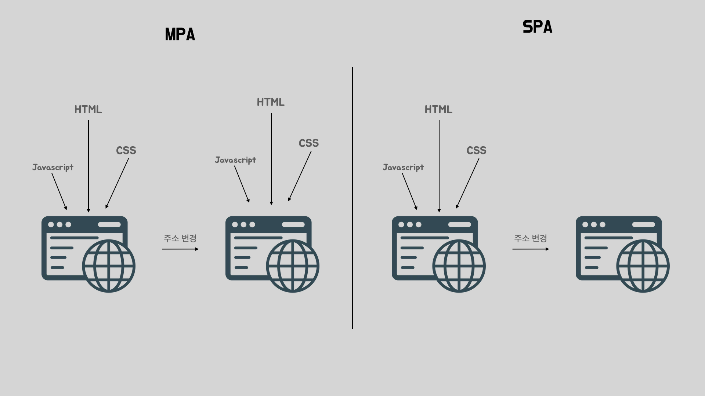
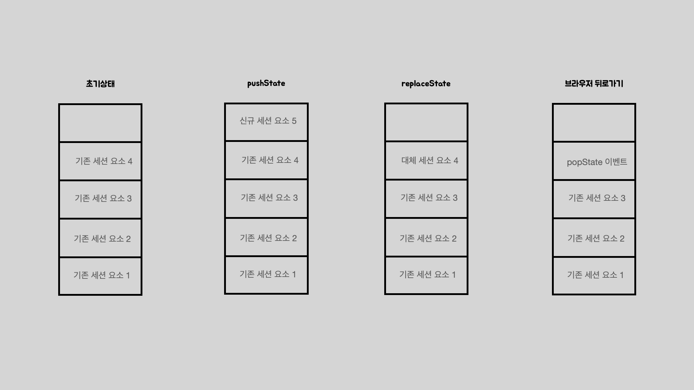

이번 아티클을 시작으로 총 2편에 걸쳐서 React-Router가 내부적으로 어떻게 구현되어있는지 살펴볼것입니다.

평소 React-Router는 어떻게 주소에 맞는 컴포넌트를 렌더링하는지 궁금하셨으면 이 글을 재미있게 읽으실 수 있을것입니다.

React-Query Deep Dive 시리즈의 첫번째 아티클에서는 본격적인 Deep Dive에 들어가기에 앞서서 등장배경과 라이브러리 구성을 살펴보겠습니다.

> 분석에 사용할 React-Router는 7.4.0입니다.

## 등장배경

초기 웹페이지는 주소를 변경하면  새로운 HTML, CSS, Javascript를 불러와 페이지를 구성하는 형태였습니다. 흔히 MPA라고 부르는 방식입니다.

초창기 웹에는 무거운 기능이 없었기 때문에 매번 이를 새롭게 불러오는것이 큰 문제가 되지 않았습니다. 하지만 웹이 발전하면서 많은 기능들이 포함된 웹사이트들이 등장하게되었고, 이때부터는 페이지 전환시 걸리는 지연시간이 문제가 되기 시작하였습니다. 특히 모바일 기기는 데스크톱 보다 네트워크나 기기의 성능이 낮았기 때문에 더 큰 문제가 되었습니다.

이로인해 SPA가 등장하게됩니다. 처음에 필요한 모든 리소스를 받아온뒤 페이지를 이동할때는 해당 페이지에 해당하는 컴포넌트를 렌더링하는것으로 매번 새로운 HTML, CSS, Javascript를 불러오지 않습니다. 이로인해 초기 렌더링 시간이 늘어난다는 점을 제외한다면 페이지 이동은 거의 네이티브 앱과 같은 성능을 보여주게 되었습니다. 

react-router는 이러한 SPA를 React와 사용할수 있도록 지원하는 라이브러리입니다.

## 기본 개념

새로운 주소로 이동할때 가장 간단한 방법은 `window.location.href`에 원하는 주소를 넣는것입니다. 하지만 이렇게 하면 주소가 변경되는것 뿐만 아니라 페이지를 새로고침하는것과 동일한 효과가 발생합니다. 따라서 SPA를 구현하기 위해서는 새로고침 없이 주소만 변경해주는 함수를 사용해야합니다.

이를 위해 `history`객체의 `pushState`와 `replaceState`를 사용해야합니다. `history`는 브라우저의 세션기록을 조작할수 있는 여러 메서드들을 제공하며, 위 함수들은 세션 스택을 관리할수 있도록 해줍니다.

스택을 관리하는 함수이기에 함수의 기능은 이름에서 쉽게 유추가 가능할것입니다. `pushState`는 새로운 세션 스택을 하나 넣는것이고, `replaceState`는 새로운 url스택으로 대체하는것입니다. 

웹브라우저에는 주소창을 통해 새로고침 없이 스택을 쌓거나 대체하는 방법은 없지만, 스택을 하나 지워 뒤로가는 기능이 있습니다. 바로 좌측 상단의 뒤로가기 버튼을 누르는것입니다. 이때는 스택이 변경되기 때문에, 이에 대한 변경사항을 애플리케이션이 받을수 있어야 해당하는 컴포넌트를 렌더링해줄수 있습니다. 이는 `pushState`이벤트를 구독하여 해결할수 있습니다.

## 세가지 모드
React Router 초기버전과 달리 v7버전에는 Framework, Data, Declaretive 세가지 모드가 있습니다. 각각의 모드는 사용법이 매우 다르고, 코드의 흐름도 완전히 다르기 때문에 모든 모드를 분석하는것은 어렵습니다.

따라서 이번 아티클에서는 가장 간단하면서도 오랜시간 사용된 Declaretive모드를 분석해볼것입니다. 만약 다양한 모드에 대해 관심이 있으시다면 [공식문서](https://reactrouter.com/start/modes)를 참고해보세요

## 마치며
간단하게 React-router에 대해서 알아보았습니다. 다음에서는 본격적으로 코드를 분석해보겠습니다.

## 참고자료
https://junilhwang.github.io/TIL/Javascript/Design/Vanilla-JS-Component/#_3-component-core-%E1%84%87%E1%85%A7%E1%86%AB%E1%84%80%E1%85%A7%E1%86%BC
https://developer.mozilla.org/en-US/docs/Web/API/History_API

