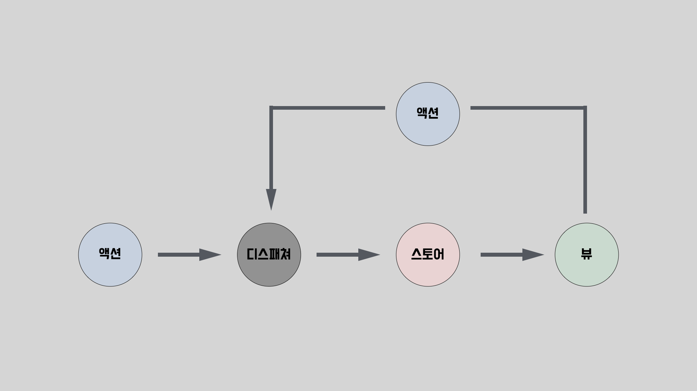
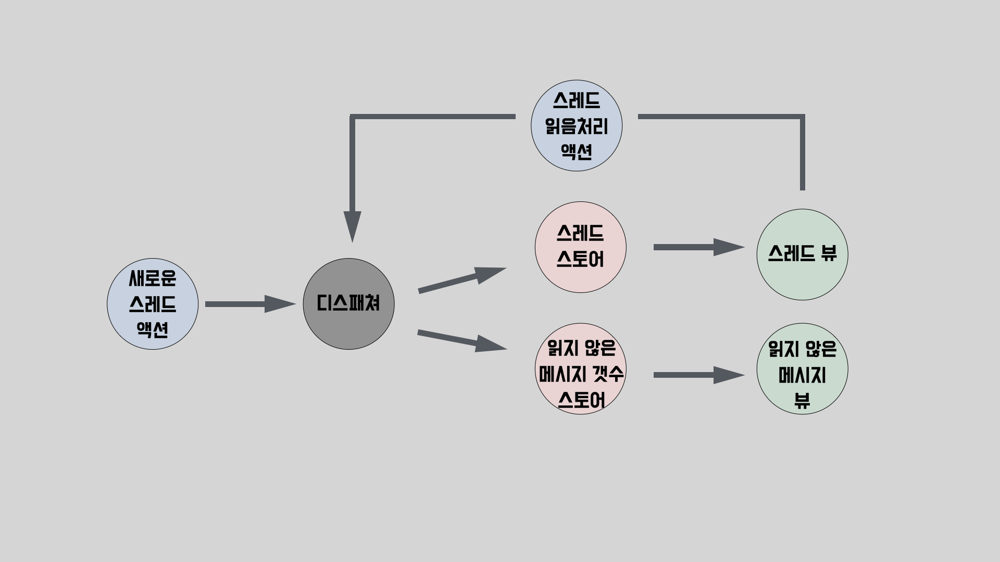

이번 아티클을 시작으로 총 4편에 걸쳐서 Redux에서 사용하는 주요 기능들이 내부적으로 어떻게 구현되어 있는지 살펴보겠습니다.

평소에 **Redux의 불변성을 지키지 않으면 최신의 상태가 반영되지 않는 이유**, **middleware가 dispatch를 가로챈뒤 작업을 수행하는 방식** 등과 같이 Redux의 내부 동작과 관련된 궁금증을 가지고 있으셨다면 이번 시리즈가 큰 도움이 될것입니다.

‘Deep Dive’ 시리즈인 만큼, 기본 개념이나 사용법에 대해서는 간단히 다루거나 생략하는 경우가 많습니다. 하지만 Deep Dive를 하기전에 기본개념과 사용법에 대해서는 반드시 이해해야 하므로 Redux를 처음 접하시거나 많이 사용해보시지 않으셨다면 시리즈를 시작하기전에 [Redux Fundamentals시리즈](https://redux.js.org/tutorials/fundamentals/part-1-overview)를 먼저 살펴보시는것을 추천드립니다. 시리즈 전체 내용을 이해하는데 큰 도움이 될 것입니다.

Redux Deep Dive 시리즈의 첫번째 아티클에서는 본격적인 분석에 들어가기 앞서서 Redux를 이해하는데 도움이 될만한 이야기로 시작해보겠습니다.

## Redux는 어떻게 탄생했을까?

라이브러리를 분석하기에 앞서서 등장배경을 살펴보는것은 매우 중요합니다. 왜냐하면 라이브러리의 등장 배경을 이해함으로써 문제의식과 철학을 이해할 수 있고, 이는 내부 설계와 구현 방식에 깊이 녹아 있기 때문입니다.

### Facebook팀이 겪은 문제

2013년경 Facebook에는 알림 갯수와 관련된 버그가 존재하였습니다. 사용자가 로그인하면 메시지 아이콘 위에 새로운 메시지가 도착했다는 알림이 표시되지만, 메시지 아이콘을 클릭해보면 새 메시지는 존재하지 않으며 알림 또한 사라집니다. 이후 다른 활동을 하다보면 처음 로그인하였을때와 같이 알림이 재등장하게됩니다.

Facebook 개발팀도 이 버그를 인지하고 여러 차례 수정해 배포했지만, 시간이 지나면 동일한 문제가 다시 발생했습니다. 왜냐하면 근본적인 문제를 해결하지 못했기 때문입니다.

### 근본적인 원인

Facebook에서는 데이터를 관리하기 위해 [Backbone](https://backbonejs.org/#)스타일의 MVC 아키텍처를 사용하고 있었습니다. Backbone 스타일의 가장 큰 특징은 Model과 View의 양방향 바인딩으로 인해 발생하는 계단식 업데이트입니다.

양방향 바인딩으로 인한 계단식 업데이트는 규모가 작은경우 논리적인 흐름을 따라가는것이 쉽기 때문에 큰 문제가 되지 않습니다. 심지어 뷰와 모델이 서로의 변경사항을 반영하기 위한 코드를 작성하지 않아도 자동으로 반영해주기 때문에(Vue의 일반적인 사용방식을 고려해보면 이해하기 쉽습니다`<input v-model="value" />`) 규모가 작을경우 코드량을 줄여준다는 장점이 있습니다.

하지만 계단식 업데이트는 관리해야할 상태가 많아지면 이를 추적하기가 매우 어렵다는 단점이 있습니다. 위 이미지와 같이 3개의 모델과 뷰가 서로 결합되어있어도 파악하기 힘든데, 모델과 뷰가 수십,수백개로 늘어난다면 이를 파악하는것이 매우 어려워질것입니다. 만약 이 과정에 비동기 업데이트가 포함되어있다면 상태 변화를 파악하는것이 사실상 불가능합니다.

따라서 Facebook은 양방향 바인딩으로 인한 계단식 업데이트가 애플리케이션의 데이터 흐름을 파악하기 어렵게 만들어 예상치 못한 버그를 지속적으로 만들어내는 근본적인 원인이라고 생각하였습니다.

> 일반적인 MVC 모델은 View 와 Model이 서로를 알지 못하기에 backbone스타일이 어떻게 MVC로 불리는지 궁금하실수 있습니다. 초기 클라이언트에서는 빈번한 유저 이벤트로 인해 View와 Model을 양방향 바인딩하여 사용하면 좋다는것이 널리 퍼지게되었고, 이로 인해 클라이언트에서는 일반적으로 View와 Model이 양방향 바인딩된 형태를 MVC로 부르게되었습니다.

### flux패턴의 등장

Facebook팀은 근본적인 원인이라고 생각한 양방향 바인딩의 계단식 업데이트를 해결하기 위해 단방향 데이터 흐름을 가지는 Flux 패턴을 고안하였습니다. Flux패턴을 사용하게 되면 뷰는 스토어의 변경사항을 구독하며 디스패치를 통해서만 액션이 실행되기 때문에 동작을 예측하기가 쉬워집니다.

앞선 Facebook의 알림 메시지 오류 사례에 Flux 패턴을 적용해봅시다. Backbone 스타일의 MVC와 비교할때 가장 큰 차이점은 스토어(유사 모델)와 뷰는 양방향 소통이 불가능하다는점입니다.

상대방의 새로운 메시지가 도착하거나 유저가 스레드를 읽음 처리하면 액션을 생성해 디스패처에 전달하고 디스패처는 들어온 액션을 순차적으로 처리해 스토어를 변경하며 스토어가 변경되었을때 이를 구독하는 뷰가 스토어 내용을 반영합니다. 따라서 버그가 발생해 디버깅을 수행하거나, 새로운 기능을 추가하는경우 데이터 흐름을 추적하기가 매우 편해집니다.

예를 들어 유저의 클릭 이벤트로인해 여러 액션이 연달아 발생한다고 가정해보겠습니다. 이때 특정 화면에서 잘못된 값이 출력될 경우 원인을 파악하기 위해 해당 뷰에 연결된 뷰와 모델을 따라가면서 흐름을 파악할 필요 없이 유저의 클릭이벤트이후 발생된 모든 액션은 디스패처에서, 그로인한 변경사항은 스토어에서 알 수 있으므로 발생한 액션들과 이로 인해 변경된 스토어가 의도와 다른지를 확인하면 데이터 흐름을 쉽게 파악할 수 있습니다.

### redux의 탄생

Flux는 라이브러리라기보다 단방향 데이터 흐름을 주장하는 하나의 패턴에 가깝습니다. 따라서 Flux 등장이후 Flux 패턴을 구현하는 몇가지 라이브러리들이 등장하였습니다. 이중 한가지가 바로 Redux입니다.

Redux는 Flux패턴을 따르지만 보다 단순화 합니다. 액션을 내보내어 상태를 변경하고, 변경된 상태는 읽기만 가능하다는점은 공통점이지만, Reducer와 단일 Store라는 큰 차이점이 존재합니다. Flux는 비즈니스 로직을 적절한 스토어에 두고 액션이 들어올때마다 스토어를 변경합니다. 또한 여러 스토어가 존재하기에 상태를 추적하는것도 약간 까다로울수 있습니다. 반면 Redux는 순수한 Reducer 함수를 도입하여 비즈니스 로직을 스토어로부터 분리하고, 단일 Store를 구성하여 상태를 쉽게 추적할수 있도록 합니다.

## redux의 데이터는 어떻게 흘러가나요?

Redux를 사용해본적이 있다면 아마 위 이미지를 많이 보셨을것입니다.

하지만 코드를 분석하기 이전에 코드를 실행함으로써 발생하는 전체적인 흐름을 이해하는것은 필수적이므로 간단히 짚고 넘어가겠습니다.

1. 사용자의 클릭 등의 이벤트로 Action이 발생합니다.
2. (미들웨어가 있는 경우) Action은 먼저 미들웨어에서 가로채어 비동기 작업 등을 수행한 뒤 다시 Dispatch됩니다.
3. Store는 해당 Action을 Reducer에 전달해 새로운 상태를 계산합니다.
4. 상태가 변경되면 Store는 이를 UI에 알리고, UI는 새로운 상태를 반영하여 화면을 업데이트합니다.

## 마치며

시리즈의 첫 번째 글에서는 Redux를 본격적으로 분석하기에 앞서, 그 등장 배경과 기본 동작 원리를 살펴보았습니다.
이러한 배경 지식은 이후의 내부 구조 분석을 이해하는 데 큰 도움이 될 것입니다.

다음 아티클부터는 Redux 내부의 핵심 기능들이 어떻게 동작하는지를 하나씩 깊이 들여다보겠습니다.

## 참고자료

[In-Depth Overview](https://facebookarchive.github.io/flux/docs/in-depth-overview/)
[JavaScript Architecture: Backbone.js Views](https://medium.com/aaronhardy/javascript-architecture-backbone-js-views-ecc295d80080)
[MVVM System 만들기](https://junilhwang.github.io/TIL/CodeSpitz/Object-Oriented-Javascript/02-MVVM/#mvc-pattern)
[A (Brief) History of Redux](https://redux.js.org/understanding/history-and-design/history-of-redux)
[프론트엔드 아키텍처의 최근 트렌드는?](https://yozm.wishket.com/magazine/detail/1663/)
[The “Bug-O” Notation](https://overreacted.io/the-bug-o-notation/)
[Why isn't React considered MVC?](https://stackoverflow.com/questions/53729411/why-isnt-react-considered-mvc/65969849#65969849)
