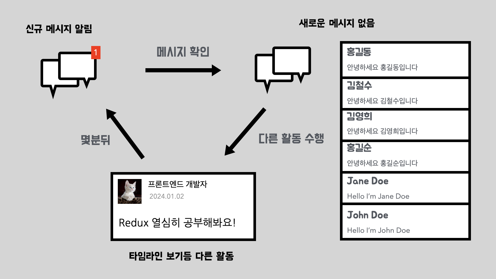
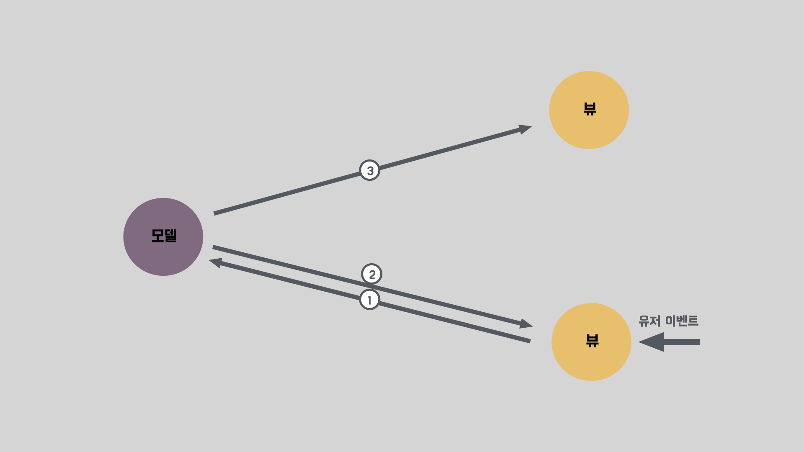
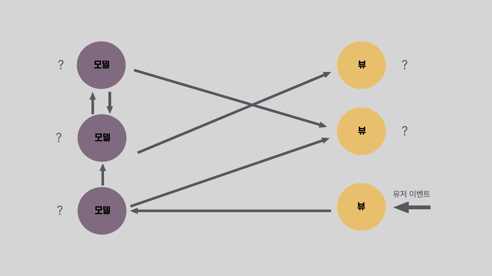
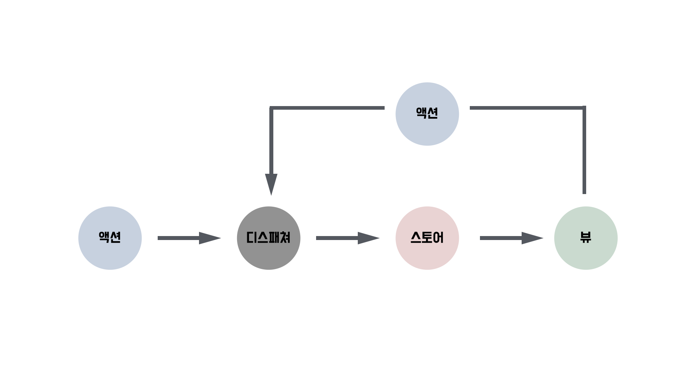
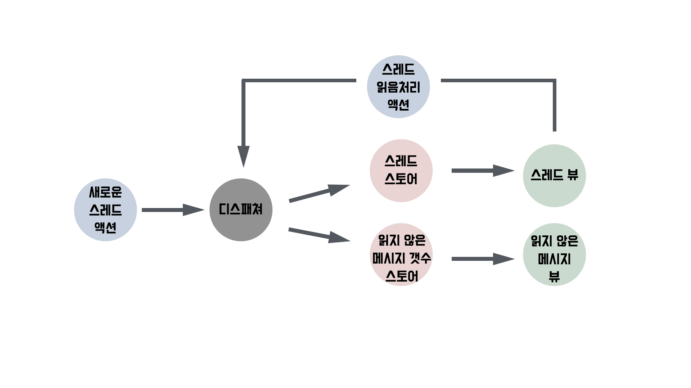
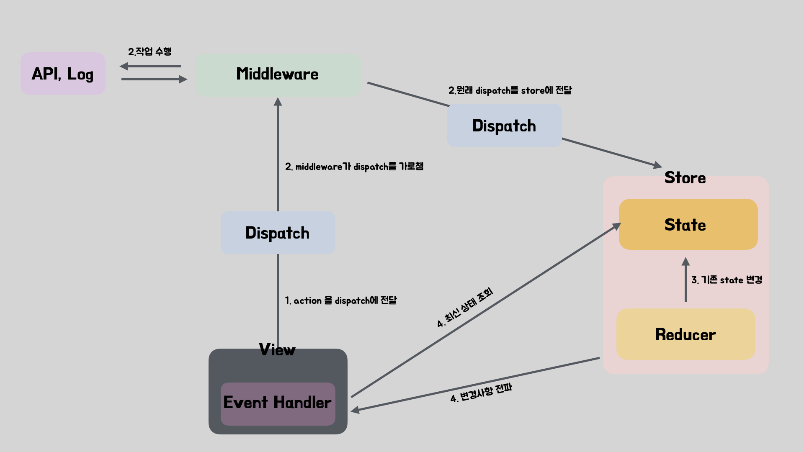

이번 아티클을 시작으로 총 4편에 걸쳐서 Redux에서 사용하는 기능들이 내부적으로 어떻게 구현되어있는지 살펴볼것입니다.

평소에 **Redux의 불변성을 지키지 않으면 최신의 상태가 반영되지 않는 이유는 무엇인가?** **middleware는 어떻게 dispatch를 가로챈뒤 작업을 수행하는가?** 등과 같이 Redux의 내부 동작과 관련된 궁금증을 가지고 있으셨다면 이번 시리즈가 많은 도움이 될것입니다.

시리즈의 주제가 Deep Dive인만큼 기본개념과 사용법에 대해서는 간단하게 살펴보거나 생략하는 경우가 많을것입니다. 하지만 Deep Dive를 하기전에 반드시 필요한것이 기본개념과 사용법에 대한 이해이므로 Redux를 처음 접하시거나 많이 사용해보시지 않으셨다면 시리즈를 시작하기전에 [Redux Fundamentals시리즈](https://redux.js.org/tutorials/fundamentals/part-1-overview)를 살펴보시는것을 추천드립니다. 시리즈를 이해하는데 있어서 많은 도움이 될 것입니다.

Redux Deep Dive 시리즈의 첫번째 아티클에서는 본격적인 Deep Dive에 들어가기에 앞서서 Redux를 이해하는데 도움이 될만한 이야기로 시작해보겠습니다.

## Redux는 어떻게 탄생했을까?

모든 라이브러리를 분석하기에 앞서서 등장배경을 살펴보는것은 매우 중요합니다. 왜냐하면 이를 통해 라이브러리의 근간이라고도 할 수 있는 철학을 이해할수 있게 되고, 철학을 이해하게 되면 철학이 녹아있는 코드에 대한 정확한 분석이 가능해지기 때문입니다.

### Facebook팀이 겪은 문제

2013년경 Facebook에는 알림 갯수 버그가 존재하였습니다. 사용자가 Facebook에 로그인하면 메시지 아이콘 위에 새로운 메시지가 도착했다는 알림이 표시되지만, 메시지 아이콘을 클릭해보면 새 메시지는 존재하지 않으며 알림 또한 사라집니다. 이후 다른 활동을 하다보면 처음 로그인하였을때와 같이 알림이 재등장하고 이후로는 동일한 과정을 반복해서 겪게 됩니다.

Facebook 개발자들도 이러한 버그를 인지하고 있었고 실제로 수정해 배포한적도 있었지만 끝내 해결하지는 못했습니다. 왜냐하면 이 버그를 수정해 배포하더라도 얼마지나지 않아 다시 버그가 발생했다는 제보를 받기 시작했기 때문입니다.

### 근본적인 원인

Facebook에서는 데이터를 관리하기 위해 [Backbone](https://backbonejs.org/#)스타일의 MVC 방식을 사용하고 있었습니다. 이 Backbone 스타일의 가장 큰 특징은 Model과 View의 양방향 바인딩으로 인해 발생하는 계단식 업데이트입니다.

양방향 바인딩으로 인한 계단식 업데이트는 규모가 작은경우 큰 문제가 되지 않습니다. 오히려 양방향 바인딩은 뷰와 모델 각각에서 서로의 변경사항을 반영하기 위한 코드를 작성하지 않아도 자동으로 반영해주기 때문에 규모가 작은 어플리케이션에서는 오히려 코드량이 줄어든다는 장점이 있습니다.

하지만 계단식 업데이트는 관리해야할 상태가 많아지면 이를 추적하기가 매우 어렵다는 단점이 있습니다. 위 이미지와 같이 4개의 모델과 뷰가 서로 결합되어있어도 파악하기 힘든데, 모델과 뷰가 수십,수백개로 늘어나고 이 과정에 비동기 업데이트가 포함되어있다면 하나의 뷰에서의 변화가 어떠한 결과를 발생시킬지 파악하는것이 매우 어려워집니다.

따라서 Facebook은 양방향 바인딩으로 인한 계단식 업데이트가 근본적인 문제라고 생각하였습니다. 계단식 업데이트가 애플리케이션의 데이터 흐름을 파악하기 어렵게 만들어 예상치 못한 버그를 지속적으로 만들어 낸다고 본것입니다.

> 일반적인 MVC 모델은 View 와 Model이 서로를 알지 못하기에 backbone스타일이 어떻게 MVC로 불리는지 궁금하실수 있습니다. 초기 클라이언트에서는 빈번한 유저 이벤트로 인해 View와 Model을 양방향 바인딩하여 사용하면 좋다는것이 널리 퍼지게되었고, 이로 인해 클라이언트에서는 일반적으로 View와 Model이 양방향 바인딩된 형태를 MVC로 부르게되었습니다.

### flux패턴의 등장

Facebook팀은 근본적인 원인이라고 생각한 양방향 바인딩의 계단식 업데이트를 해결하기 위해 단방향 데이터 흐름을 가지는 Flux 패턴을 고안하였습니다. Flux패턴을 사용하게 되면 뷰는 스토어의 변경사항을 구독하며 디스패치를 통해서만 액션이 실행됩니다. 따라서 계단식으로 변경되지 않고 순차적으로 변경되기 때문에 동작을 예측하기가 쉬워집니다. Facebook의 알림 메시지 오류 사례를 이용해 Flux와 Backbone 스타일의 MVC가 어떤 차이점을 가지고 있는지 조금더 살펴보겠습니다.

Backbone 스타일의 MVC 방식은 새로운 이벤트가 발생해 모델 혹은 뷰가 변경되면 이미지와 같이 계단식으로 연결된 뷰와 모델이 변경됩니다. 따라서 위 이미지와 같이 작은 규모의 애플리케이션은 하나의 이벤트가 발생하였을때 데이터의 흐름을 파악한후 각 모델과 뷰의 최종상태를 추측하는것이 쉽지만, 조금만 규모가 커져고 업데이트가 비동기적으로 수행되는경우 데이터 흐름과 최종상태를 파악하는것이 매우 어렵습니다.(뷰와 모델이 각각 100개이고 이들 간에 화살표가 1000개가까이 연결되어있으면서, 변경은 비동기적으로 이루어진다고 할때, 하나의 이벤트를 특정 뷰에서 트리거하는상황에서 최종상태를 추측해봅시다.) 결국 디버깅을 하거나 새로운 기능을 추가하게되면 연결된 모든 뷰와 모델을 따라가며 상태가 의도한대로 변경되어있는지 파악해야하는데 이것이 매우 어렵기 때문에 버그가 수정되지 않고 오히려 새로운 버그가 만들어지게 될 가능성이 커집니다.

Flux패턴을 적용할경우 스토어(유사 모델)와 뷰는 양방향 소통이 불가능합니다. 상대방의 새로운 메시지가 도착하거나 유저가 스레드를 읽음 처리하면 액션을 생성해 디스패처에 전달하고 디스패처는 들어온 액션을 순차적으로 처리해 스토어를 변경하며 스토어가 변경되었을때 이를 구독하는 뷰가 스토어 내용을 반영합니다. 따라서 버그가 발생해 디버깅을 수행하거나, 새로운 기능을 추가하는경우 데이터 흐름을 추적하기가 매우 편해집니다. 예를 들어 유저의 클릭 이벤트로인해 여러 액션이 연달아 발생한다고 생각해보겠습니다. 이때 특정 화면에서 잘못된 값이 출력된경우 원인을 파악하기 위해 해당 뷰에 연결된 뷰와 모델을 따라가면서 흐름을 파악할 필요 없이 유저의 클릭이벤트이후 발생된 모든 액션은 디스패처에서, 그로인한 변경사항은 스토어에서 알 수 있으므로 발생한 액션의 순서나 발생여부가 의도와 다른지, 액션으로 인해 변경된 스토어가 의도와 다른지를 확인하면 데이터 흐름을 쉽게 파악할 수 있습니다.

### redux의 탄생

Flux는 라이브러리라기보다 단방향 데이터 흐름을 주장하는 하나의 패턴에 가깝습니다. 따라서 Flux 등장이후 Flux 패턴을 구현하는 몇가지 라이브러리들이 등장하였습니다. 이중 한가지가 바로 Redux입니다.

Redux는 Flux패턴을 따르지만 보다 단순화 합니다. 액션을 내보내어 상태를 변경하고, 변경된 상태는 읽기만 가능하다는점은 공통점이지만, Reducer와 단일 Store라는 큰 차이점이 존재합니다. Flux는 비즈니스 로직을 적절한 스토어에 두고 액션이 들어올때마다 스토어를 변경합니다. 또한 여러 스토어가 존재하기에 상태를 추적하는것도 약간 까다로울수 있습니다. 반면 Redux는 순수한 Reducer 함수를 도입하여 비즈니스 로직을 스토어로부터 분리하고, 단일 Store를 구성하여 상태를 쉽게 추적할수 있도록 합니다.

## redux의 데이터는 어떻게 흘러가나요?

Redux를 사용해본적이 있다면 아마 위 이미지를 많이 보았을것이지만, 코드를 분석하기 이전에 코드를 실행함으로써 발생하는 전체적인 흐름을 이해하는것은 필수적이므로 한번더 상기시킨다는 생각하고 살펴보겠습니다. 간략하게 4단계로 정리하면 아래와 같습니다.

1. 클릭과 같은 사용자 상호작용에 대한 응답으로 작업이 전달됩니다.
2. (미들웨어가 있는경우)미들웨어가 전달된 작업을 가로채어 특정작업을 수행한뒤 다시 스토어에 작업을 전달합니다.
3. 저장소는 새로운 상태를 계산하기 위해 리듀서를 사용합니다.
4. 저장소가 변경되면 UI에 변경사실을 전파하고 UI는 새로운 상태를 읽은뒤 새로운 값을 표기합니다.

## 마치며

시리즈의 첫번째인 이번 아티클에서는 Redux 분석을 들어가기에 앞서서 알아두면 좋은 Redux의 등장배경과 기본동작을 살펴보았습니다. 이 내용들이 이후 Redux를 이해하는데 있어서 많은 도움을 줄것입니다. 이제 Redux 내부로 들어가보겠습니다.

## 참고자료

[In-Depth Overview](https://facebookarchive.github.io/flux/docs/in-depth-overview/)
[JavaScript Architecture: Backbone.js Views](https://medium.com/aaronhardy/javascript-architecture-backbone-js-views-ecc295d80080)
[MVVM System 만들기](https://junilhwang.github.io/TIL/CodeSpitz/Object-Oriented-Javascript/02-MVVM/#mvc-pattern)
[A (Brief) History of Redux](https://redux.js.org/understanding/history-and-design/history-of-redux)
[프론트엔드 아키텍처의 최근 트렌드는?](https://yozm.wishket.com/magazine/detail/1663/)
[The “Bug-O” Notation](https://overreacted.io/the-bug-o-notation/)
[Why isn't React considered MVC?](https://stackoverflow.com/questions/53729411/why-isnt-react-considered-mvc/65969849#65969849)
