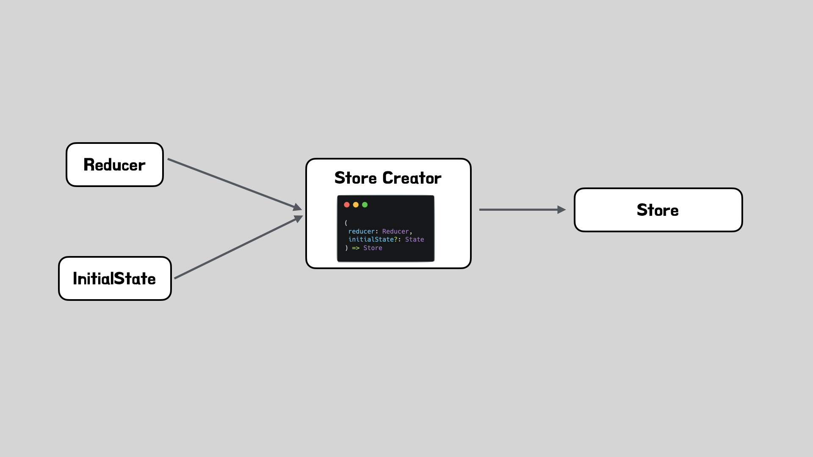
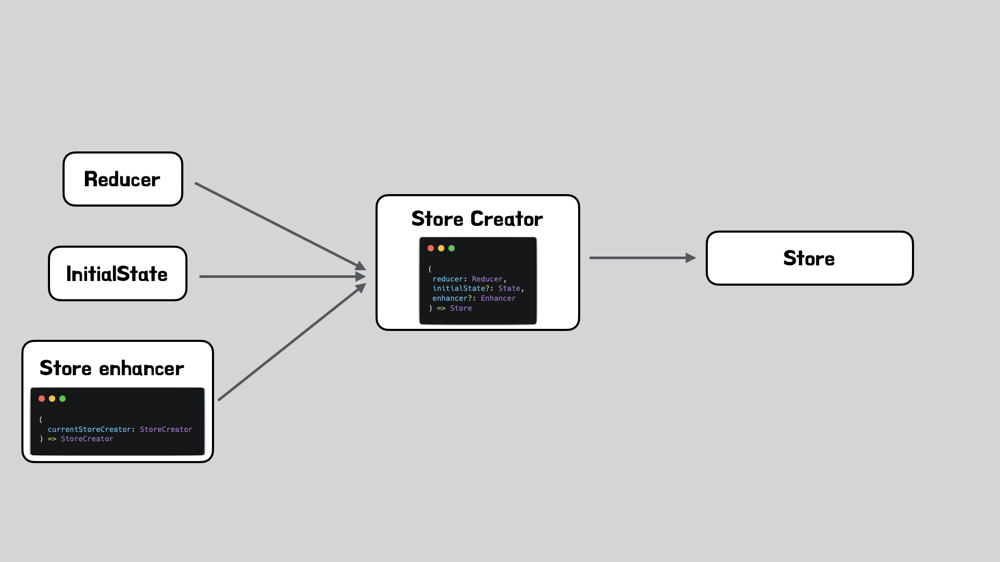

이번 아티클에서는 `dispatch`함수를 호출하면 비동기 API를 호출하거나 로깅을 수행하는 middleware 대해서 살펴보겠습니다. middleware가 어떻게 동작하는지, 실제 middleware가는 어떻게 만드는지 살펴볼것이므로 이번 아티클을 읽고나면  middleware 오픈소스(redux-thunk, redux-saga등)의 분석뿐만 아니라, 나만의 middleware도 만들수 있을것입니다.

본격적으로 middleware를 살펴보기에 앞서서 이전 아티클에서 createStore를 분석할때 생략했던 enhancer를 설명하는것으로 이번 아티클을 시작해보겠습니다.

## Enhancer



앞서 살펴본것처럼 `store`는 `createStore`함수에 `reducer`와 `preloadedState`를 넣어 실행하면 얻을 수 있습니다. 그리고 이렇게 얻은 `store`의 `getState`, `dispatch`, `subscribe`함수를 이용해 상태를 관리 할 수 있습니다.



그런데 `createStore`함수는 세번째 인수로 `createStore`함수로 전달하는 인자나 반환하는 함수들의 동작을 수정할 수 있도록 해주는 `enhancer`함수를 받을 수 있습니다.

```javascript
// 실제 createStore 함수내부
if (typeof enhancer === "function") {
  return enhancer(createStore)(reducer, preloadedState)
}
```

실제로 `creatStore`함수가 `enhancer`함수를 받을 경우 위와 같이 `enhancer`함수에 `createStore`함수를 넣어 실행한뒤 반환된 강화된 `creatStore`함수에 기존 인자를 넣어 실행한뒤 반환하는것을 볼 수 있습니다.

> 실제 `createStore`함수의 타입 정의를 살펴보면, `preloadState`는 생략이 가능하므로 두번째 인자로 `enhancer`함수를 전달해 줄수도 있습니다.

```javascript
export function createStore<
  S,
  A extends Action,
  Ext extends {} = {},
  StateExt extends {} = {}
>(
  reducer: Reducer<S, A>,
  enhancer?: StoreEnhancer<Ext, StateExt>
): Store<S, A, UnknownIfNonSpecific<StateExt>> & Ext
```

### createStore에 enhacer를 적용하기

`enhacer`함수는 `store`로 들어오는 인자들(`reducer`, `state`등)과 `store`가 반환하는 함수 (`dispatch`, `subscribe`, `getState`등)의 프록시 함수를 정의할 수 있습니다. `reducer`와 `dispatch`를 강화하는 예제를 한번 살펴보겠습니다.

```javascript
import { createStore } from "redux";

const enhancer = (createStore) => {
    return (reducer, state) => {
      // 넘겨받은 reducer 함수가 실행되는 시간을 측정할 수 있도록 reducer 함수를 새롭게 정의합니다.
      const newReducer = (state, action) => {
      		const start = performance.now()
      		const newState = reducer(state, action)
      		const end = performance.now()
      		const diff = round(end - start)

      		console.log('reducer 실행시간:', diff)

      		return newState
    	}

        const store = createStore(newReducer, state)

        // dispatch의 실행여부를 알수 있도록 dispatch 함수를 새롭게 정의합니다.
        const newDispatch = (action) => {
            console.log(`dispatch가 발생했습니다! action:${action} `)
            return store.dispatch(action)
        }

        return {
            ...store
            dispatch: newDispatch
        }
    }
}

const store = createStore(rootReducer, undefined, enhancer);
```

### 여러 enhancer를 동시에 사용하기

위 예제처럼 하나의 `enhacer`함수만 사용하는 경우도 있지만, 이미 만들어진 여러 `enhancer`함수를 적용하기 위해서 `enhacer`함수를 여러번 사용해야할수 있습니다. 앞서 보았던것처럼 `enhancer`함수는 `createStore`함수를 받아 강화된 `createStore`함수를 반환하기 때문에 이전 `enhancer`함수의 결과를 다음 `enhancer`에 넣어 실행하면 여러 `enhacer`함수를 동시에 사용할 수 있게됩니다. 예제코드와 함께 어떤방식으로 여러 `enhacer`를 적용하는지 살펴봅시다.

```javascript
import { createStore, compose } from "redux"
import rootReducer from "./reducer"
import {
  sayHiOnDispatch,
  includeMeaningOfLife,
  checkRedcuerFnTime,
} from "./exampleAddons/enhancers"

const composedEnhancer = compose(
  sayHiOnDispatch,
  includeMeaningOfLife,
  checkRedcuerFnTime
)

const store = createStore(rootReducer, undefined, composedEnhancer)

export default store
```

코드를 보면 `compose`함수에 여러개의 `enhacer`함수를 넣어주고 있는데, 앞서 언급한것처럼 이전 `enhancer`함수의 결과를 다음 `enhancer`함수에 넣어 실행할 수 있도록 연결된 함수를 만들어주는것입니다. 즉 `const composedEnhancer = (...arg)=>sayHiOnDispatch(includeMeaningOfLife(checkRedcuerFnTime(...arg)))` 와 동일하다고 볼수 있습니다. 따라서 `composedEnhancer`함수는 `createStore`함수를 받아 여러 `enhacer`함수가 적용되어 강화된 `createStore`함수를 반환하므로 원본 `createStore`함수의 `enhacer`함수로 사용할수 있습니다. `compose`함수는 간단한 함수이지만, 어떻게 함수를 연결하는 기능을 할 수 있는지 분석해보겠습니다.

```javascript
export default function compose(...funcs: Function[]) {
  return funcs.reduce(
    (a, b) =>
      (...args: any) =>
        a(b(...args))
  )
}
```

이 함수는 배열로 받은 인자에 `reduce`함수를 적용한 값을 반환하는 한가지 역할을 가집니다. 따라서 중요한것은 `reduce`함수를 적용한 결과가 무엇인가? 라는것 입니다. `reduce`함수의 두번째 인자가 없기 때문에, 배열의 첫번째 요소가 첫번째 인자가 되므로 배열의 두번째 요소먼저 살펴보면 `a`는 첫번째 요소이자 초기값이자 이전값인 `checkRedcuerFnTime`함수, `b`는 `includeMeaningOfLife`함수가 될것입니다. 즉 `reduce`함수가 반환하는 값은 `(...args:any) => checkRedcuerFnTime(includeMeaningOfLife(...args))` 임을 알 수 있습니다. 세번째 요소에서는 `a`는 이전 값인 `(...args:any) => checkRedcuerFnTime(includeMeaningOfLife(...args))` , `b`는 세번째 요소인 `checkRedcuerFnTime`함수가 될것입니다. 즉 `reduce`함수가 반환하는 값은 `((...args:any) => checkRedcuerFnTime(includeMeaningOfLife(...args)))(checkRedcuerFnTime(...args))` 입니다. 따라서 오른쪽에서 왼쪽으로 이전 함수의 실행값을 인자로 받아(처음에는 외부에서 넘겨준 인자사용) 실행할 수 있는 함수가 생성됨을 알 수 있습니다.

> 조금 복잡할수는 있겠지만, 가능한 위 로직을 이해하고 넘어가시는것을 추천드립니다. 그래야 다음에 설명할 내용도 쉽게 이해하실수 있기 때문입니다.

## Middleware

앞서 살펴본 `enhancer`함수는 store의 모든 요소를 수정할 수 있는데 일반적으로는 dispatch의 기능을 강화하는것만으로도 충분합니다. 이때 등장하는것이 바로 middleware입니다. middleware는 `enhancer`함수의 일종으로 모든 기능을 강화하지 않고 오로지 dispatch만을 강화하는데 사용되는 도구입니다.

```javascript
const middleware =
  ({ dispatch, getState }) =>
  next =>
  action => {
    /* ... 특정 작업을 수행합니다. */
    return next(action)
  }

const middlewareEnhancer = applyMiddleware(
  middleware1,
  middleware2,
  middleware3
)

const store = createStore(rootReducer, middlewareEnhancer)
```

일반적으로 middleware의 타입은 위와 같으며 이러한 middleware를 `applyMiddleware`함수에 넣어 사용하게 됩니다. 따라서 middleware의 동작을 분석하는것은 곧 `applyMiddleware`함수를 분석하는것과 동일하므로 `applyMiddleware`함수를 살펴보겠습니다.

### applyMiddleware분석

앞서 예제코드에서 확인한것처럼 `applyMiddleware`함수는 `enhacer`함수의 타입을 리턴해야한다는점과, 여러 middleware를 순서대로 결합해주어야한다는 사실을 기억하면서 분석을 시작해보겠습니다.

```javascript
export default function applyMiddleware(
  ...middlewares: Middleware[]
): StoreEnhancer {
  return createStore => (reducer, preloadedState) => {
    const store = createStore(reducer, preloadedState)
    let dispatch: Dispatch = () => {}

    const middlewareAPI: MiddlewareAPI = {
      getState: store.getState,
      dispatch: (action, ...args) => dispatch(action, ...args),
    }
    const chain = middlewares.map(middleware => middleware(middlewareAPI))
    dispatch = compose(...chain)(store.dispatch)

    return {
      ...store,
      dispatch,
    }
  }
}
```

`applyMiddleware`가 반환하는 함수를 살펴보면 전형적인 `enhancer`함수임을 알 수 있습니다. 먼저 `middlewares.map(middleware => middleware(middlewareAPI))` 로직을 통해 인자로 받은 middleware에 새로운 `getState`함수와 `dispatch`함수를 넣어 실행한 결과를 저장합니다. 결과적으로 `[(next)=>(action)=>{/*작업하고 싶은 코드1*/ return next(action)},(next)=>(action)=>{/*작업하고 싶은 코드2*/ return next(action)},(next)=>(action)=>{/*작업하고 싶은 코드3*/ return next(action)}]`와 같이 될것입니다. 이 배열을 앞서 살펴본 compose 함수에 넣게되면 `(...args)=>{(next)=>(action)=>{/*작업하고 싶은 코드1*/return next(action)}((next)=>(action)=>{/*작업하고 싶은 코드2*/ return next(action)}((next)=>(action)=>{/*작업하고 싶은 코드3*/ return next(action)}(...args)))}`와 같이 되고, 이 함수에 `store.dispatch`를 넣어 실행하면 `(action)=>{/*작업하고 싶은 코드1*/ return (action)=>{/*작업하고 싶은 코드2*/return (action)=>{/*작업하고 싶은 코드3*/ return store.dispatch(action)}(action)}(action)}`과 같을것입니다. 따라서 middleware가 적용된 dispatch 함수를 실행하면 모든 middleware가 실행된후 마지막으로 `store.disaptch`가 호출되어 dispatch 전 필요한 작업을 수행할 수 있음을 알 수 있습니다.

## redux-thunk

middleware에 대해 이해했다면 이제 오픈소스 middleware 라이브러리중 하나인 Redux-Thunk를 분석해보겠습니다.

### 사용법

Redux-Thunk의 사용 방식을 예제코드와 함께 알아보겠습니다.

```javascript
// thunk 액션 생성자 함수
export const fetchTodoById = todoId => async dispatch => {
  const response = await client.get(`/fakeApi/todo/${todoId}`)
  dispatch(todosLoaded(response.todos))
}

// 사용 컴포넌트
function TodoComponent({ todoId }) {
  const dispatch = useDispatch()

  const onFetchClicked = () => {
    dispatch(fetchTodoById(todoId))
  }
}
```

dispatch 이전에 비동기 호출을 하기 위해 dispatch를 인자로 받는 함수를 dispatch에 넣어 실행합니다. 그리고 비동기나 특정 작업을 수행한뒤에 해당 함수 내부에서 인자로 넘어온 dispatch를 사용해줍니다. 이렇게 사용하게되면 특정 작업수행후 disaptch를 실행할수 있게 됩니다.

### 코드 분석

middleware를 사용하였을때 Redux-Thunk에서 가져올수 있는 코드는 `extraThunkArg`를 제외한다면 아래와 같습니다.

```javascript
const middleware: ThunkMiddleware<State, BasicAction, ExtraThunkArg> =
  ({ dispatch, getState }) =>
  next =>
  action => {
    if (typeof action === "function") {
      return action(dispatch, getState)
    }

    return next(action)
  }
```

앞서보았던 middleware의 형태와 동일한것을 알 수 있습니다. 첫번째 조건문을 보면 `action`이 `function`일때 `action`에 `dispatch`, `getState`를 넣어 실행한뒤 반환해버림을 알 수 있습니다. 이러면 우리가 `dispatch`를 실행할때 넣은 `action`은 실행되겠지만, 다음 middleware가 실행되지 않지 않을까 라는 생각을 할수 있지만, `action`에 넣은 함수에서 정상적으로 `dispatch`를 실행해주고, 이때 실행한 `dispatch`의 `action`은 `function`이 아니므로, 마지막 `next(action)`이 실행될것입니다.

## 마치며

이번 아티클에서는 middleware를 살펴보았습니다. 이번 아티클을 기반으로 redux-thunk뿐만 아니라 redux-saga등의 라이브러리도 분석해본다면 미들웨어를 사용하는데 있어서 많은 도움이 될 것입니다.

이번 아티클을 끝으로 Redux Deep Dive 시리즈를 마무리합니다. 시리즈를 기반으로 하여 자신이 사용하는 상태관리 라이브러리를 분석해보는것도 좋은 학습이 될 것입니다.

## 참고 자료

[Redux Fundamentals, Part 4: Store](https://redux.js.org/tutorials/fundamentals/part-4-store)
[Redux enhancer](https://dev.to/pandresdev/redux-enhancer-j9i)
[Exploring ApplyMiddleware: How it works behind the scenes](https://dev.to/pandresdev/exploring-applymiddleware-how-it-works-behind-the-curtain-1kc)
